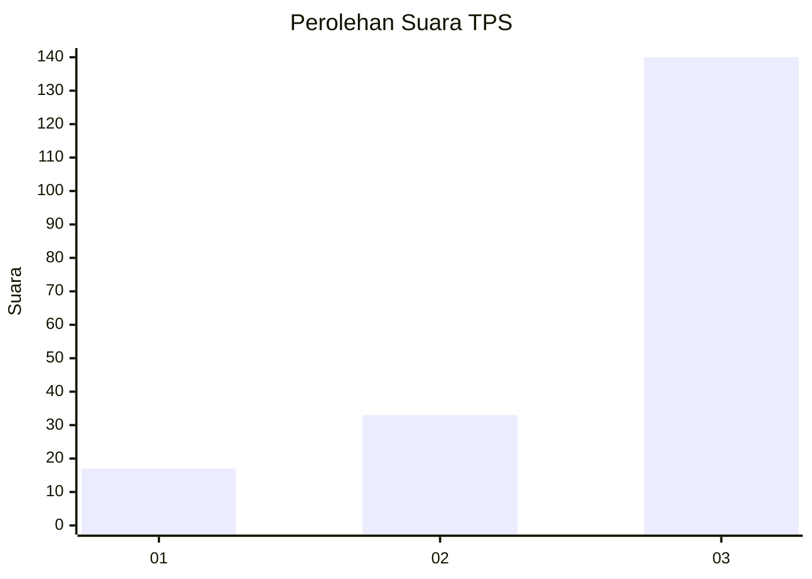
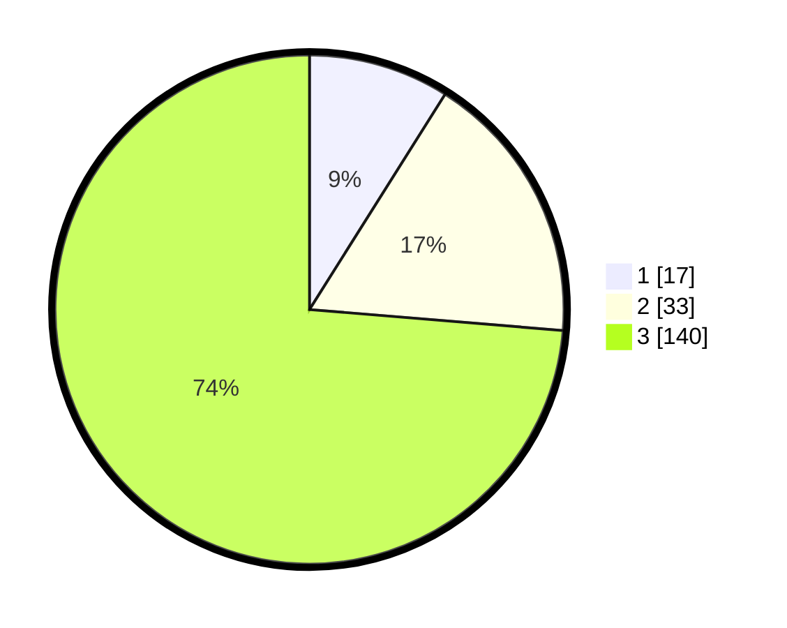

# Hasil

## Grafik

## Tabel

| No. | Nama Paslon    | Suara | Suara (raw) | Persentase |
|:--- |:-------------- | -----:| -----------:| ----------:|
| 1   | ANIES MUHAIMIN | 17    | [17][p-1]   | 8,95       |
| 2   | PRABOWO GIBRAN | 33    | [33][p-2]   | 17,37      |
| 3   | GANJAR MAHFUD  | 140   | [140][p-3]  | 73,68      |

[p-1]: https://github.com/gigit-pemilu/pemilu-2024/blob/main/pilpres/hitung-suara/sub/33-jawa-tengah/sub/06-purworejo/sub/06-purworejo/sub/2025-donorati/sub/004-tps/sub/paslon-1.txt
[p-2]: https://github.com/gigit-pemilu/pemilu-2024/blob/main/pilpres/hitung-suara/sub/33-jawa-tengah/sub/06-purworejo/sub/06-purworejo/sub/2025-donorati/sub/004-tps/sub/paslon-2.txt
[p-3]: https://github.com/gigit-pemilu/pemilu-2024/blob/main/pilpres/hitung-suara/sub/33-jawa-tengah/sub/06-purworejo/sub/06-purworejo/sub/2025-donorati/sub/004-tps/sub/paslon-3.txt

## Foto C Plano

https://sirekap-obj-formc.kpu.go.id/49bd/pemilu/ppwp/33/06/06/20/25/3306062025004-20240214-233737--4c6ef115-5d0d-4c2a-b309-1d2919f0bea2.jpg

https://sirekap-obj-formc.kpu.go.id/49bd/pemilu/ppwp/33/06/06/20/25/3306062025004-20240214-233622--84391aa6-4f18-4736-ac95-f10f284e9f44.jpg

https://sirekap-obj-formc.kpu.go.id/49bd/pemilu/ppwp/33/06/06/20/25/3306062025004-20240214-233727--6d3e9e32-b3c9-4162-9a0e-280715ff4caf.jpg

## Metadata

| Key        | Value               |
| ---------- | ------------------- |
| Time Stamp | 2024-02-15 09:00:24 |

