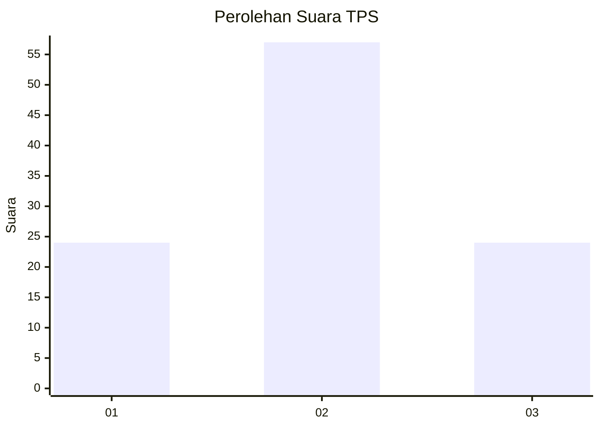
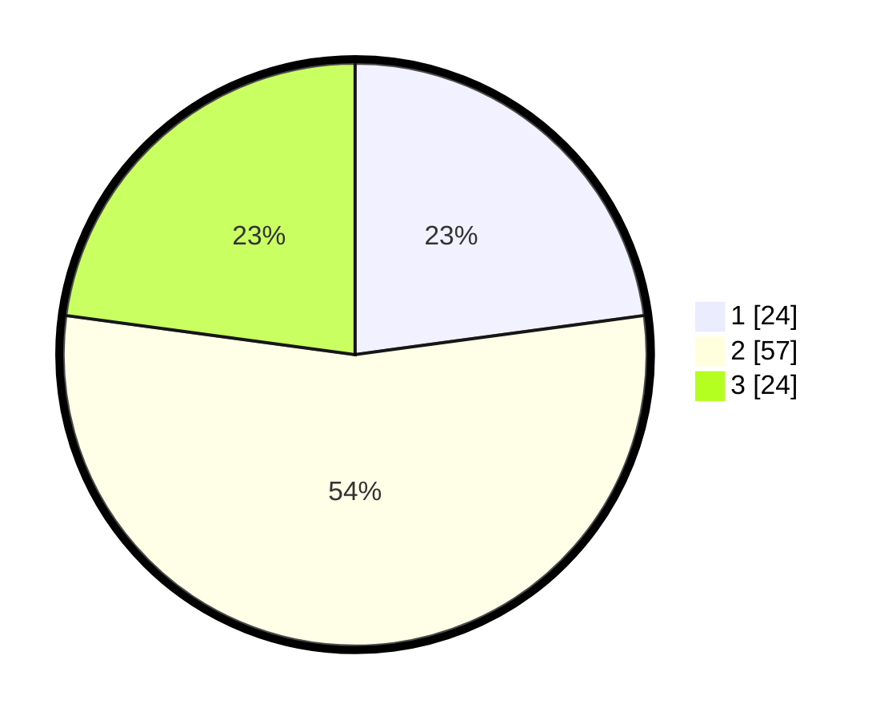

# Hasil

## Grafik

## Tabel

| No. | Nama Paslon    | Suara | Suara (raw) | Persentase |
|:--- |:-------------- | -----:| -----------:| ----------:|
| 1   | ANIES MUHAIMIN | 24    | [24][p-1]   | 22,86      |
| 2   | PRABOWO GIBRAN | 57    | [57][p-2]   | 54,29      |
| 3   | GANJAR MAHFUD  | 24    | [24][p-3]   | 22,86      |

[p-1]: https://github.com/gigit-pemilu/pemilu-2024-33-jawa-tengah/blob/main/pilpres/hitung-suara/sub/33-jawa-tengah/sub/06-purworejo/sub/07-banyuurip/sub/1010-borokulon/sub/003-tps/sub/paslon-1.txt
[p-2]: https://github.com/gigit-pemilu/pemilu-2024-33-jawa-tengah/blob/main/pilpres/hitung-suara/sub/33-jawa-tengah/sub/06-purworejo/sub/07-banyuurip/sub/1010-borokulon/sub/003-tps/sub/paslon-2.txt
[p-3]: https://github.com/gigit-pemilu/pemilu-2024-33-jawa-tengah/blob/main/pilpres/hitung-suara/sub/33-jawa-tengah/sub/06-purworejo/sub/07-banyuurip/sub/1010-borokulon/sub/003-tps/sub/paslon-3.txt

## Foto C Plano

https://sirekap-obj-formc.kpu.go.id/a45f/pemilu/ppwp/33/06/07/10/10/3306071010003-20240218-201225--8e7d425a-bd31-41ba-8ce3-9c104fb5bbd3.jpg

https://sirekap-obj-formc.kpu.go.id/a45f/pemilu/ppwp/33/06/07/10/10/3306071010003-20240215-013209--6842be77-e6bf-4360-8c49-24e17cc9eb36.jpg

https://sirekap-obj-formc.kpu.go.id/a45f/pemilu/ppwp/33/06/07/10/10/3306071010003-20240218-201401--8d695234-1da9-4b10-a79a-0b4593cf66e1.jpg

## Metadata

| Key        | Value               |
| ---------- | ------------------- |
| Time Stamp | 2024-02-19 06:16:00 |

## DATA PEMILIH TETAP

Jumlah pemilih dalam DPT: **135**.
 * L: **61**.
 * P: **74**.

## DATA PENGGUNA HAK PILIH

Jumlah pengguna hak pilih dalam DPT: **106**.
 * L: **48**.
 * P: **58**.

Jumlah pengguna hak pilih dalam DPTb: **1**.
 * L: **0**.
 * P: **1**.

Jumlah pengguna hak pilih dalam DPK: **2**.
 * L: **1**.
 * P: **1**.

Jumlah pengguna hak pilih: **109**.
 * L: **49**.
 * P: **60**.

## JUMLAH SUARA SAH DAN TIDAK SAH

JUMLAH SELURUH SUARA SAH: **105**.

JUMLAH SUARA TIDAK SAH: **4**.

JUMLAH SELURUH SUARA SAH DAN SUARA TIDAK SAH: **109**.

