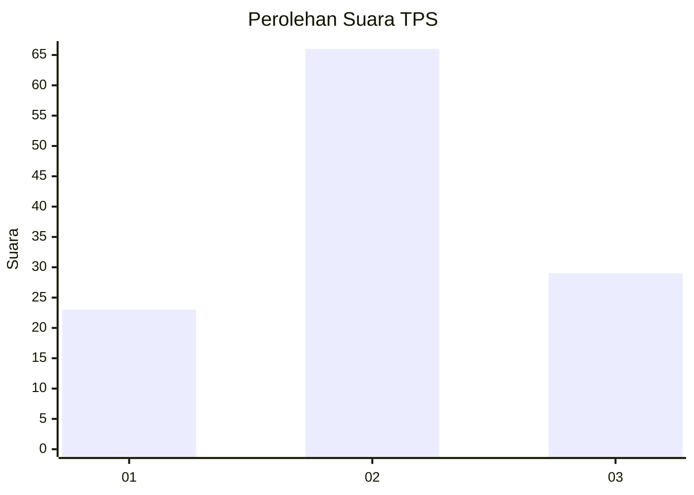
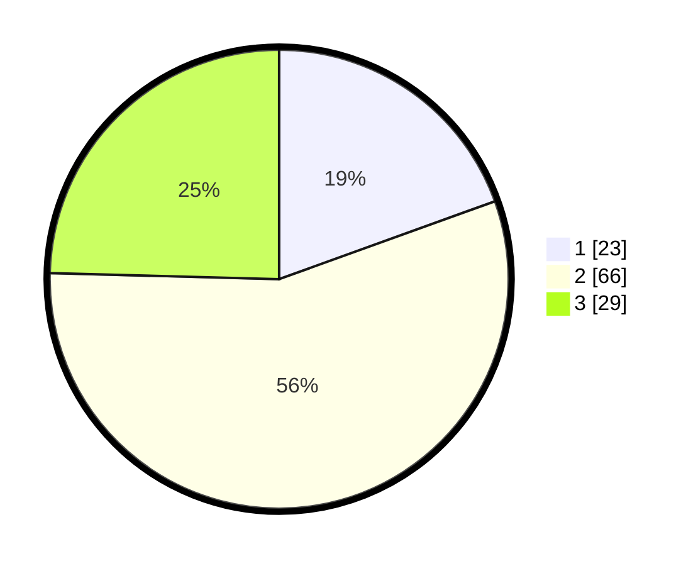

# Hasil

## Grafik

## Tabel

| No. | Nama Paslon    | Suara | Suara (raw) | Persentase |
|:--- |:-------------- | -----:| -----------:| ----------:|
| 1   | ANIES MUHAIMIN | 23    | [23][p-1]   | 19,49      |
| 2   | PRABOWO GIBRAN | 66    | [66][p-2]   | 55,93      |
| 3   | GANJAR MAHFUD  | 29    | [29][p-3]   | 24,58      |

[p-1]: https://github.com/gigit-pemilu/pemilu-2024-33-jawa-tengah/blob/main/pilpres/hitung-suara/sub/33-jawa-tengah/sub/06-purworejo/sub/07-banyuurip/sub/1026-kledungkradenan/sub/003-tps/sub/paslon-1.txt
[p-2]: https://github.com/gigit-pemilu/pemilu-2024-33-jawa-tengah/blob/main/pilpres/hitung-suara/sub/33-jawa-tengah/sub/06-purworejo/sub/07-banyuurip/sub/1026-kledungkradenan/sub/003-tps/sub/paslon-2.txt
[p-3]: https://github.com/gigit-pemilu/pemilu-2024-33-jawa-tengah/blob/main/pilpres/hitung-suara/sub/33-jawa-tengah/sub/06-purworejo/sub/07-banyuurip/sub/1026-kledungkradenan/sub/003-tps/sub/paslon-3.txt

## Foto C Plano

https://sirekap-obj-formc.kpu.go.id/77d6/pemilu/ppwp/33/06/07/10/26/3306071026003-20240216-211539--306df388-22d1-4fb9-8803-fc808d52e6c9.jpg

https://sirekap-obj-formc.kpu.go.id/77d6/pemilu/ppwp/33/06/07/10/26/3306071026003-20240216-211613--c3222260-79e5-4726-90d0-df06a9e3f89d.jpg

https://sirekap-obj-formc.kpu.go.id/77d6/pemilu/ppwp/33/06/07/10/26/3306071026003-20240216-212456--8a9055e8-c515-45b9-a0c4-c4781c7f227e.jpg

## Metadata

| Key        | Value               |
| ---------- | ------------------- |
| Time Stamp | 2024-02-16 22:01:00 |

