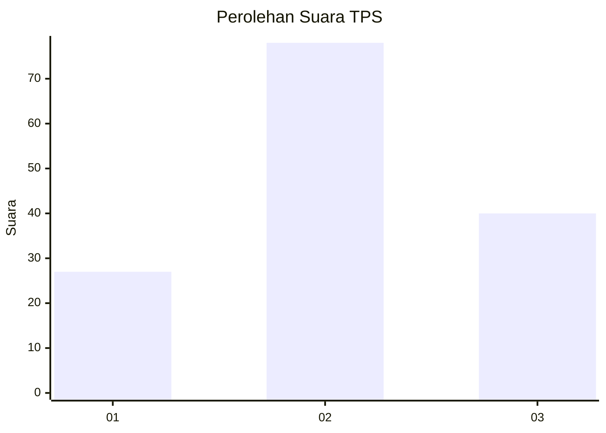
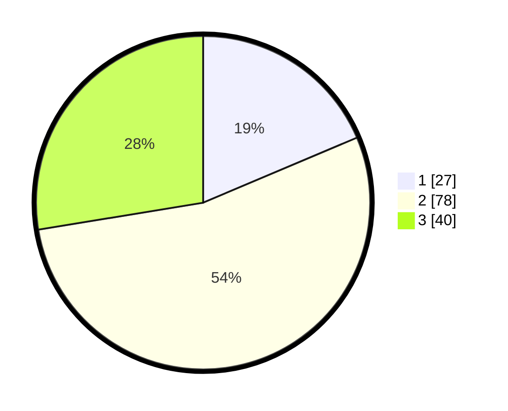

# Hasil

## Grafik

## Tabel

| No. | Nama Paslon    | Suara | Suara (raw) | Persentase |
|:--- |:-------------- | -----:| -----------:| ----------:|
| 1   | ANIES MUHAIMIN | 27    | [27][p-1]   | 18,62      |
| 2   | PRABOWO GIBRAN | 78    | [78][p-2]   | 53,79      |
| 3   | GANJAR MAHFUD  | 40    | [40][p-3]   | 27,59      |

[p-1]: https://github.com/gigit-pemilu/pemilu-2024/blob/main/pilpres/hitung-suara/sub/33-jawa-tengah/sub/06-purworejo/sub/07-banyuurip/sub/1026-kledungkradenan/sub/009-tps/sub/paslon-1.txt
[p-2]: https://github.com/gigit-pemilu/pemilu-2024/blob/main/pilpres/hitung-suara/sub/33-jawa-tengah/sub/06-purworejo/sub/07-banyuurip/sub/1026-kledungkradenan/sub/009-tps/sub/paslon-2.txt
[p-3]: https://github.com/gigit-pemilu/pemilu-2024/blob/main/pilpres/hitung-suara/sub/33-jawa-tengah/sub/06-purworejo/sub/07-banyuurip/sub/1026-kledungkradenan/sub/009-tps/sub/paslon-3.txt

## Foto C Plano

https://sirekap-obj-formc.kpu.go.id/9369/pemilu/ppwp/33/06/07/10/26/3306071026009-20240216-220617--64415980-8d89-46b8-b682-4201d2ddd444.jpg

https://sirekap-obj-formc.kpu.go.id/9369/pemilu/ppwp/33/06/07/10/26/3306071026009-20240216-220728--82997562-1541-408a-9414-8b609a92772a.jpg

https://sirekap-obj-formc.kpu.go.id/9369/pemilu/ppwp/33/06/07/10/26/3306071026009-20240216-220824--623c87b9-1f6f-4387-8a82-df273fd4e07d.jpg

## Metadata

| Key        | Value               |
| ---------- | ------------------- |
| Time Stamp | 2024-02-16 23:00:00 |

