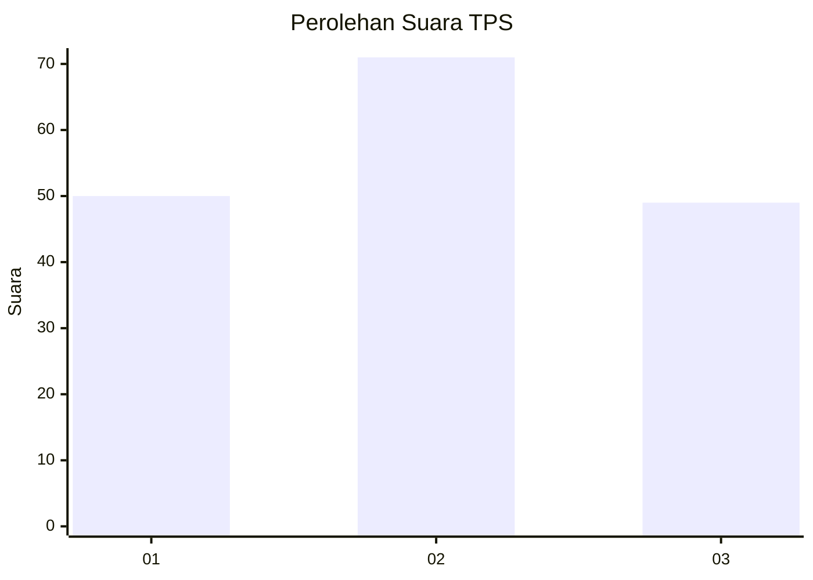
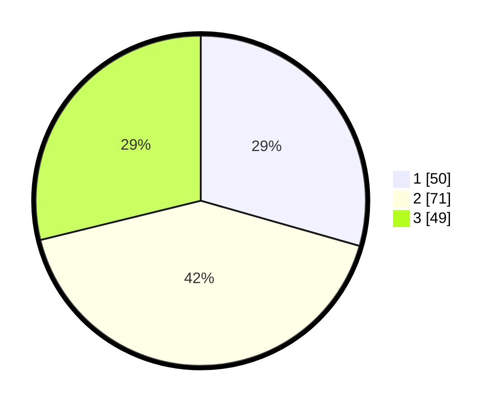

# Hasil

## Grafik

## Tabel

| No. | Nama Paslon    | Suara | Suara (raw) | Persentase |
|:--- |:-------------- | -----:| -----------:| ----------:|
| 1   | ANIES MUHAIMIN | 50    | [50][p-1]   | 29,41      |
| 2   | PRABOWO GIBRAN | 71    | [71][p-2]   | 41,76      |
| 3   | GANJAR MAHFUD  | 49    | [49][p-3]   | 28,82      |

[p-1]: https://github.com/gigit-pemilu/pemilu-2024-33-jawa-tengah/blob/main/pilpres/hitung-suara/sub/33-jawa-tengah/sub/06-purworejo/sub/07-banyuurip/sub/1027-kledung-karangdalem/sub/009-tps/sub/paslon-1.txt
[p-2]: https://github.com/gigit-pemilu/pemilu-2024-33-jawa-tengah/blob/main/pilpres/hitung-suara/sub/33-jawa-tengah/sub/06-purworejo/sub/07-banyuurip/sub/1027-kledung-karangdalem/sub/009-tps/sub/paslon-2.txt
[p-3]: https://github.com/gigit-pemilu/pemilu-2024-33-jawa-tengah/blob/main/pilpres/hitung-suara/sub/33-jawa-tengah/sub/06-purworejo/sub/07-banyuurip/sub/1027-kledung-karangdalem/sub/009-tps/sub/paslon-3.txt

## Foto C Plano

https://sirekap-obj-formc.kpu.go.id/8726/pemilu/ppwp/33/06/07/10/27/3306071027009-20240214-190211--70fd137b-d3d8-4a9d-9488-2c1000dd0029.jpg

https://sirekap-obj-formc.kpu.go.id/8726/pemilu/ppwp/33/06/07/10/27/3306071027009-20240214-155755--a470a854-d969-4fe9-b2f4-f2d918651585.jpg

https://sirekap-obj-formc.kpu.go.id/8726/pemilu/ppwp/33/06/07/10/27/3306071027009-20240214-155126--3d3016ff-3e83-41f4-bfbf-e0830c5a2c75.jpg

## Metadata

| Key        | Value               |
| ---------- | ------------------- |
| Time Stamp | 2024-02-14 21:46:01 |

