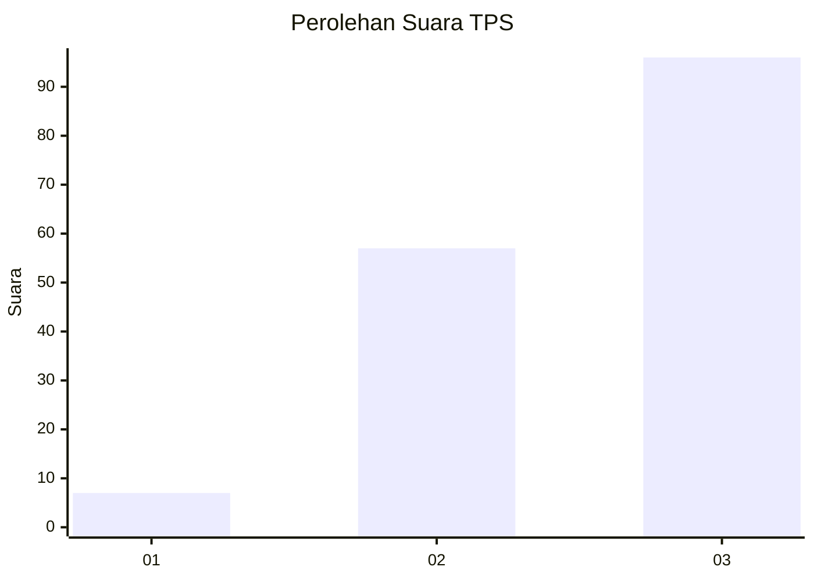
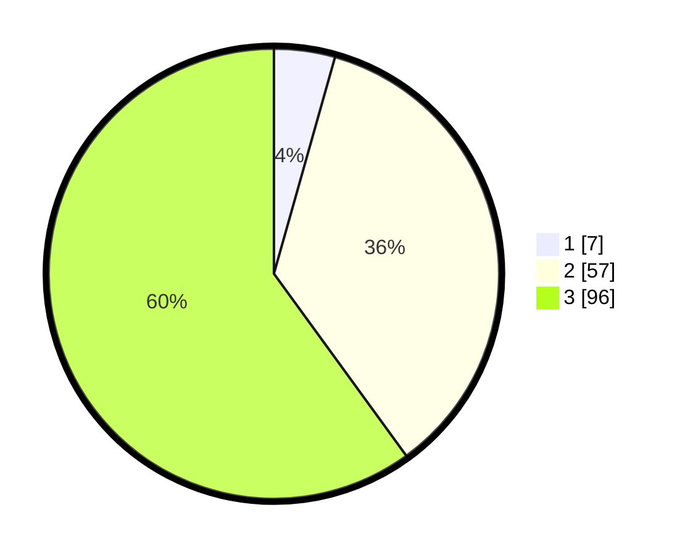

# Hasil

## Grafik

## Tabel

| No. | Nama Paslon    | Suara | Suara (raw) | Persentase |
|:--- |:-------------- | -----:| -----------:| ----------:|
| 1   | ANIES MUHAIMIN | 7     | [7][p-1]    | 4,38       |
| 2   | PRABOWO GIBRAN | 57    | [57][p-2]   | 35,63      |
| 3   | GANJAR MAHFUD  | 96    | [96][p-3]   | 60,00      |

[p-1]: https://github.com/gigit-pemilu/pemilu-2024-33-jawa-tengah/blob/main/pilpres/hitung-suara/sub/33-jawa-tengah/sub/06-purworejo/sub/07-banyuurip/sub/2002-triwarno/sub/004-tps/sub/paslon-1.txt
[p-2]: https://github.com/gigit-pemilu/pemilu-2024-33-jawa-tengah/blob/main/pilpres/hitung-suara/sub/33-jawa-tengah/sub/06-purworejo/sub/07-banyuurip/sub/2002-triwarno/sub/004-tps/sub/paslon-2.txt
[p-3]: https://github.com/gigit-pemilu/pemilu-2024-33-jawa-tengah/blob/main/pilpres/hitung-suara/sub/33-jawa-tengah/sub/06-purworejo/sub/07-banyuurip/sub/2002-triwarno/sub/004-tps/sub/paslon-3.txt

## Foto C Plano

https://sirekap-obj-formc.kpu.go.id/0cef/pemilu/ppwp/33/06/07/20/02/3306072002004-20240216-233019--e36d8b8d-d3f2-4260-9a45-2c785ed45376.jpg

https://sirekap-obj-formc.kpu.go.id/0cef/pemilu/ppwp/33/06/07/20/02/3306072002004-20240216-233130--7c231aa3-b4d0-41b4-9643-03f0203b7b81.jpg

https://sirekap-obj-formc.kpu.go.id/0cef/pemilu/ppwp/33/06/07/20/02/3306072002004-20240216-233227--8d789561-5843-4889-9372-c477ea21f8f1.jpg

## Metadata

| Key        | Value               |
| ---------- | ------------------- |
| Time Stamp | 2024-02-17 00:28:35 |

