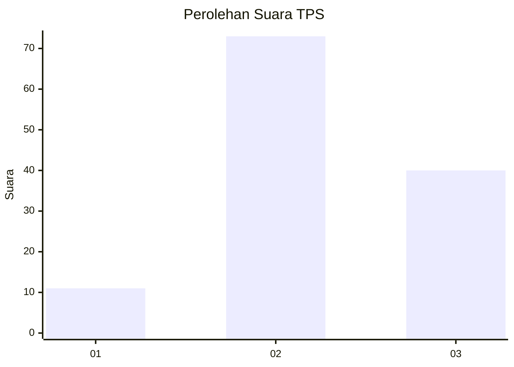
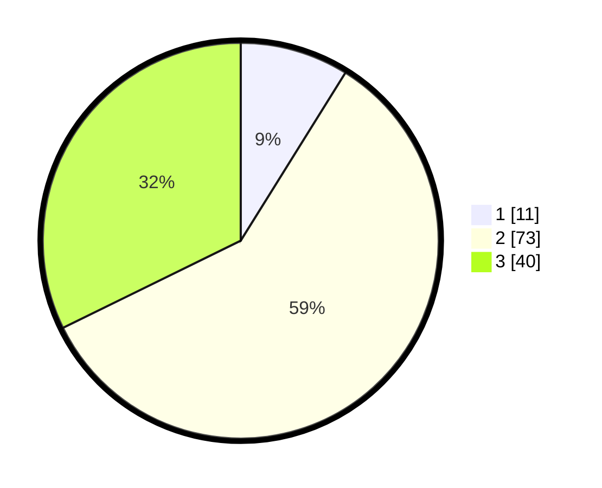

# Hasil

## Grafik

## Tabel

| No. | Nama Paslon    | Suara | Suara (raw) | Persentase |
|:--- |:-------------- | -----:| -----------:| ----------:|
| 1   | ANIES MUHAIMIN | 11    | [11][p-1]   | 8,87       |
| 2   | PRABOWO GIBRAN | 73    | [73][p-2]   | 58,87      |
| 3   | GANJAR MAHFUD  | 40    | [40][p-3]   | 32,26      |

[p-1]: https://github.com/gigit-pemilu/pemilu-2024/blob/main/pilpres/hitung-suara/sub/33-jawa-tengah/sub/06-purworejo/sub/07-banyuurip/sub/2011-tegalrejo/sub/003-tps/sub/paslon-1.txt
[p-2]: https://github.com/gigit-pemilu/pemilu-2024/blob/main/pilpres/hitung-suara/sub/33-jawa-tengah/sub/06-purworejo/sub/07-banyuurip/sub/2011-tegalrejo/sub/003-tps/sub/paslon-2.txt
[p-3]: https://github.com/gigit-pemilu/pemilu-2024/blob/main/pilpres/hitung-suara/sub/33-jawa-tengah/sub/06-purworejo/sub/07-banyuurip/sub/2011-tegalrejo/sub/003-tps/sub/paslon-3.txt

## Foto C Plano

https://sirekap-obj-formc.kpu.go.id/beae/pemilu/ppwp/33/06/07/20/11/3306072011003-20240214-220044--9a1c1f19-86f5-4a57-a042-33c0a311ff40.jpg

https://sirekap-obj-formc.kpu.go.id/beae/pemilu/ppwp/33/06/07/20/11/3306072011003-20240214-220210--b0ed4799-a93e-4110-8b19-a09a441f9106.jpg

https://sirekap-obj-formc.kpu.go.id/beae/pemilu/ppwp/33/06/07/20/11/3306072011003-20240214-220408--d0718a2e-4250-41c6-8f01-a6d4c5791ac9.jpg

## Metadata

| Key        | Value               |
| ---------- | ------------------- |
| Time Stamp | 2024-02-15 16:00:26 |

