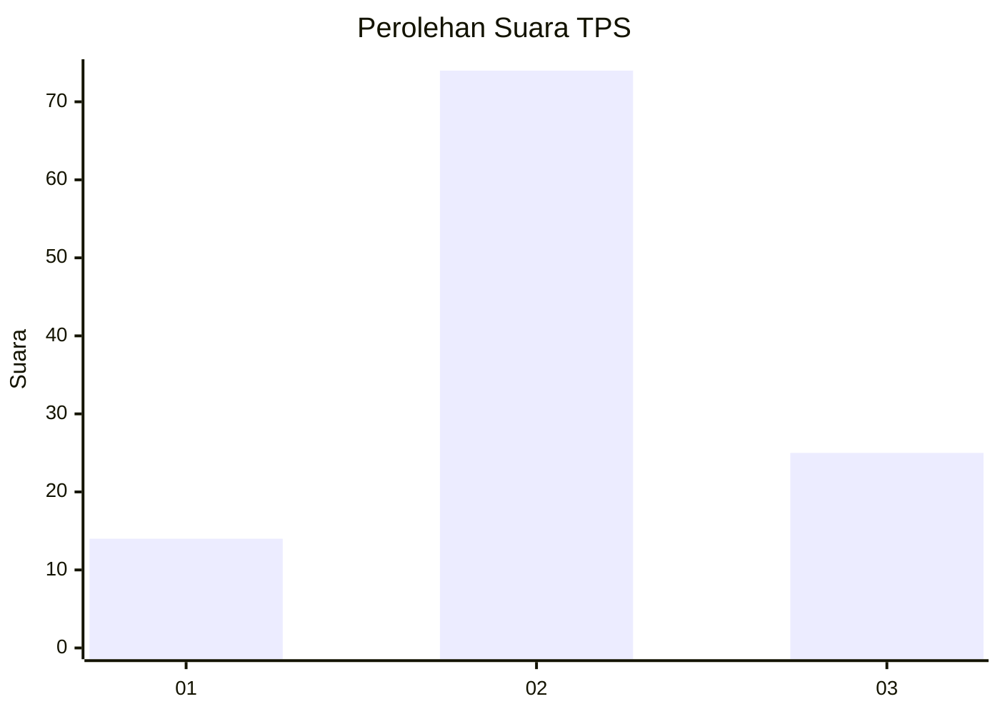
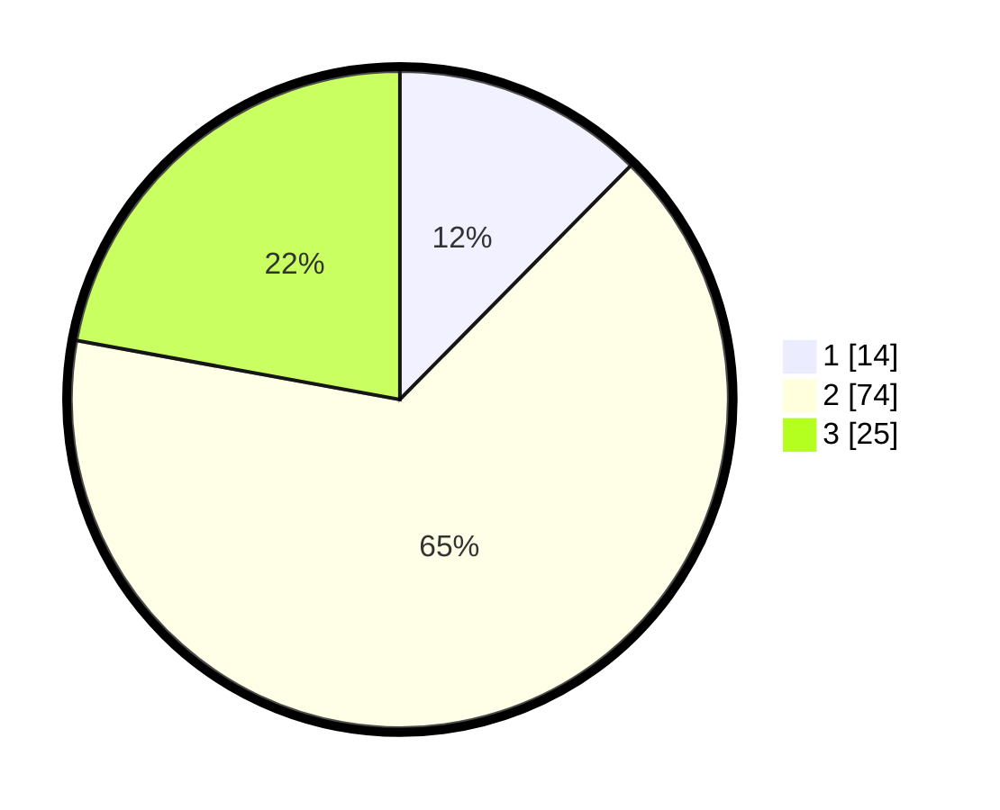

# Hasil

## Grafik

## Tabel

| No. | Nama Paslon    | Suara | Suara (raw) | Persentase |
|:--- |:-------------- | -----:| -----------:| ----------:|
| 1   | ANIES MUHAIMIN | 14    | [14][p-1]   | 12,39      |
| 2   | PRABOWO GIBRAN | 74    | [74][p-2]   | 65,49      |
| 3   | GANJAR MAHFUD  | 25    | [25][p-3]   | 22,12      |

[p-1]: https://github.com/gigit-pemilu/pemilu-2024/blob/main/pilpres/hitung-suara/sub/33-jawa-tengah/sub/06-purworejo/sub/07-banyuurip/sub/2013-malangrejo/sub/001-tps/sub/paslon-1.txt
[p-2]: https://github.com/gigit-pemilu/pemilu-2024/blob/main/pilpres/hitung-suara/sub/33-jawa-tengah/sub/06-purworejo/sub/07-banyuurip/sub/2013-malangrejo/sub/001-tps/sub/paslon-2.txt
[p-3]: https://github.com/gigit-pemilu/pemilu-2024/blob/main/pilpres/hitung-suara/sub/33-jawa-tengah/sub/06-purworejo/sub/07-banyuurip/sub/2013-malangrejo/sub/001-tps/sub/paslon-3.txt

## Foto C Plano

https://sirekap-obj-formc.kpu.go.id/58e2/pemilu/ppwp/33/06/07/20/13/3306072013001-20240214-224340--01bf7556-5af4-4212-88a2-986262e46d1b.jpg

https://sirekap-obj-formc.kpu.go.id/58e2/pemilu/ppwp/33/06/07/20/13/3306072013001-20240214-224606--da908274-0eb9-43b4-9e2b-6e77820f23f4.jpg

https://sirekap-obj-formc.kpu.go.id/58e2/pemilu/ppwp/33/06/07/20/13/3306072013001-20240214-224746--e25f4957-400a-4d6f-ac2a-0b515a0e4958.jpg

## Metadata

| Key        | Value               |
| ---------- | ------------------- |
| Time Stamp | 2024-02-15 16:00:26 |

