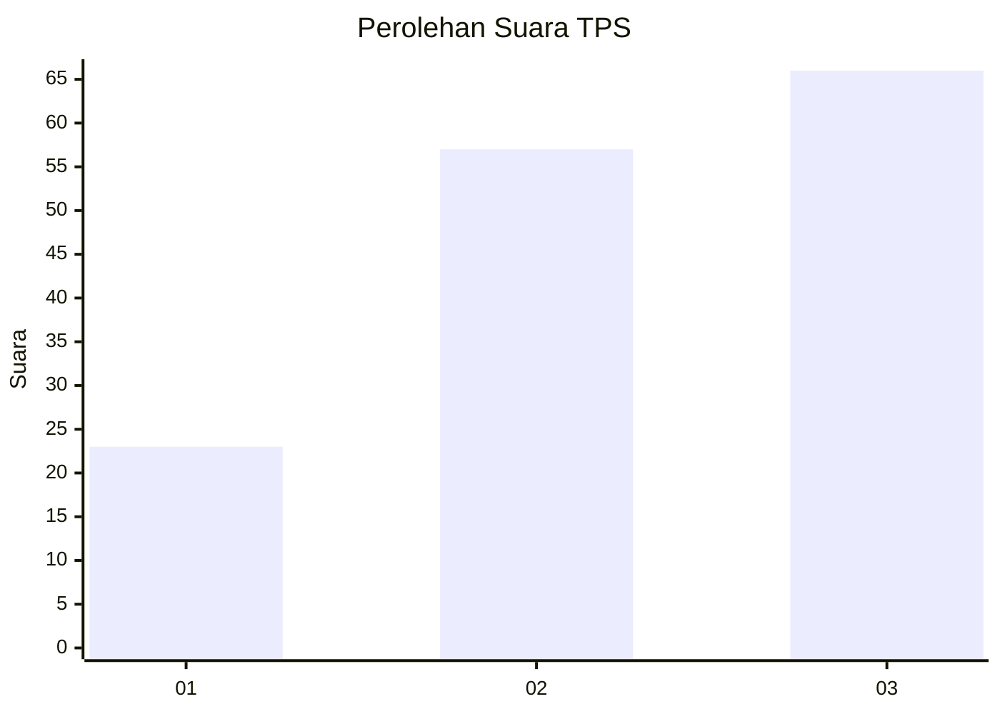
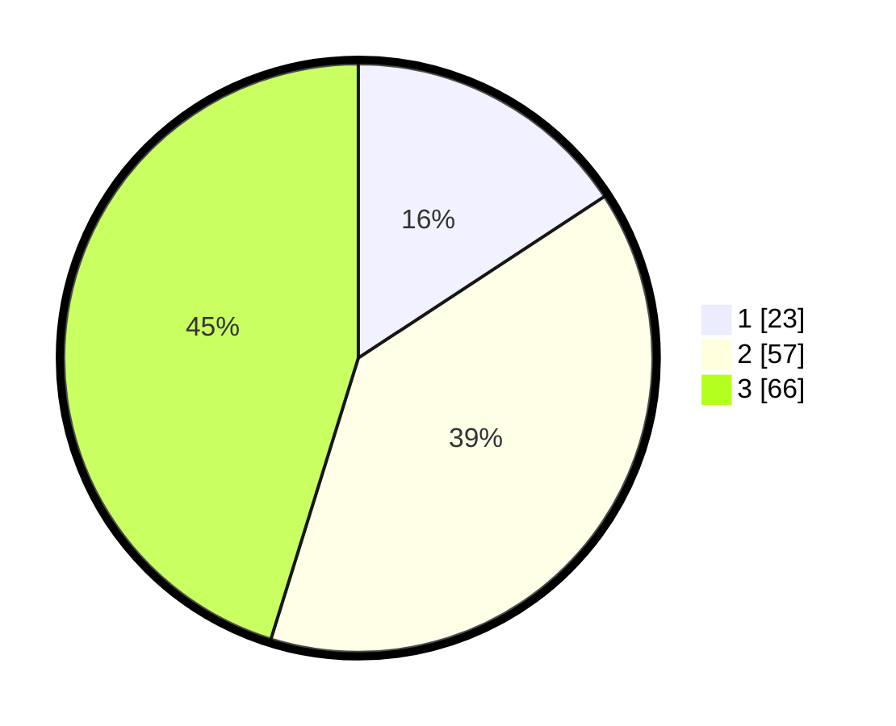

# Hasil

## Grafik

## Tabel

| No. | Nama Paslon    | Suara | Suara (raw) | Persentase |
|:--- |:-------------- | -----:| -----------:| ----------:|
| 1   | ANIES MUHAIMIN | 23    | [23][p-1]   | 15,75      |
| 2   | PRABOWO GIBRAN | 57    | [57][p-2]   | 39,04      |
| 3   | GANJAR MAHFUD  | 66    | [66][p-3]   | 45,21      |

[p-1]: https://github.com/gigit-pemilu/pemilu-2024-33-jawa-tengah/blob/main/pilpres/hitung-suara/sub/33-jawa-tengah/sub/06-purworejo/sub/07-banyuurip/sub/2013-malangrejo/sub/005-tps/sub/paslon-1.txt
[p-2]: https://github.com/gigit-pemilu/pemilu-2024-33-jawa-tengah/blob/main/pilpres/hitung-suara/sub/33-jawa-tengah/sub/06-purworejo/sub/07-banyuurip/sub/2013-malangrejo/sub/005-tps/sub/paslon-2.txt
[p-3]: https://github.com/gigit-pemilu/pemilu-2024-33-jawa-tengah/blob/main/pilpres/hitung-suara/sub/33-jawa-tengah/sub/06-purworejo/sub/07-banyuurip/sub/2013-malangrejo/sub/005-tps/sub/paslon-3.txt

## Foto C Plano

https://sirekap-obj-formc.kpu.go.id/8124/pemilu/ppwp/33/06/07/20/13/3306072013005-20240214-224709--f6a034d2-0f55-4c6c-985e-6f7484d20af4.jpg

https://sirekap-obj-formc.kpu.go.id/8124/pemilu/ppwp/33/06/07/20/13/3306072013005-20240214-213041--48a6b072-85a8-46ab-b0c6-04de024c5f0a.jpg

https://sirekap-obj-formc.kpu.go.id/8124/pemilu/ppwp/33/06/07/20/13/3306072013005-20240214-213253--5800ad2a-8a07-42e8-af17-6ab5f10640f3.jpg

## Metadata

| Key        | Value               |
| ---------- | ------------------- |
| Time Stamp | 2024-02-15 22:00:27 |

