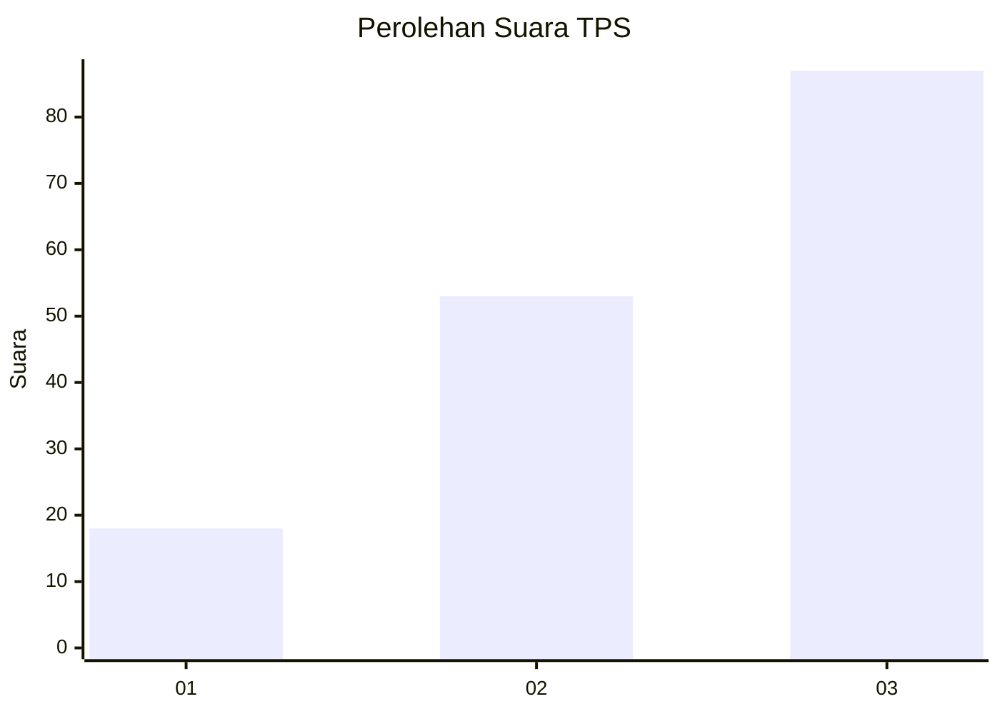
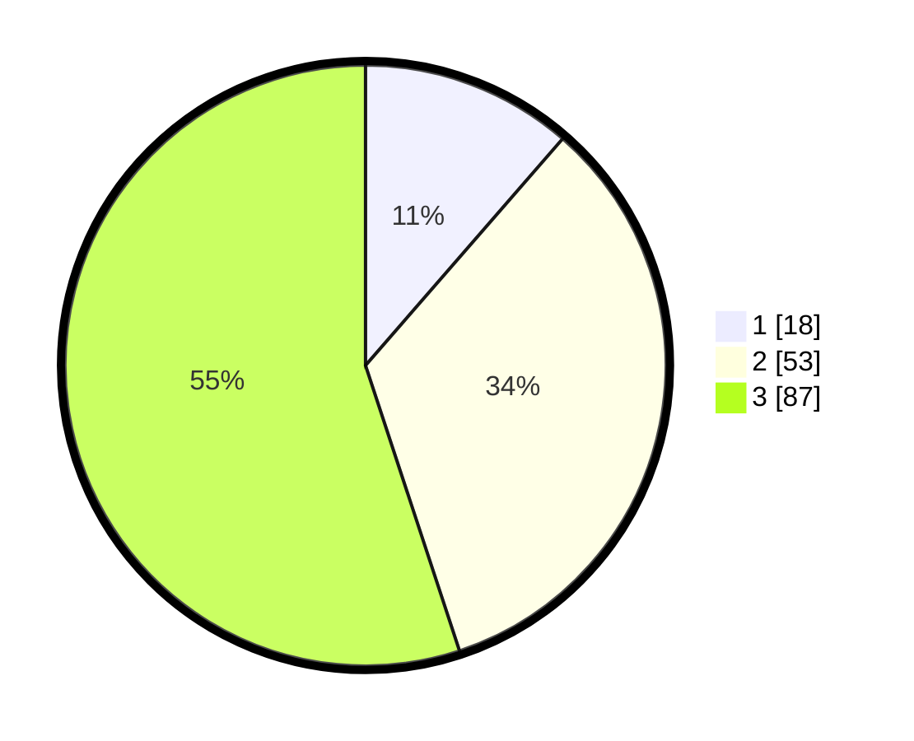

# Hasil

## Grafik

## Tabel

| No. | Nama Paslon    | Suara | Suara (raw) | Persentase |
|:--- |:-------------- | -----:| -----------:| ----------:|
| 1   | ANIES MUHAIMIN | 18    | [18][p-1]   | 11,39      |
| 2   | PRABOWO GIBRAN | 53    | [53][p-2]   | 33,54      |
| 3   | GANJAR MAHFUD  | 87    | [87][p-3]   | 55,06      |

[p-1]: https://github.com/gigit-pemilu/pemilu-2024-33-jawa-tengah/blob/main/pilpres/hitung-suara/sub/33-jawa-tengah/sub/06-purworejo/sub/07-banyuurip/sub/2014-tegalkuning/sub/004-tps/sub/paslon-1.txt
[p-2]: https://github.com/gigit-pemilu/pemilu-2024-33-jawa-tengah/blob/main/pilpres/hitung-suara/sub/33-jawa-tengah/sub/06-purworejo/sub/07-banyuurip/sub/2014-tegalkuning/sub/004-tps/sub/paslon-2.txt
[p-3]: https://github.com/gigit-pemilu/pemilu-2024-33-jawa-tengah/blob/main/pilpres/hitung-suara/sub/33-jawa-tengah/sub/06-purworejo/sub/07-banyuurip/sub/2014-tegalkuning/sub/004-tps/sub/paslon-3.txt

## Foto C Plano

https://sirekap-obj-formc.kpu.go.id/aa07/pemilu/ppwp/33/06/07/20/14/3306072014004-20240214-223423--3eff6922-c05d-4b48-9961-cd7cd5979672.jpg

https://sirekap-obj-formc.kpu.go.id/aa07/pemilu/ppwp/33/06/07/20/14/3306072014004-20240214-224301--10d6d13a-e0c7-4c0b-8772-0a42197cce8c.jpg

https://sirekap-obj-formc.kpu.go.id/aa07/pemilu/ppwp/33/06/07/20/14/3306072014004-20240214-224718--ad5821eb-9098-474b-8a32-2cc8638579fc.jpg

## Metadata

| Key        | Value               |
| ---------- | ------------------- |
| Time Stamp | 2024-02-15 06:00:23 |

