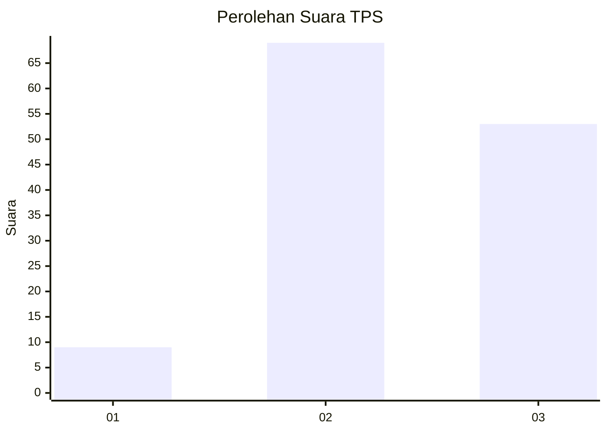
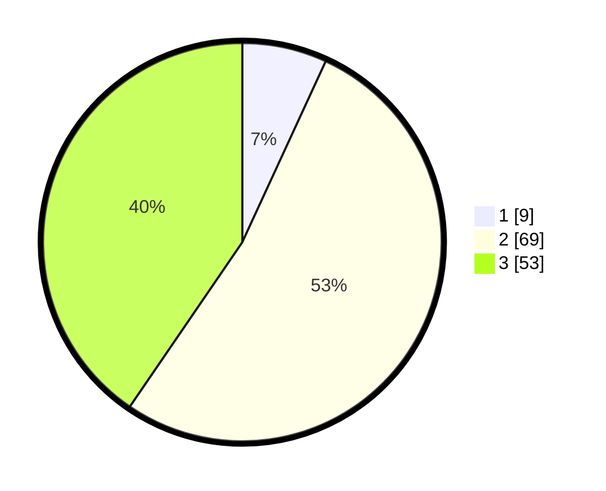

# Hasil

## Grafik

## Tabel

| No. | Nama Paslon    | Suara | Suara (raw) | Persentase |
|:--- |:-------------- | -----:| -----------:| ----------:|
| 1   | ANIES MUHAIMIN | 9     | [9][p-1]    | 6,87       |
| 2   | PRABOWO GIBRAN | 69    | [69][p-2]   | 52,67      |
| 3   | GANJAR MAHFUD  | 53    | [53][p-3]   | 40,46      |

[p-1]: https://github.com/gigit-pemilu/pemilu-2024-33-jawa-tengah/blob/main/pilpres/hitung-suara/sub/33-jawa-tengah/sub/06-purworejo/sub/07-banyuurip/sub/2015-kliwonan/sub/003-tps/sub/paslon-1.txt
[p-2]: https://github.com/gigit-pemilu/pemilu-2024-33-jawa-tengah/blob/main/pilpres/hitung-suara/sub/33-jawa-tengah/sub/06-purworejo/sub/07-banyuurip/sub/2015-kliwonan/sub/003-tps/sub/paslon-2.txt
[p-3]: https://github.com/gigit-pemilu/pemilu-2024-33-jawa-tengah/blob/main/pilpres/hitung-suara/sub/33-jawa-tengah/sub/06-purworejo/sub/07-banyuurip/sub/2015-kliwonan/sub/003-tps/sub/paslon-3.txt

## Foto C Plano

https://sirekap-obj-formc.kpu.go.id/3a3b/pemilu/ppwp/33/06/07/20/15/3306072015003-20240215-025332--cf224f17-8dfc-4d25-92c9-655f833e9477.jpg

https://sirekap-obj-formc.kpu.go.id/3a3b/pemilu/ppwp/33/06/07/20/15/3306072015003-20240215-030135--bda16831-2fc0-41f2-9a2c-aad7d1f3125c.jpg

https://sirekap-obj-formc.kpu.go.id/3a3b/pemilu/ppwp/33/06/07/20/15/3306072015003-20240215-030326--2793ba6c-826f-4b19-827b-db1b3f252678.jpg

## Metadata

| Key        | Value               |
| ---------- | ------------------- |
| Time Stamp | 2024-02-15 16:00:26 |

