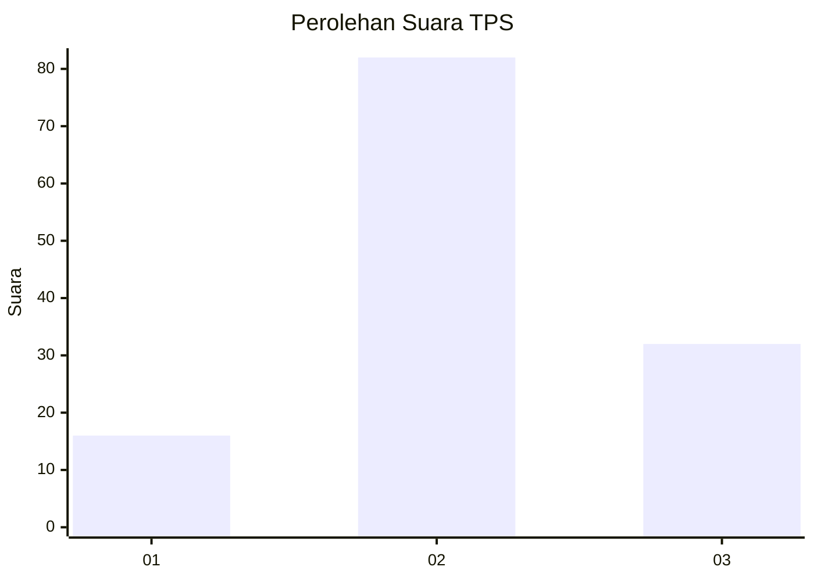
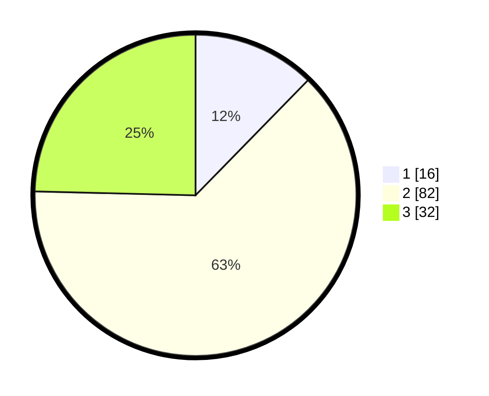

# Hasil

## Grafik

## Tabel

| No. | Nama Paslon    | Suara | Suara (raw) | Persentase |
|:--- |:-------------- | -----:| -----------:| ----------:|
| 1   | ANIES MUHAIMIN | 16    | [16][p-1]   | 12,31      |
| 2   | PRABOWO GIBRAN | 82    | [82][p-2]   | 63,08      |
| 3   | GANJAR MAHFUD  | 32    | [32][p-3]   | 24,62      |

[p-1]: https://github.com/gigit-pemilu/pemilu-2024-33-jawa-tengah/blob/main/pilpres/hitung-suara/sub/33-jawa-tengah/sub/06-purworejo/sub/07-banyuurip/sub/2023-golok/sub/003-tps/sub/paslon-1.txt
[p-2]: https://github.com/gigit-pemilu/pemilu-2024-33-jawa-tengah/blob/main/pilpres/hitung-suara/sub/33-jawa-tengah/sub/06-purworejo/sub/07-banyuurip/sub/2023-golok/sub/003-tps/sub/paslon-2.txt
[p-3]: https://github.com/gigit-pemilu/pemilu-2024-33-jawa-tengah/blob/main/pilpres/hitung-suara/sub/33-jawa-tengah/sub/06-purworejo/sub/07-banyuurip/sub/2023-golok/sub/003-tps/sub/paslon-3.txt

## Foto C Plano

https://sirekap-obj-formc.kpu.go.id/07ee/pemilu/ppwp/33/06/07/20/23/3306072023003-20240214-232145--ee5fa3f6-cbf7-4499-9296-ed437aba0f7e.jpg

https://sirekap-obj-formc.kpu.go.id/07ee/pemilu/ppwp/33/06/07/20/23/3306072023003-20240214-232148--8d44f673-60da-434c-b64a-cc7a701f6003.jpg

https://sirekap-obj-formc.kpu.go.id/07ee/pemilu/ppwp/33/06/07/20/23/3306072023003-20240214-232152--3c80b1e4-ede8-421c-aa53-c905183da5f2.jpg

## Metadata

| Key        | Value               |
| ---------- | ------------------- |
| Time Stamp | 2024-02-15 15:30:25 |

