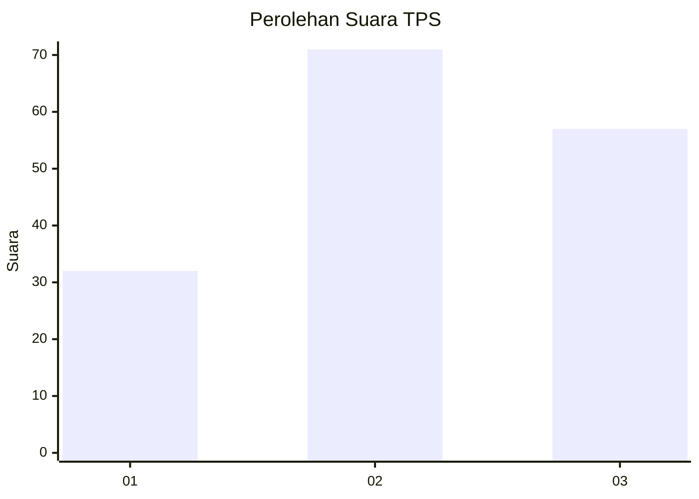
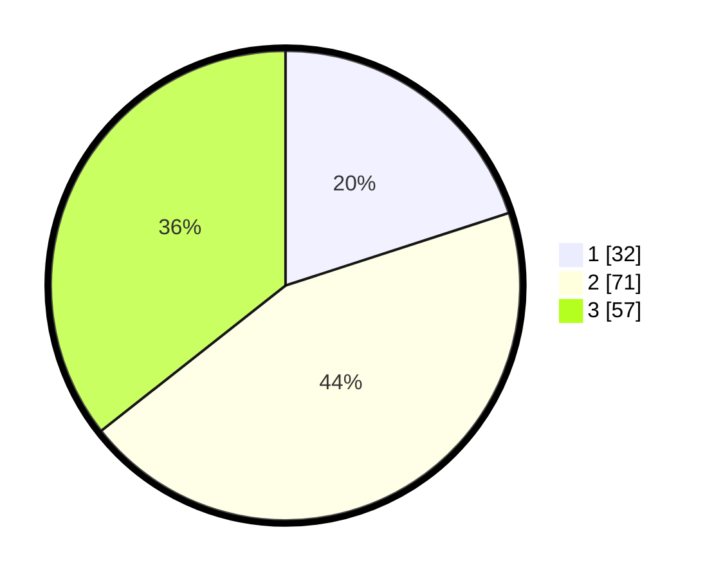

# Hasil

## Grafik

## Tabel

| No. | Nama Paslon    | Suara | Suara (raw) | Persentase |
|:--- |:-------------- | -----:| -----------:| ----------:|
| 1   | ANIES MUHAIMIN | 32    | [32][p-1]   | 20,00      |
| 2   | PRABOWO GIBRAN | 71    | [71][p-2]   | 44,38      |
| 3   | GANJAR MAHFUD  | 57    | [57][p-3]   | 35,63      |

[p-1]: https://github.com/gigit-pemilu/pemilu-2024-33-jawa-tengah/blob/main/pilpres/hitung-suara/sub/33-jawa-tengah/sub/06-purworejo/sub/08-bayan/sub/2002-pogungjurutengah/sub/003-tps/sub/paslon-1.txt
[p-2]: https://github.com/gigit-pemilu/pemilu-2024-33-jawa-tengah/blob/main/pilpres/hitung-suara/sub/33-jawa-tengah/sub/06-purworejo/sub/08-bayan/sub/2002-pogungjurutengah/sub/003-tps/sub/paslon-2.txt
[p-3]: https://github.com/gigit-pemilu/pemilu-2024-33-jawa-tengah/blob/main/pilpres/hitung-suara/sub/33-jawa-tengah/sub/06-purworejo/sub/08-bayan/sub/2002-pogungjurutengah/sub/003-tps/sub/paslon-3.txt

## Foto C Plano

https://sirekap-obj-formc.kpu.go.id/c3bb/pemilu/ppwp/33/06/08/20/02/3306082002003-20240217-213547--4abd1e19-e694-4a06-973e-a08625ffa12f.jpg

https://sirekap-obj-formc.kpu.go.id/c3bb/pemilu/ppwp/33/06/08/20/02/3306082002003-20240217-213842--06190d77-9928-44de-a4bb-7e0288670bc6.jpg

https://sirekap-obj-formc.kpu.go.id/c3bb/pemilu/ppwp/33/06/08/20/02/3306082002003-20240217-213949--0e11c8d5-450c-4cb3-af72-bc703b91572e.jpg

## Metadata

| Key        | Value               |
| ---------- | ------------------- |
| Time Stamp | 2024-02-19 06:16:00 |

## DATA PEMILIH TETAP

Jumlah pemilih dalam DPT: **419**.
 * L: **444**.
 * P: **444**.

## DATA PENGGUNA HAK PILIH

Jumlah pengguna hak pilih dalam DPT: **444**.
 * L: **164**.
 * P: **444**.

Jumlah pengguna hak pilih dalam DPTb: **440**.
 * L: **4**.
 * P: **444**.

Jumlah pengguna hak pilih dalam DPK: **441**.
 * L: **6**.
 * P: **444**.

Jumlah pengguna hak pilih: **416**.
 * L: **622**.
 * P: **644**.

## JUMLAH SUARA SAH DAN TIDAK SAH

JUMLAH SELURUH SUARA SAH: **160**.

JUMLAH SUARA TIDAK SAH: **5**.

JUMLAH SELURUH SUARA SAH DAN SUARA TIDAK SAH: **165**.

