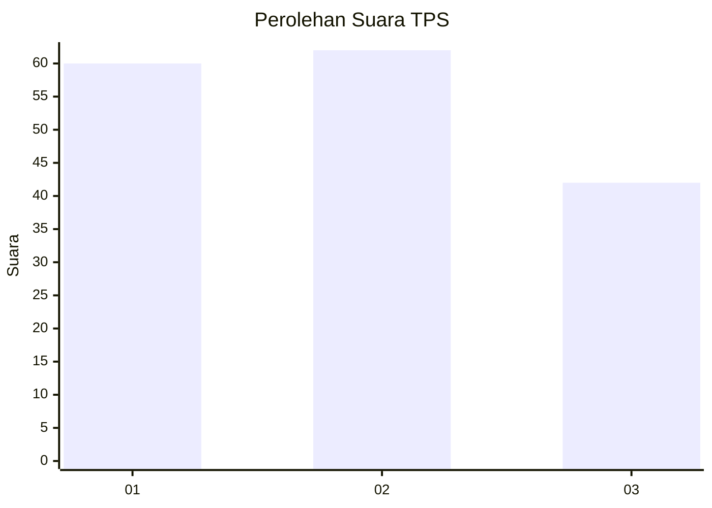
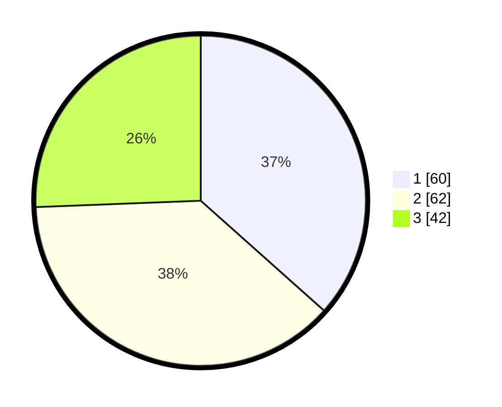

# Hasil

## Grafik

## Tabel

| No. | Nama Paslon    | Suara | Suara (raw) | Persentase |
|:--- |:-------------- | -----:| -----------:| ----------:|
| 1   | ANIES MUHAIMIN | 60    | [60][p-1]   | 36,59      |
| 2   | PRABOWO GIBRAN | 62    | [62][p-2]   | 37,80      |
| 3   | GANJAR MAHFUD  | 42    | [42][p-3]   | 25,61      |

[p-1]: https://github.com/gigit-pemilu/pemilu-2024/blob/main/pilpres/hitung-suara/sub/33-jawa-tengah/sub/06-purworejo/sub/08-bayan/sub/2005-pogungkalangan/sub/003-tps/sub/paslon-1.txt
[p-2]: https://github.com/gigit-pemilu/pemilu-2024/blob/main/pilpres/hitung-suara/sub/33-jawa-tengah/sub/06-purworejo/sub/08-bayan/sub/2005-pogungkalangan/sub/003-tps/sub/paslon-2.txt
[p-3]: https://github.com/gigit-pemilu/pemilu-2024/blob/main/pilpres/hitung-suara/sub/33-jawa-tengah/sub/06-purworejo/sub/08-bayan/sub/2005-pogungkalangan/sub/003-tps/sub/paslon-3.txt

## Foto C Plano

https://sirekap-obj-formc.kpu.go.id/e492/pemilu/ppwp/33/06/08/20/05/3306082005003-20240217-111510--cdcdc18d-ecd2-4c3f-8c2a-5f5753818e6d.jpg

https://sirekap-obj-formc.kpu.go.id/e492/pemilu/ppwp/33/06/08/20/05/3306082005003-20240214-234250--cbde340e-f3de-4066-9021-92dfc22c77a5.jpg

https://sirekap-obj-formc.kpu.go.id/e492/pemilu/ppwp/33/06/08/20/05/3306082005003-20240215-034207--85c2b6a8-4f47-467d-b843-ae5ca0cc9af8.jpg

## Metadata

| Key        | Value               |
| ---------- | ------------------- |
| Time Stamp | 2024-02-17 11:30:03 |

