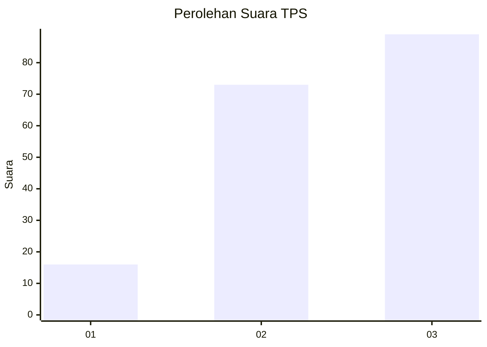
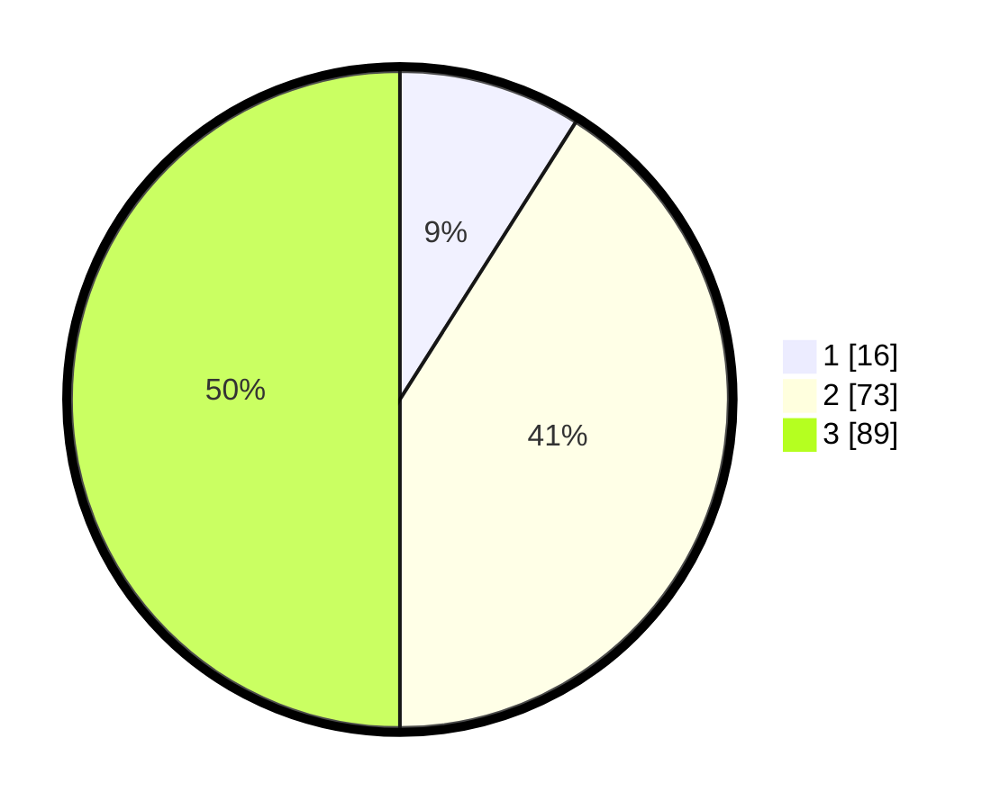

# Hasil

## Grafik

## Tabel

| No. | Nama Paslon    | Suara | Suara (raw) | Persentase |
|:--- |:-------------- | -----:| -----------:| ----------:|
| 1   | ANIES MUHAIMIN | 16    | [16][p-1]   | 8,99       |
| 2   | PRABOWO GIBRAN | 73    | [73][p-2]   | 41,01      |
| 3   | GANJAR MAHFUD  | 89    | [89][p-3]   | 50,00      |

[p-1]: https://github.com/gigit-pemilu/pemilu-2024/blob/main/pilpres/hitung-suara/sub/33-jawa-tengah/sub/06-purworejo/sub/08-bayan/sub/2011-jatingarang/sub/001-tps/sub/paslon-1.txt
[p-2]: https://github.com/gigit-pemilu/pemilu-2024/blob/main/pilpres/hitung-suara/sub/33-jawa-tengah/sub/06-purworejo/sub/08-bayan/sub/2011-jatingarang/sub/001-tps/sub/paslon-2.txt
[p-3]: https://github.com/gigit-pemilu/pemilu-2024/blob/main/pilpres/hitung-suara/sub/33-jawa-tengah/sub/06-purworejo/sub/08-bayan/sub/2011-jatingarang/sub/001-tps/sub/paslon-3.txt

## Foto C Plano

https://sirekap-obj-formc.kpu.go.id/7303/pemilu/ppwp/33/06/08/20/11/3306082011001-20240215-025915--a000d719-68be-4d47-a107-ee0c2b4e4d75.jpg

https://sirekap-obj-formc.kpu.go.id/7303/pemilu/ppwp/33/06/08/20/11/3306082011001-20240215-031548--1cb8126c-77e6-42d0-a9a6-770c2bb5bc39.jpg

https://sirekap-obj-formc.kpu.go.id/7303/pemilu/ppwp/33/06/08/20/11/3306082011001-20240215-030105--97656f50-86a8-4ff6-83e0-e4016ce57e11.jpg

## Metadata

| Key        | Value               |
| ---------- | ------------------- |
| Time Stamp | 2024-02-16 00:30:27 |

