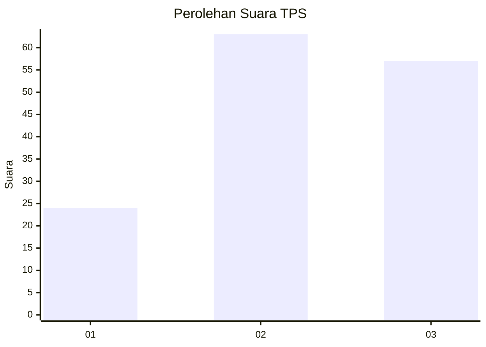
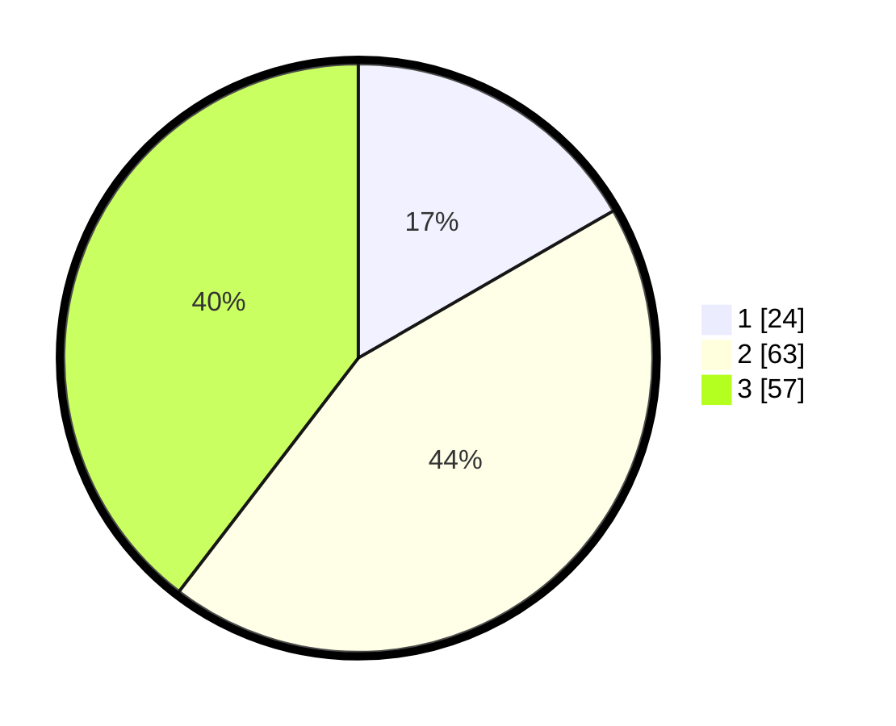

# Hasil

## Grafik

## Tabel

| No. | Nama Paslon    | Suara | Suara (raw) | Persentase |
|:--- |:-------------- | -----:| -----------:| ----------:|
| 1   | ANIES MUHAIMIN | 24    | [24][p-1]   | 16,67      |
| 2   | PRABOWO GIBRAN | 63    | [63][p-2]   | 43,75      |
| 3   | GANJAR MAHFUD  | 57    | [57][p-3]   | 39,58      |

[p-1]: https://github.com/gigit-pemilu/pemilu-2024/blob/main/pilpres/hitung-suara/sub/33-jawa-tengah/sub/06-purworejo/sub/08-bayan/sub/2011-jatingarang/sub/002-tps/sub/paslon-1.txt
[p-2]: https://github.com/gigit-pemilu/pemilu-2024/blob/main/pilpres/hitung-suara/sub/33-jawa-tengah/sub/06-purworejo/sub/08-bayan/sub/2011-jatingarang/sub/002-tps/sub/paslon-2.txt
[p-3]: https://github.com/gigit-pemilu/pemilu-2024/blob/main/pilpres/hitung-suara/sub/33-jawa-tengah/sub/06-purworejo/sub/08-bayan/sub/2011-jatingarang/sub/002-tps/sub/paslon-3.txt

## Foto C Plano

https://sirekap-obj-formc.kpu.go.id/7b24/pemilu/ppwp/33/06/08/20/11/3306082011002-20240214-200524--f4c16ead-33d8-4516-be15-6b429f2bfb15.jpg

https://sirekap-obj-formc.kpu.go.id/7b24/pemilu/ppwp/33/06/08/20/11/3306082011002-20240214-162240--6e4eaeff-fed7-4f4e-8b2b-78c25fbd7dc6.jpg

https://sirekap-obj-formc.kpu.go.id/7b24/pemilu/ppwp/33/06/08/20/11/3306082011002-20240214-200606--769fc4a0-1cc1-4edd-8559-f28c3b795fe2.jpg

## Metadata

| Key        | Value               |
| ---------- | ------------------- |
| Time Stamp | 2024-02-16 16:25:10 |

