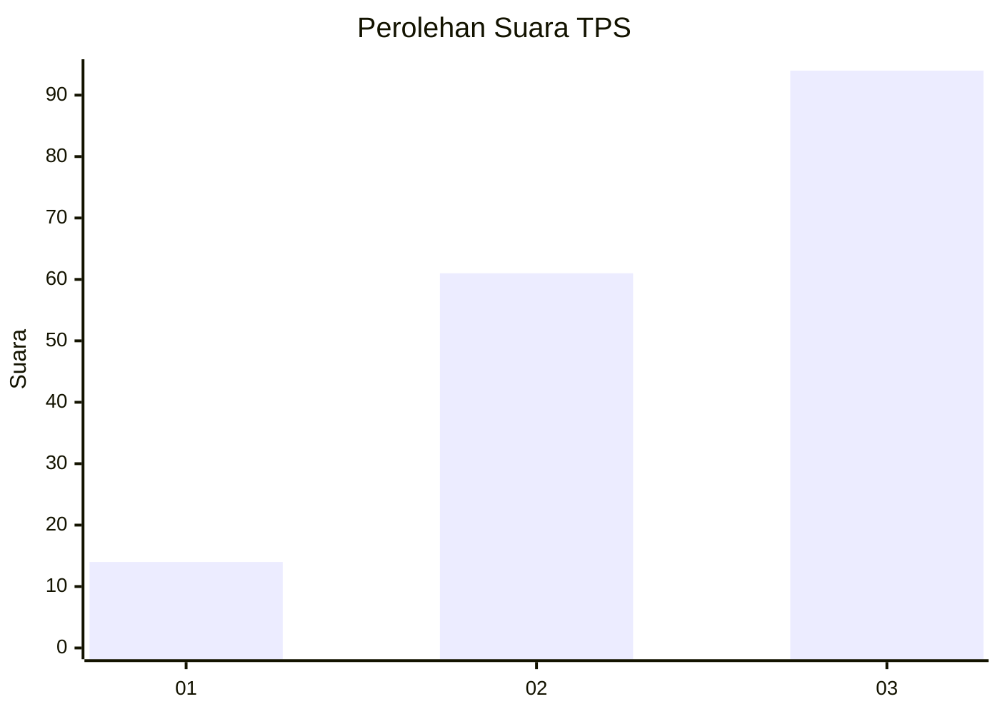
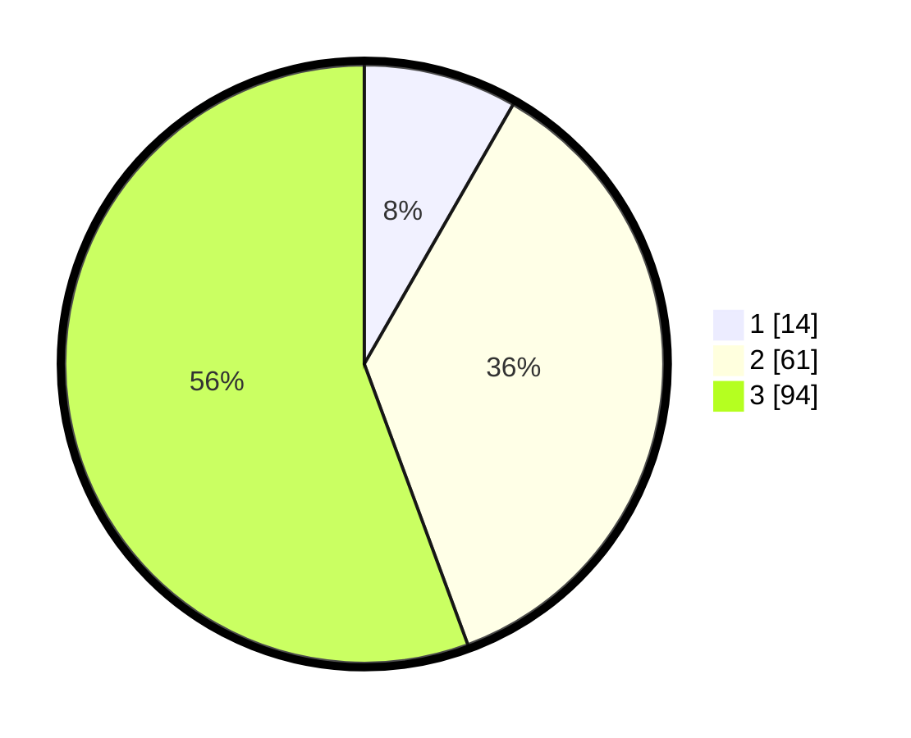

# Hasil

## Grafik

## Tabel

| No. | Nama Paslon    | Suara | Suara (raw) | Persentase |
|:--- |:-------------- | -----:| -----------:| ----------:|
| 1   | ANIES MUHAIMIN | 14    | [14][p-1]   | 8,28       |
| 2   | PRABOWO GIBRAN | 61    | [61][p-2]   | 36,09      |
| 3   | GANJAR MAHFUD  | 94    | [94][p-3]   | 55,62      |

[p-1]: https://github.com/gigit-pemilu/pemilu-2024-33-jawa-tengah/blob/main/pilpres/hitung-suara/sub/33-jawa-tengah/sub/06-purworejo/sub/08-bayan/sub/2011-jatingarang/sub/003-tps/sub/paslon-1.txt
[p-2]: https://github.com/gigit-pemilu/pemilu-2024-33-jawa-tengah/blob/main/pilpres/hitung-suara/sub/33-jawa-tengah/sub/06-purworejo/sub/08-bayan/sub/2011-jatingarang/sub/003-tps/sub/paslon-2.txt
[p-3]: https://github.com/gigit-pemilu/pemilu-2024-33-jawa-tengah/blob/main/pilpres/hitung-suara/sub/33-jawa-tengah/sub/06-purworejo/sub/08-bayan/sub/2011-jatingarang/sub/003-tps/sub/paslon-3.txt

## Foto C Plano

https://sirekap-obj-formc.kpu.go.id/04b3/pemilu/ppwp/33/06/08/20/11/3306082011003-20240217-221027--420b41c8-7d34-4121-bb12-47b7066cbb8b.jpg

https://sirekap-obj-formc.kpu.go.id/04b3/pemilu/ppwp/33/06/08/20/11/3306082011003-20240217-221141--41bfe52f-fd93-4639-97b9-7459e1be6d2c.jpg

https://sirekap-obj-formc.kpu.go.id/04b3/pemilu/ppwp/33/06/08/20/11/3306082011003-20240217-221301--af56ebfc-6958-4287-9e3b-2a9dd64d7694.jpg

## Metadata

| Key        | Value               |
| ---------- | ------------------- |
| Time Stamp | 2024-02-19 06:16:00 |

## DATA PEMILIH TETAP

Jumlah pemilih dalam DPT: **284**.
 * L: **899**.
 * P: **880**.

## DATA PENGGUNA HAK PILIH

Jumlah pengguna hak pilih dalam DPT: **872**.
 * L: **75**.
 * P: **896**.

Jumlah pengguna hak pilih dalam DPTb: **2**.
 * L: **508**.
 * P: **504**.

Jumlah pengguna hak pilih dalam DPK: **7**.
 * L: **55**.
 * P: **500**.

Jumlah pengguna hak pilih: **822**.
 * L: **89**.
 * P: **92**.

## JUMLAH SUARA SAH DAN TIDAK SAH

JUMLAH SELURUH SUARA SAH: **169**.

JUMLAH SUARA TIDAK SAH: **5**.

JUMLAH SELURUH SUARA SAH DAN SUARA TIDAK SAH: **174**.

