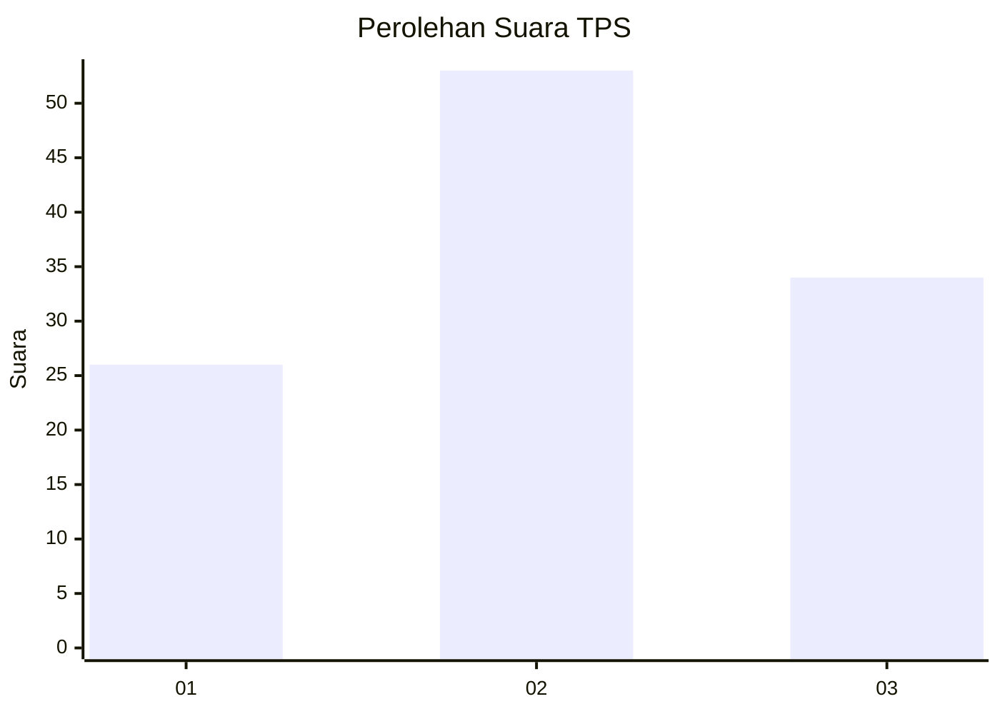
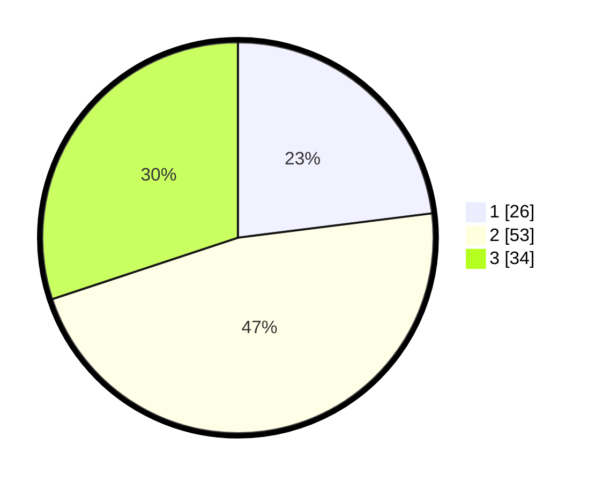

# Hasil

## Grafik

## Tabel

| No. | Nama Paslon    | Suara | Suara (raw) | Persentase |
|:--- |:-------------- | -----:| -----------:| ----------:|
| 1   | ANIES MUHAIMIN | 26    | [26][p-1]   | 23,01      |
| 2   | PRABOWO GIBRAN | 53    | [53][p-2]   | 46,90      |
| 3   | GANJAR MAHFUD  | 34    | [34][p-3]   | 30,09      |

[p-1]: https://github.com/gigit-pemilu/pemilu-2024/blob/main/pilpres/hitung-suara/sub/33-jawa-tengah/sub/06-purworejo/sub/08-bayan/sub/2011-jatingarang/sub/004-tps/sub/paslon-1.txt
[p-2]: https://github.com/gigit-pemilu/pemilu-2024/blob/main/pilpres/hitung-suara/sub/33-jawa-tengah/sub/06-purworejo/sub/08-bayan/sub/2011-jatingarang/sub/004-tps/sub/paslon-2.txt
[p-3]: https://github.com/gigit-pemilu/pemilu-2024/blob/main/pilpres/hitung-suara/sub/33-jawa-tengah/sub/06-purworejo/sub/08-bayan/sub/2011-jatingarang/sub/004-tps/sub/paslon-3.txt

## Foto C Plano

https://sirekap-obj-formc.kpu.go.id/028e/pemilu/ppwp/33/06/08/20/11/3306082011004-20240217-224942--e520eb35-32c3-40be-8745-97bd60f47772.jpg

https://sirekap-obj-formc.kpu.go.id/028e/pemilu/ppwp/33/06/08/20/11/3306082011004-20240217-225107--481bdfac-8478-4e04-b7a0-1dd6dd2cb8c8.jpg

https://sirekap-obj-formc.kpu.go.id/028e/pemilu/ppwp/33/06/08/20/11/3306082011004-20240217-225341--047689e0-d815-4a75-a3a3-2c360b0aaabb.jpg

## Metadata

| Key        | Value               |
| ---------- | ------------------- |
| Time Stamp | 2024-02-19 06:16:00 |

## DATA PEMILIH TETAP

Jumlah pemilih dalam DPT: **50**.
 * L: **200**.
 * P: **200**.

## DATA PENGGUNA HAK PILIH

Jumlah pengguna hak pilih dalam DPT: **601**.
 * L: **200**.
 * P: **5**.

Jumlah pengguna hak pilih dalam DPTb: **0**.
 * L: **222**.
 * P: **0**.

Jumlah pengguna hak pilih dalam DPK: **0**.
 * L: **200**.
 * P: **0**.

Jumlah pengguna hak pilih: **816**.
 * L: **56**.
 * P: **60**.

## JUMLAH SUARA SAH DAN TIDAK SAH

JUMLAH SELURUH SUARA SAH: **113**.

JUMLAH SUARA TIDAK SAH: **3**.

JUMLAH SELURUH SUARA SAH DAN SUARA TIDAK SAH: **116**.

