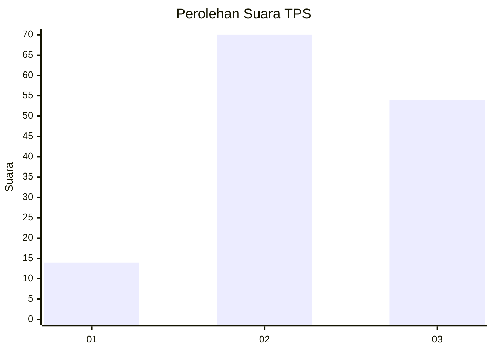
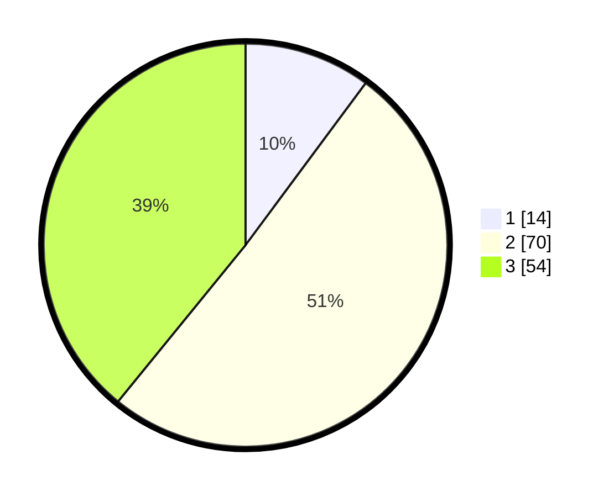

# Hasil

## Grafik

## Tabel

| No. | Nama Paslon    | Suara | Suara (raw) | Persentase |
|:--- |:-------------- | -----:| -----------:| ----------:|
| 1   | ANIES MUHAIMIN | 14    | [14][p-1]   | 10,14      |
| 2   | PRABOWO GIBRAN | 70    | [70][p-2]   | 50,72      |
| 3   | GANJAR MAHFUD  | 54    | [54][p-3]   | 39,13      |

[p-1]: https://github.com/gigit-pemilu/pemilu-2024-33-jawa-tengah/blob/main/pilpres/hitung-suara/sub/33-jawa-tengah/sub/06-purworejo/sub/08-bayan/sub/2012-bandungkidul/sub/008-tps/sub/paslon-1.txt
[p-2]: https://github.com/gigit-pemilu/pemilu-2024-33-jawa-tengah/blob/main/pilpres/hitung-suara/sub/33-jawa-tengah/sub/06-purworejo/sub/08-bayan/sub/2012-bandungkidul/sub/008-tps/sub/paslon-2.txt
[p-3]: https://github.com/gigit-pemilu/pemilu-2024-33-jawa-tengah/blob/main/pilpres/hitung-suara/sub/33-jawa-tengah/sub/06-purworejo/sub/08-bayan/sub/2012-bandungkidul/sub/008-tps/sub/paslon-3.txt

## Foto C Plano

https://sirekap-obj-formc.kpu.go.id/47a8/pemilu/ppwp/33/06/08/20/12/3306082012008-20240214-192729--bf8464fe-72f0-4f9d-af01-5a4c65baf6d7.jpg

https://sirekap-obj-formc.kpu.go.id/47a8/pemilu/ppwp/33/06/08/20/12/3306082012008-20240214-192753--4decafc9-5d2b-4893-9aad-28dae85787c7.jpg

https://sirekap-obj-formc.kpu.go.id/47a8/pemilu/ppwp/33/06/08/20/12/3306082012008-20240214-192803--0af82afd-05ae-4bca-85d2-96e224b96ea6.jpg

## Metadata

| Key        | Value               |
| ---------- | ------------------- |
| Time Stamp | 2024-02-14 21:46:01 |

