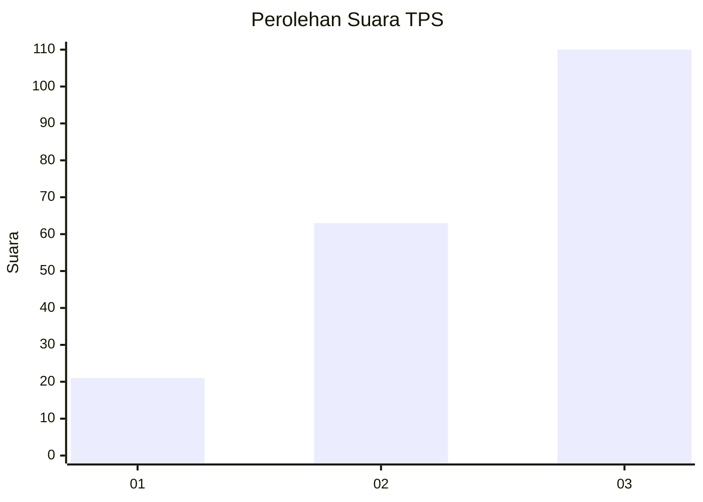
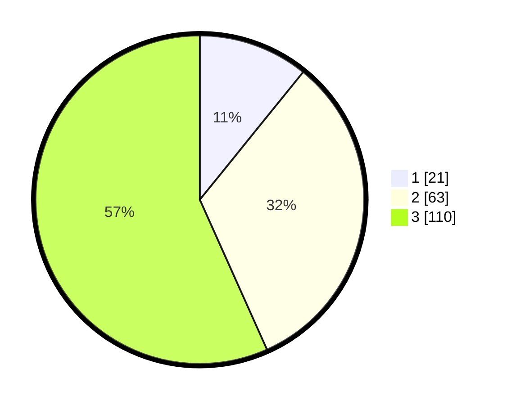

# Hasil

## Grafik

## Tabel

| No. | Nama Paslon    | Suara | Suara (raw) | Persentase |
|:--- |:-------------- | -----:| -----------:| ----------:|
| 1   | ANIES MUHAIMIN | 21    | [21][p-1]   | 10,82      |
| 2   | PRABOWO GIBRAN | 63    | [63][p-2]   | 32,47      |
| 3   | GANJAR MAHFUD  | 110   | [110][p-3]  | 56,70      |

[p-1]: https://github.com/gigit-pemilu/pemilu-2024-33-jawa-tengah/blob/main/pilpres/hitung-suara/sub/33-jawa-tengah/sub/06-purworejo/sub/08-bayan/sub/2021-bringin/sub/002-tps/sub/paslon-1.txt
[p-2]: https://github.com/gigit-pemilu/pemilu-2024-33-jawa-tengah/blob/main/pilpres/hitung-suara/sub/33-jawa-tengah/sub/06-purworejo/sub/08-bayan/sub/2021-bringin/sub/002-tps/sub/paslon-2.txt
[p-3]: https://github.com/gigit-pemilu/pemilu-2024-33-jawa-tengah/blob/main/pilpres/hitung-suara/sub/33-jawa-tengah/sub/06-purworejo/sub/08-bayan/sub/2021-bringin/sub/002-tps/sub/paslon-3.txt

## Foto C Plano

https://sirekap-obj-formc.kpu.go.id/1b5e/pemilu/ppwp/33/06/08/20/21/3306082021002-20240216-190306--14ec5b6a-a6d9-47af-9cce-8a6ae83cef96.jpg

https://sirekap-obj-formc.kpu.go.id/1b5e/pemilu/ppwp/33/06/08/20/21/3306082021002-20240216-190501--24eaba40-28c4-4629-bb12-b875dcee6da9.jpg

https://sirekap-obj-formc.kpu.go.id/1b5e/pemilu/ppwp/33/06/08/20/21/3306082021002-20240216-190632--dfe7aa3c-30b3-433d-8ba9-7f4f06804836.jpg

## Metadata

| Key        | Value               |
| ---------- | ------------------- |
| Time Stamp | 2024-02-16 21:01:00 |

