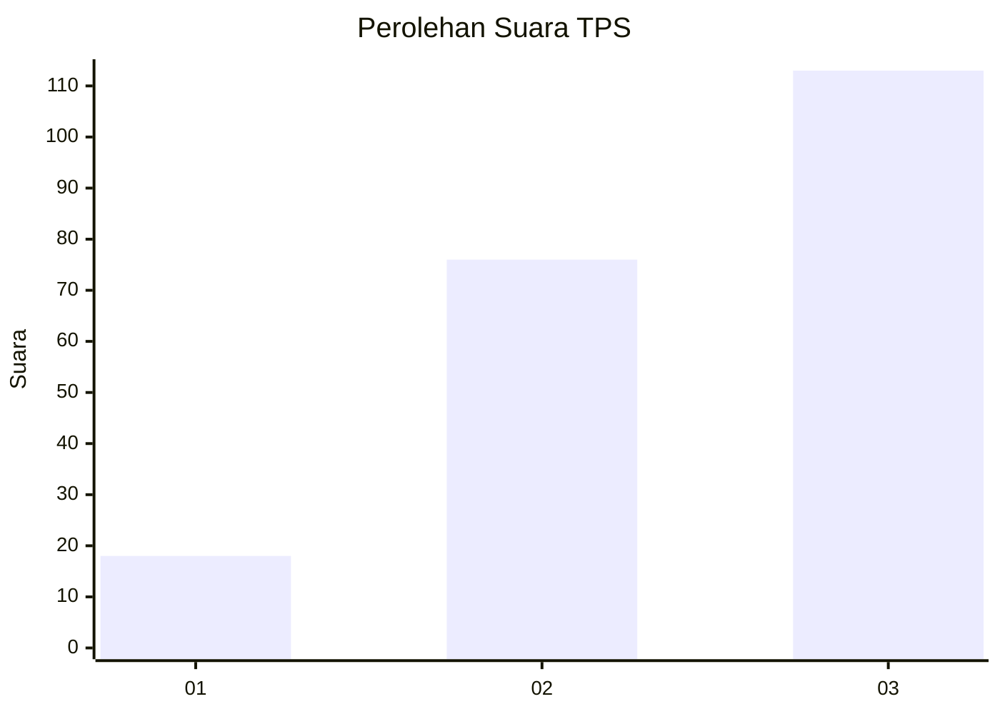
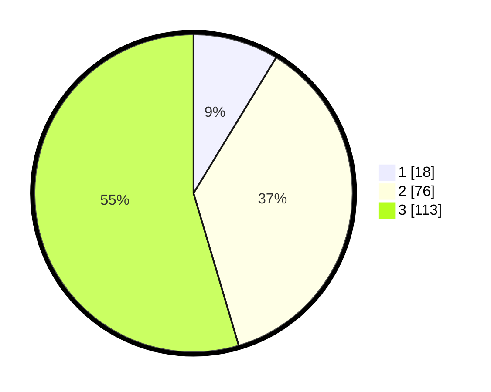

# Hasil

## Grafik

## Tabel

| No. | Nama Paslon    | Suara | Suara (raw) | Persentase |
|:--- |:-------------- | -----:| -----------:| ----------:|
| 1   | ANIES MUHAIMIN | 18    | [18][p-1]   | 8,70       |
| 2   | PRABOWO GIBRAN | 76    | [76][p-2]   | 36,71      |
| 3   | GANJAR MAHFUD  | 113   | [113][p-3]  | 54,59      |

[p-1]: https://github.com/gigit-pemilu/pemilu-2024/blob/main/pilpres/hitung-suara/sub/33-jawa-tengah/sub/06-purworejo/sub/08-bayan/sub/2021-bringin/sub/005-tps/sub/paslon-1.txt
[p-2]: https://github.com/gigit-pemilu/pemilu-2024/blob/main/pilpres/hitung-suara/sub/33-jawa-tengah/sub/06-purworejo/sub/08-bayan/sub/2021-bringin/sub/005-tps/sub/paslon-2.txt
[p-3]: https://github.com/gigit-pemilu/pemilu-2024/blob/main/pilpres/hitung-suara/sub/33-jawa-tengah/sub/06-purworejo/sub/08-bayan/sub/2021-bringin/sub/005-tps/sub/paslon-3.txt

## Foto C Plano

https://sirekap-obj-formc.kpu.go.id/cb78/pemilu/ppwp/33/06/08/20/21/3306082021005-20240214-235954--ec94d28f-9ac9-4030-bd00-649b3d178585.jpg

https://sirekap-obj-formc.kpu.go.id/cb78/pemilu/ppwp/33/06/08/20/21/3306082021005-20240215-000202--70f24e4c-034a-49e9-928b-d4e37df01c43.jpg

https://sirekap-obj-formc.kpu.go.id/cb78/pemilu/ppwp/33/06/08/20/21/3306082021005-20240215-000450--a305afa6-bac2-4ed0-bcdf-b991938a14c1.jpg

## Metadata

| Key        | Value               |
| ---------- | ------------------- |
| Time Stamp | 2024-02-15 19:00:26 |

