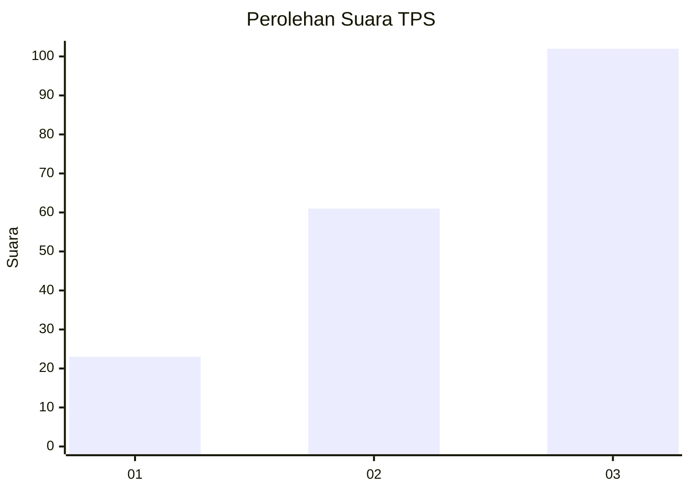
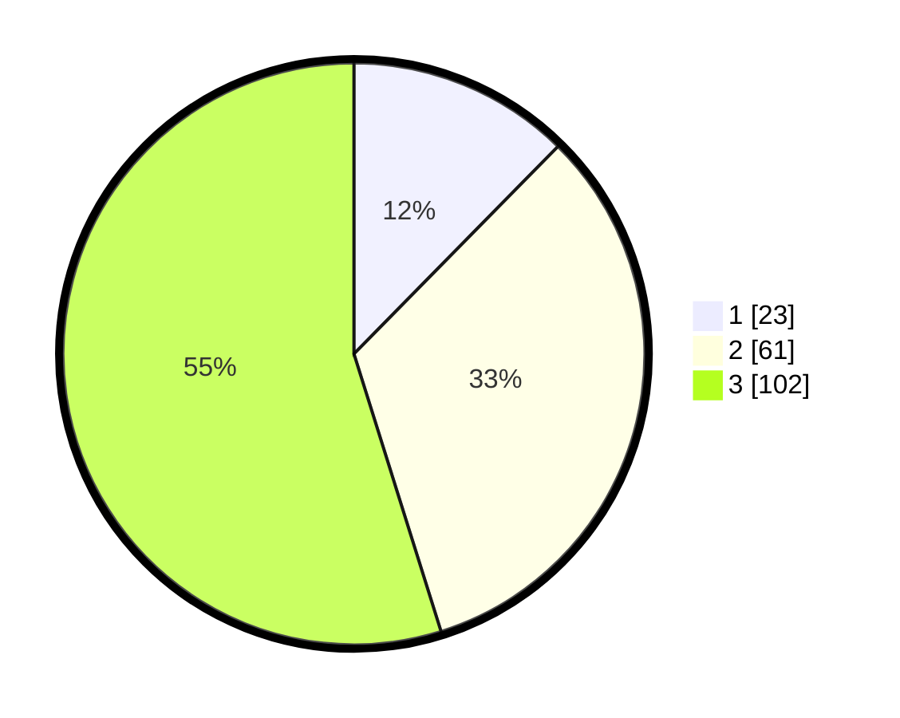

# Hasil

## Grafik

## Tabel

| No. | Nama Paslon    | Suara | Suara (raw) | Persentase |
|:--- |:-------------- | -----:| -----------:| ----------:|
| 1   | ANIES MUHAIMIN | 23    | [23][p-1]   | 12,37      |
| 2   | PRABOWO GIBRAN | 61    | [61][p-2]   | 32,80      |
| 3   | GANJAR MAHFUD  | 102   | [102][p-3]  | 54,84      |

[p-1]: https://github.com/gigit-pemilu/pemilu-2024-33-jawa-tengah/blob/main/pilpres/hitung-suara/sub/33-jawa-tengah/sub/06-purworejo/sub/08-bayan/sub/2021-bringin/sub/006-tps/sub/paslon-1.txt
[p-2]: https://github.com/gigit-pemilu/pemilu-2024-33-jawa-tengah/blob/main/pilpres/hitung-suara/sub/33-jawa-tengah/sub/06-purworejo/sub/08-bayan/sub/2021-bringin/sub/006-tps/sub/paslon-2.txt
[p-3]: https://github.com/gigit-pemilu/pemilu-2024-33-jawa-tengah/blob/main/pilpres/hitung-suara/sub/33-jawa-tengah/sub/06-purworejo/sub/08-bayan/sub/2021-bringin/sub/006-tps/sub/paslon-3.txt

## Foto C Plano

https://sirekap-obj-formc.kpu.go.id/e15e/pemilu/ppwp/33/06/08/20/21/3306082021006-20240214-221903--ecd6cb96-187f-4fc5-8c92-b471e43f8729.jpg

https://sirekap-obj-formc.kpu.go.id/e15e/pemilu/ppwp/33/06/08/20/21/3306082021006-20240214-222034--3d731899-6a06-4399-a9f1-052d173d4150.jpg

https://sirekap-obj-formc.kpu.go.id/e15e/pemilu/ppwp/33/06/08/20/21/3306082021006-20240214-222148--e6089639-58db-4364-a16b-f9563c4a240a.jpg

## Metadata

| Key        | Value               |
| ---------- | ------------------- |
| Time Stamp | 2024-02-15 12:00:28 |

