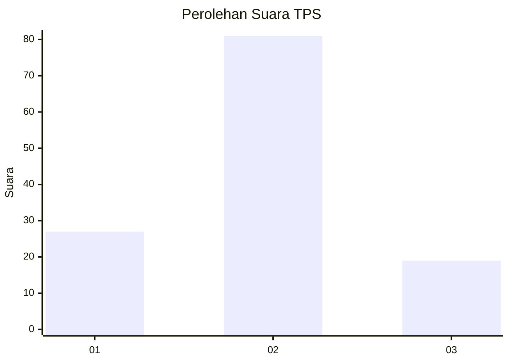
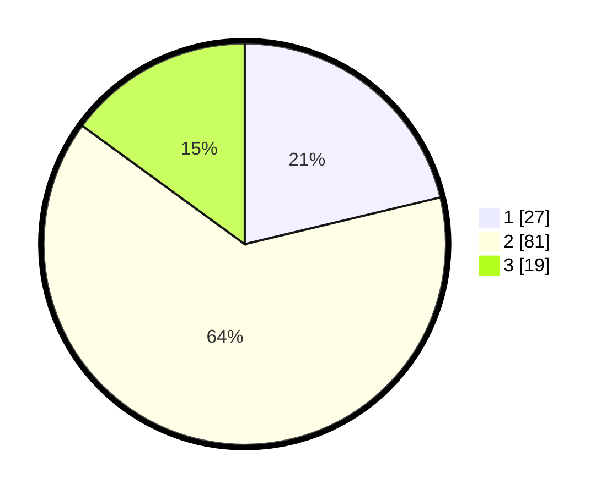

# Hasil

## Grafik

## Tabel

| No. | Nama Paslon    | Suara | Suara (raw) | Persentase |
|:--- |:-------------- | -----:| -----------:| ----------:|
| 1   | ANIES MUHAIMIN | 27    | [27][p-1]   | 21,26      |
| 2   | PRABOWO GIBRAN | 81    | [81][p-2]   | 63,78      |
| 3   | GANJAR MAHFUD  | 19    | [19][p-3]   | 14,96      |

[p-1]: https://github.com/gigit-pemilu/pemilu-2024/blob/main/pilpres/hitung-suara/sub/33-jawa-tengah/sub/06-purworejo/sub/08-bayan/sub/2023-pekutan/sub/005-tps/sub/paslon-1.txt
[p-2]: https://github.com/gigit-pemilu/pemilu-2024/blob/main/pilpres/hitung-suara/sub/33-jawa-tengah/sub/06-purworejo/sub/08-bayan/sub/2023-pekutan/sub/005-tps/sub/paslon-2.txt
[p-3]: https://github.com/gigit-pemilu/pemilu-2024/blob/main/pilpres/hitung-suara/sub/33-jawa-tengah/sub/06-purworejo/sub/08-bayan/sub/2023-pekutan/sub/005-tps/sub/paslon-3.txt

## Foto C Plano

https://sirekap-obj-formc.kpu.go.id/ed99/pemilu/ppwp/33/06/08/20/23/3306082023005-20240217-160958--d71ac3b9-0dd2-4a21-a2a1-1b42db5431a3.jpg

https://sirekap-obj-formc.kpu.go.id/ed99/pemilu/ppwp/33/06/08/20/23/3306082023005-20240217-161239--89da801a-c3a9-4be7-852a-195f0ebfee58.jpg

https://sirekap-obj-formc.kpu.go.id/ed99/pemilu/ppwp/33/06/08/20/23/3306082023005-20240217-161352--627e3b1f-6357-45f4-a2b4-37b7025db655.jpg

## Metadata

| Key        | Value               |
| ---------- | ------------------- |
| Time Stamp | 2024-02-19 06:16:00 |

