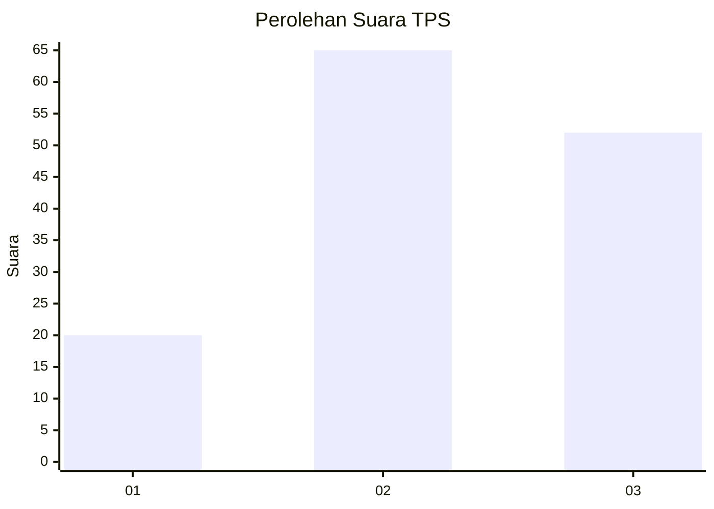
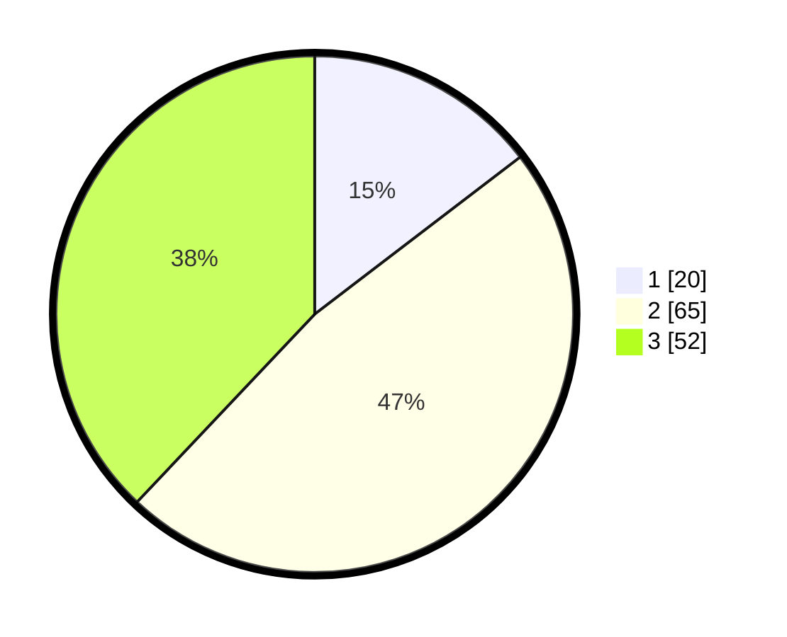

# Hasil

## Grafik

## Tabel

| No. | Nama Paslon    | Suara | Suara (raw) | Persentase |
|:--- |:-------------- | -----:| -----------:| ----------:|
| 1   | ANIES MUHAIMIN | 20    | [20][p-1]   | 14,60      |
| 2   | PRABOWO GIBRAN | 65    | [65][p-2]   | 47,45      |
| 3   | GANJAR MAHFUD  | 52    | [52][p-3]   | 37,96      |

[p-1]: https://github.com/gigit-pemilu/pemilu-2024/blob/main/pilpres/hitung-suara/sub/33-jawa-tengah/sub/06-purworejo/sub/08-bayan/sub/2024-jrakah/sub/007-tps/sub/paslon-1.txt
[p-2]: https://github.com/gigit-pemilu/pemilu-2024/blob/main/pilpres/hitung-suara/sub/33-jawa-tengah/sub/06-purworejo/sub/08-bayan/sub/2024-jrakah/sub/007-tps/sub/paslon-2.txt
[p-3]: https://github.com/gigit-pemilu/pemilu-2024/blob/main/pilpres/hitung-suara/sub/33-jawa-tengah/sub/06-purworejo/sub/08-bayan/sub/2024-jrakah/sub/007-tps/sub/paslon-3.txt

## Foto C Plano

https://sirekap-obj-formc.kpu.go.id/9290/pemilu/ppwp/33/06/08/20/24/3306082024007-20240214-210245--b7b94a4d-4d04-447a-a183-b8f77fb598b2.jpg

https://sirekap-obj-formc.kpu.go.id/9290/pemilu/ppwp/33/06/08/20/24/3306082024007-20240214-210530--d4c00405-98b5-4a03-89d5-4137c4af336e.jpg

https://sirekap-obj-formc.kpu.go.id/9290/pemilu/ppwp/33/06/08/20/24/3306082024007-20240214-210752--035fbae3-000c-41ba-999e-e4195310193f.jpg

## Metadata

| Key        | Value               |
| ---------- | ------------------- |
| Time Stamp | 2024-02-16 00:30:27 |

