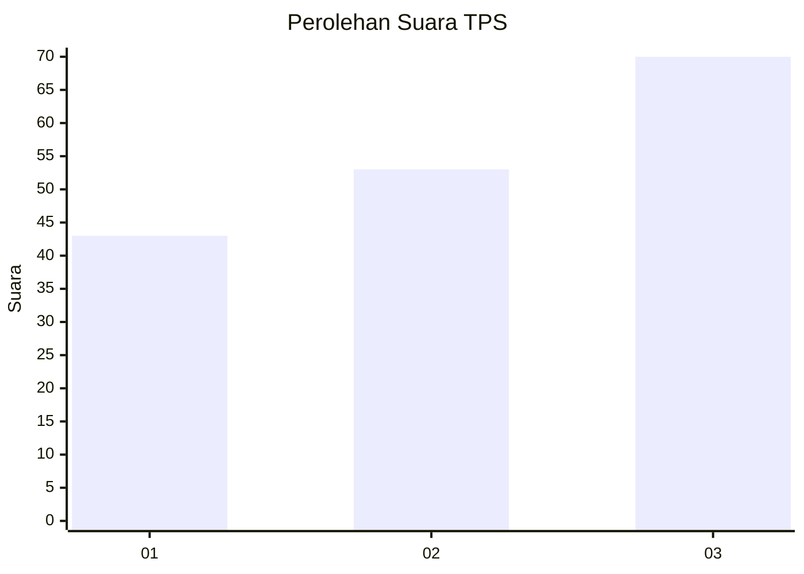
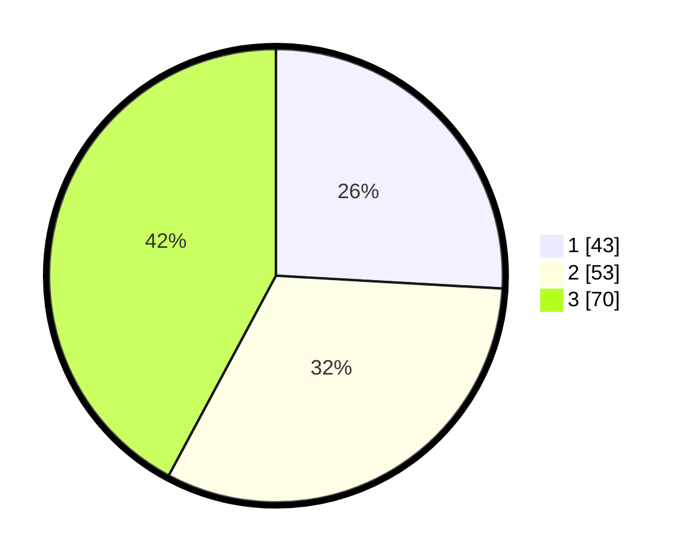

# Hasil

## Grafik

## Tabel

| No. | Nama Paslon    | Suara | Suara (raw) | Persentase |
|:--- |:-------------- | -----:| -----------:| ----------:|
| 1   | ANIES MUHAIMIN | 43    | [43][p-1]   | 25,90      |
| 2   | PRABOWO GIBRAN | 53    | [53][p-2]   | 31,93      |
| 3   | GANJAR MAHFUD  | 70    | [70][p-3]   | 42,17      |

[p-1]: https://github.com/gigit-pemilu/pemilu-2024/blob/main/pilpres/hitung-suara/sub/33-jawa-tengah/sub/06-purworejo/sub/08-bayan/sub/2026-pucangagung/sub/004-tps/sub/paslon-1.txt
[p-2]: https://github.com/gigit-pemilu/pemilu-2024/blob/main/pilpres/hitung-suara/sub/33-jawa-tengah/sub/06-purworejo/sub/08-bayan/sub/2026-pucangagung/sub/004-tps/sub/paslon-2.txt
[p-3]: https://github.com/gigit-pemilu/pemilu-2024/blob/main/pilpres/hitung-suara/sub/33-jawa-tengah/sub/06-purworejo/sub/08-bayan/sub/2026-pucangagung/sub/004-tps/sub/paslon-3.txt

## Foto C Plano

https://sirekap-obj-formc.kpu.go.id/095f/pemilu/ppwp/33/06/08/20/26/3306082026004-20240215-041725--adc56126-06fa-4dc1-9091-1c74ac0ac261.jpg

https://sirekap-obj-formc.kpu.go.id/095f/pemilu/ppwp/33/06/08/20/26/3306082026004-20240215-041932--d506ddc6-ac15-4e77-b2e6-816f5ee314d5.jpg

https://sirekap-obj-formc.kpu.go.id/095f/pemilu/ppwp/33/06/08/20/26/3306082026004-20240215-042339--e665256f-7ee7-4886-85b7-e0ecea1f5e9b.jpg

## Metadata

| Key        | Value               |
| ---------- | ------------------- |
| Time Stamp | 2024-02-15 21:01:18 |

