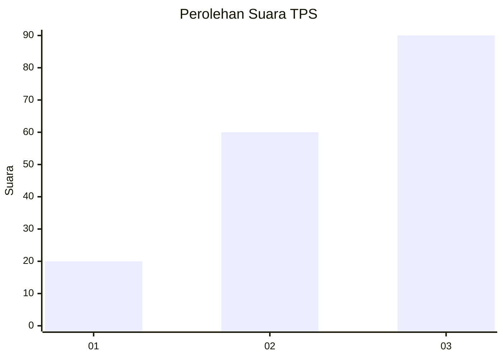
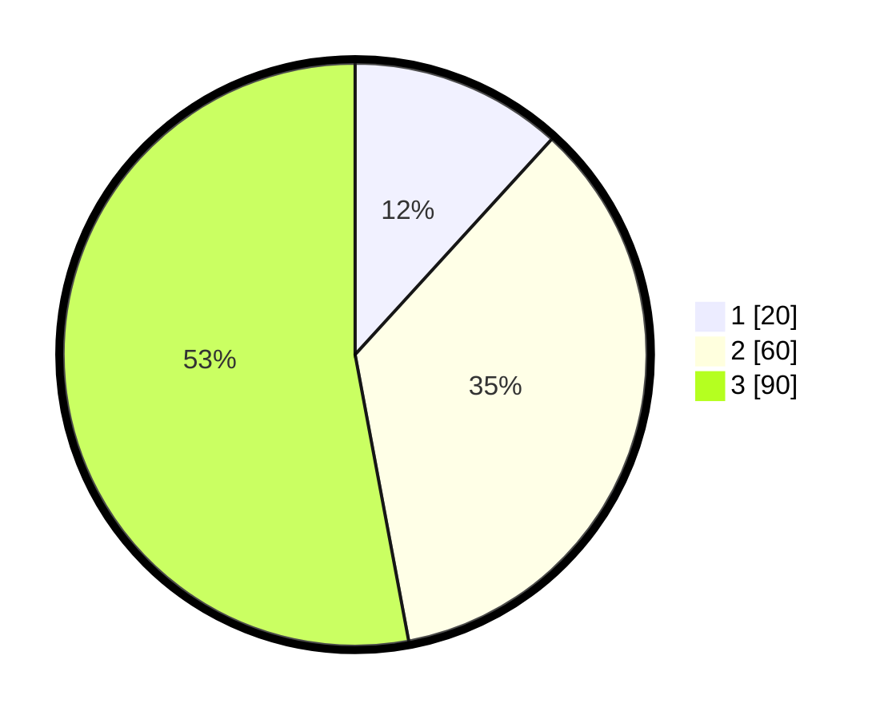

# Hasil

## Grafik

## Tabel

| No. | Nama Paslon    | Suara | Suara (raw) | Persentase |
|:--- |:-------------- | -----:| -----------:| ----------:|
| 1   | ANIES MUHAIMIN | 20    | [20][p-1]   | 11,76      |
| 2   | PRABOWO GIBRAN | 60    | [60][p-2]   | 35,29      |
| 3   | GANJAR MAHFUD  | 90    | [90][p-3]   | 52,94      |

[p-1]: https://github.com/gigit-pemilu/pemilu-2024/blob/main/pilpres/hitung-suara/sub/33-jawa-tengah/sub/06-purworejo/sub/08-bayan/sub/2026-pucangagung/sub/011-tps/sub/paslon-1.txt
[p-2]: https://github.com/gigit-pemilu/pemilu-2024/blob/main/pilpres/hitung-suara/sub/33-jawa-tengah/sub/06-purworejo/sub/08-bayan/sub/2026-pucangagung/sub/011-tps/sub/paslon-2.txt
[p-3]: https://github.com/gigit-pemilu/pemilu-2024/blob/main/pilpres/hitung-suara/sub/33-jawa-tengah/sub/06-purworejo/sub/08-bayan/sub/2026-pucangagung/sub/011-tps/sub/paslon-3.txt

## Foto C Plano

https://sirekap-obj-formc.kpu.go.id/0039/pemilu/ppwp/33/06/08/20/26/3306082026011-20240214-234020--6b589b97-c4c6-4f54-b685-d8caa404d7ba.jpg

https://sirekap-obj-formc.kpu.go.id/0039/pemilu/ppwp/33/06/08/20/26/3306082026011-20240214-234212--04621294-a8a7-40f3-907b-8ad6bda00578.jpg

https://sirekap-obj-formc.kpu.go.id/0039/pemilu/ppwp/33/06/08/20/26/3306082026011-20240214-234321--b4275ccc-24e6-4668-9fd8-7c6e2b5ec74a.jpg

## Metadata

| Key        | Value               |
| ---------- | ------------------- |
| Time Stamp | 2024-02-15 16:00:26 |

