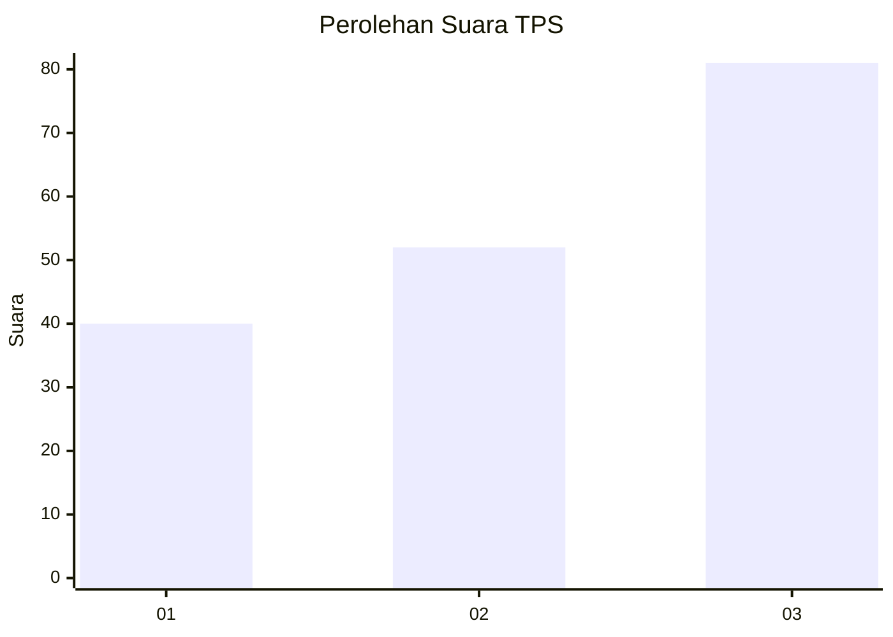
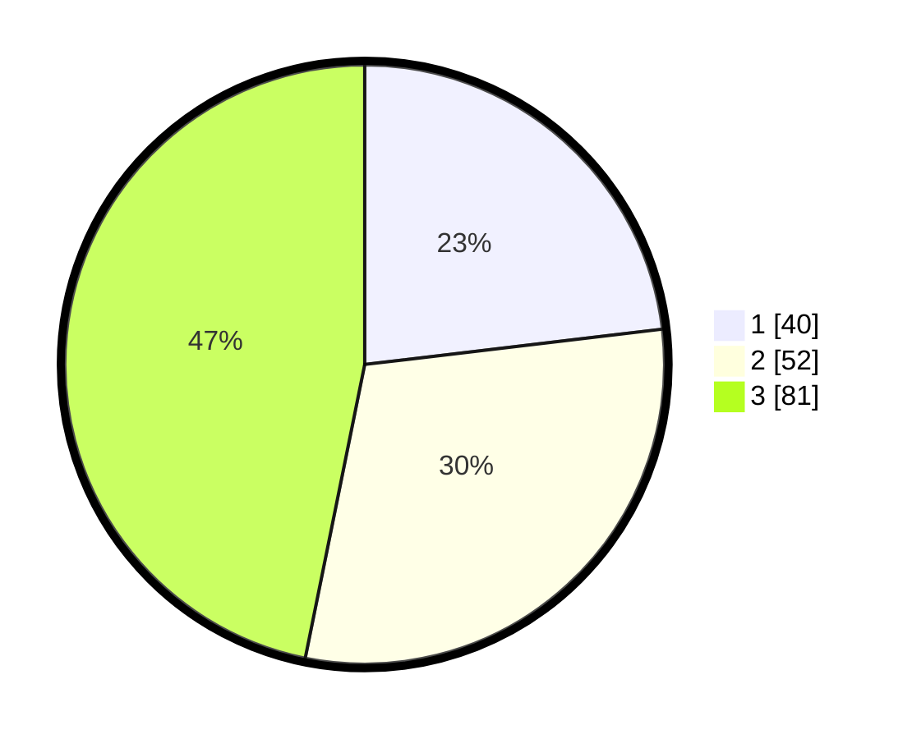

# Hasil

## Grafik

## Tabel

| No. | Nama Paslon    | Suara | Suara (raw) | Persentase |
|:--- |:-------------- | -----:| -----------:| ----------:|
| 1   | ANIES MUHAIMIN | 40    | [40][p-1]   | 23,12      |
| 2   | PRABOWO GIBRAN | 52    | [52][p-2]   | 30,06      |
| 3   | GANJAR MAHFUD  | 81    | [81][p-3]   | 46,82      |

[p-1]: https://github.com/gigit-pemilu/pemilu-2024/blob/main/pilpres/hitung-suara/sub/33-jawa-tengah/sub/06-purworejo/sub/08-bayan/sub/2026-pucangagung/sub/015-tps/sub/paslon-1.txt
[p-2]: https://github.com/gigit-pemilu/pemilu-2024/blob/main/pilpres/hitung-suara/sub/33-jawa-tengah/sub/06-purworejo/sub/08-bayan/sub/2026-pucangagung/sub/015-tps/sub/paslon-2.txt
[p-3]: https://github.com/gigit-pemilu/pemilu-2024/blob/main/pilpres/hitung-suara/sub/33-jawa-tengah/sub/06-purworejo/sub/08-bayan/sub/2026-pucangagung/sub/015-tps/sub/paslon-3.txt

## Foto C Plano

https://sirekap-obj-formc.kpu.go.id/8419/pemilu/ppwp/33/06/08/20/26/3306082026015-20240215-192844--301f94f4-aecd-48d1-865b-04be56c0f4f0.jpg

https://sirekap-obj-formc.kpu.go.id/8419/pemilu/ppwp/33/06/08/20/26/3306082026015-20240214-231923--a6d85b84-33b9-4880-869b-dc2713421dae.jpg

https://sirekap-obj-formc.kpu.go.id/8419/pemilu/ppwp/33/06/08/20/26/3306082026015-20240214-232036--61ea2c0c-683b-4400-ae23-8cf798b6478a.jpg

## Metadata

| Key        | Value               |
| ---------- | ------------------- |
| Time Stamp | 2024-02-16 00:30:27 |

