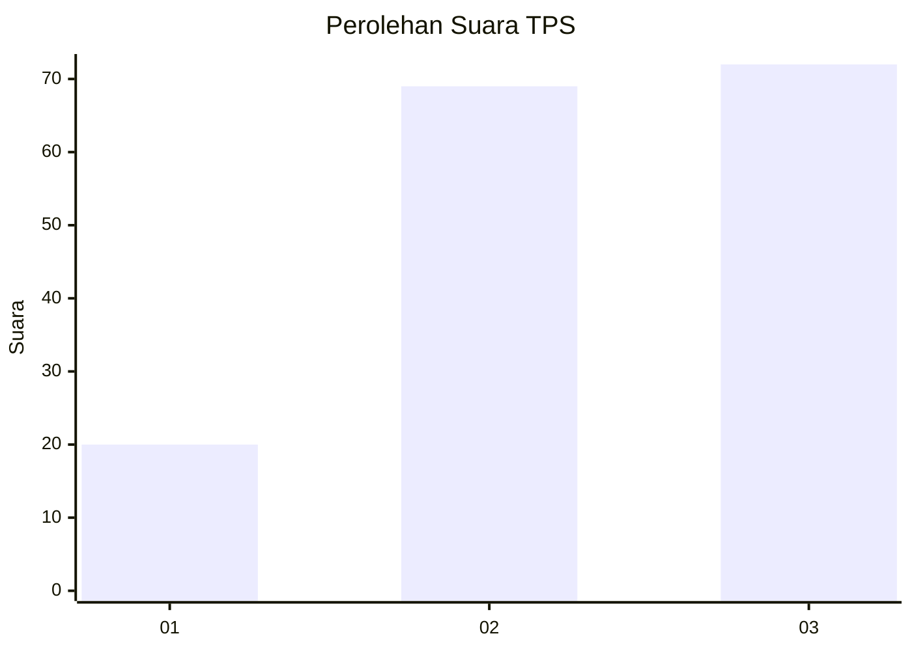
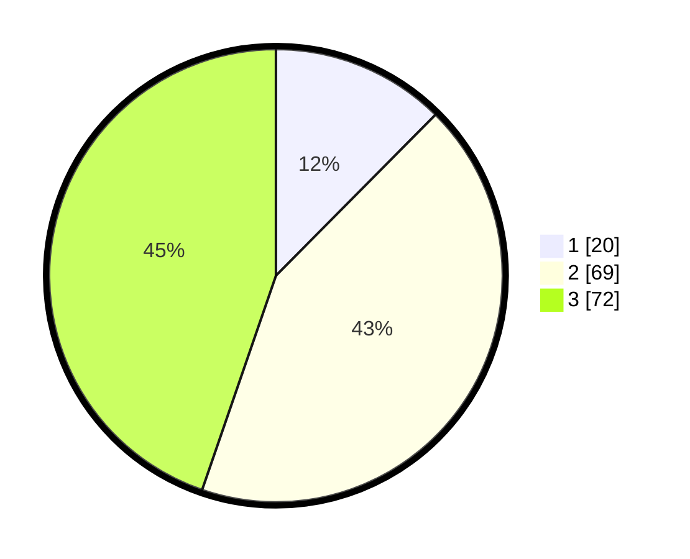

# Hasil

## Grafik

## Tabel

| No. | Nama Paslon    | Suara | Suara (raw) | Persentase |
|:--- |:-------------- | -----:| -----------:| ----------:|
| 1   | ANIES MUHAIMIN | 20    | [20][p-1]   | 12,42      |
| 2   | PRABOWO GIBRAN | 69    | [69][p-2]   | 42,86      |
| 3   | GANJAR MAHFUD  | 72    | [72][p-3]   | 44,72      |

[p-1]: https://github.com/gigit-pemilu/pemilu-2024/blob/main/pilpres/hitung-suara/sub/33-jawa-tengah/sub/06-purworejo/sub/09-kutoarjo/sub/1009-bayem/sub/002-tps/sub/paslon-1.txt
[p-2]: https://github.com/gigit-pemilu/pemilu-2024/blob/main/pilpres/hitung-suara/sub/33-jawa-tengah/sub/06-purworejo/sub/09-kutoarjo/sub/1009-bayem/sub/002-tps/sub/paslon-2.txt
[p-3]: https://github.com/gigit-pemilu/pemilu-2024/blob/main/pilpres/hitung-suara/sub/33-jawa-tengah/sub/06-purworejo/sub/09-kutoarjo/sub/1009-bayem/sub/002-tps/sub/paslon-3.txt

## Foto C Plano

https://sirekap-obj-formc.kpu.go.id/7242/pemilu/ppwp/33/06/09/10/09/3306091009002-20240217-183300--e8d37256-a45f-4382-b971-25bcd1bdd1fd.jpg

https://sirekap-obj-formc.kpu.go.id/7242/pemilu/ppwp/33/06/09/10/09/3306091009002-20240217-190631--7339fe0b-574c-4efd-835b-89d48f71f168.jpg

https://sirekap-obj-formc.kpu.go.id/7242/pemilu/ppwp/33/06/09/10/09/3306091009002-20240217-183643--e17f25e5-a1e9-4dc9-bf07-2877bd3e80ed.jpg

## Metadata

| Key        | Value               |
| ---------- | ------------------- |
| Time Stamp | 2024-02-17 19:30:00 |

