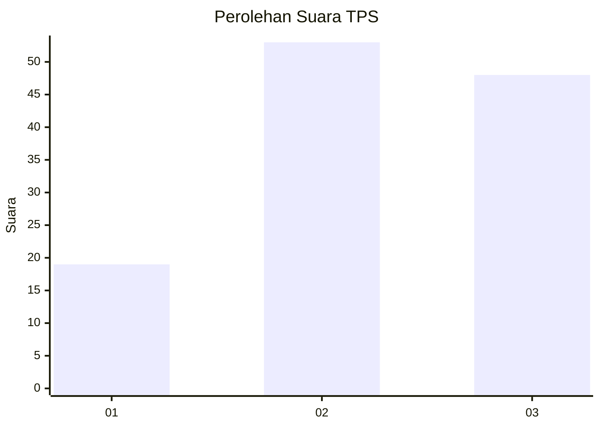
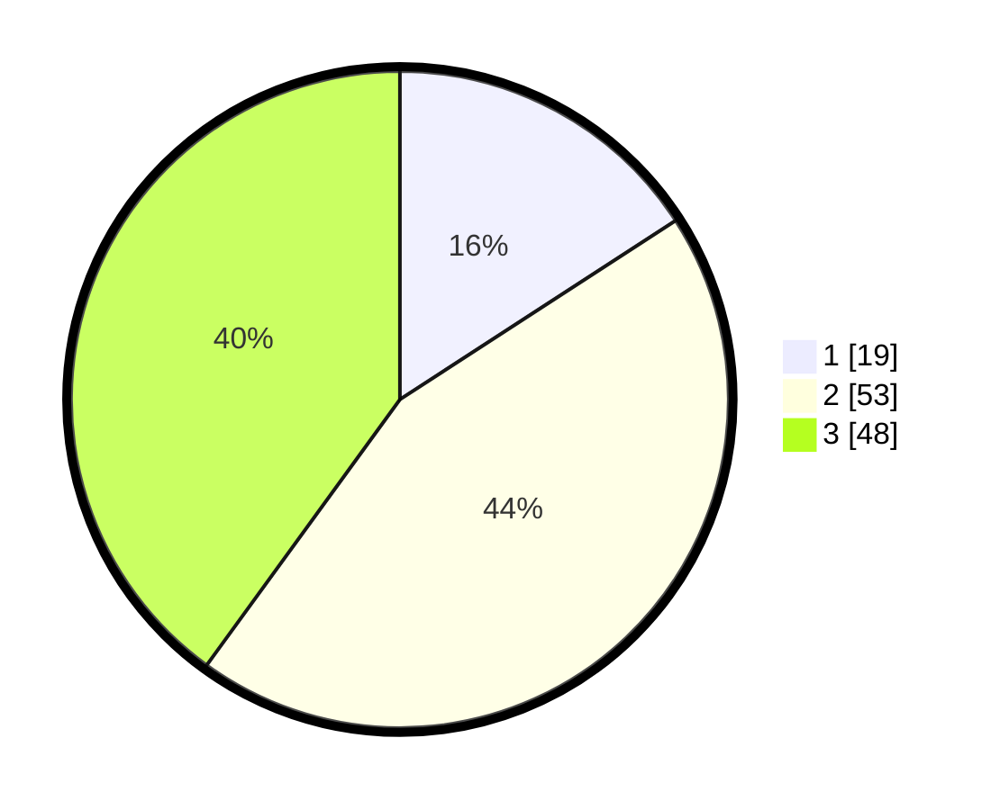

# Hasil

## Grafik

## Tabel

| No. | Nama Paslon    | Suara | Suara (raw) | Persentase |
|:--- |:-------------- | -----:| -----------:| ----------:|
| 1   | ANIES MUHAIMIN | 19    | [19][p-1]   | 15,83      |
| 2   | PRABOWO GIBRAN | 53    | [53][p-2]   | 44,17      |
| 3   | GANJAR MAHFUD  | 48    | [48][p-3]   | 40,00      |

[p-1]: https://github.com/gigit-pemilu/pemilu-2024-33-jawa-tengah/blob/main/pilpres/hitung-suara/sub/33-jawa-tengah/sub/06-purworejo/sub/09-kutoarjo/sub/1016-kutoarjo/sub/007-tps/sub/paslon-1.txt
[p-2]: https://github.com/gigit-pemilu/pemilu-2024-33-jawa-tengah/blob/main/pilpres/hitung-suara/sub/33-jawa-tengah/sub/06-purworejo/sub/09-kutoarjo/sub/1016-kutoarjo/sub/007-tps/sub/paslon-2.txt
[p-3]: https://github.com/gigit-pemilu/pemilu-2024-33-jawa-tengah/blob/main/pilpres/hitung-suara/sub/33-jawa-tengah/sub/06-purworejo/sub/09-kutoarjo/sub/1016-kutoarjo/sub/007-tps/sub/paslon-3.txt

## Foto C Plano

https://sirekap-obj-formc.kpu.go.id/7fb6/pemilu/ppwp/33/06/09/10/16/3306091016007-20240218-171803--ce7aa078-4781-48d4-b776-183f2b2b88a4.jpg

https://sirekap-obj-formc.kpu.go.id/7fb6/pemilu/ppwp/33/06/09/10/16/3306091016007-20240215-005703--ac441e96-acf2-4d07-b11f-ea9710557b1e.jpg

https://sirekap-obj-formc.kpu.go.id/7fb6/pemilu/ppwp/33/06/09/10/16/3306091016007-20240218-171548--ec47ae3d-3b9a-4826-8e41-bc2f4ad47471.jpg

## Metadata

| Key        | Value               |
| ---------- | ------------------- |
| Time Stamp | 2024-02-19 06:16:00 |

