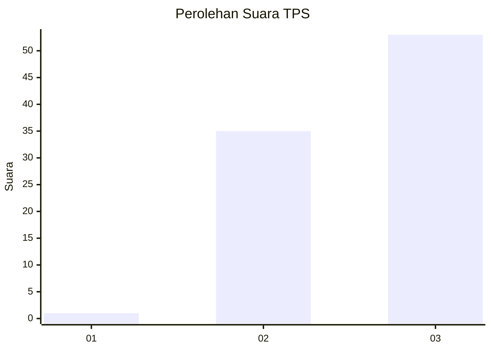
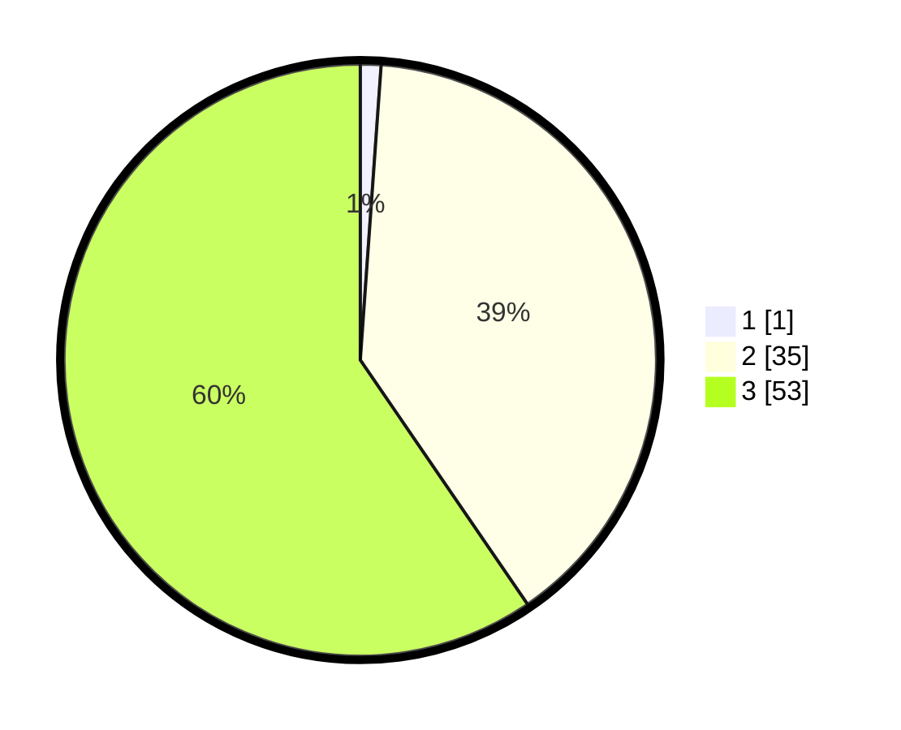

# Hasil

## Grafik

## Tabel

| No. | Nama Paslon    | Suara | Suara (raw) | Persentase |
|:--- |:-------------- | -----:| -----------:| ----------:|
| 1   | ANIES MUHAIMIN | 1     | [1][p-1]    | 1,12       |
| 2   | PRABOWO GIBRAN | 35    | [35][p-2]   | 39,33      |
| 3   | GANJAR MAHFUD  | 53    | [53][p-3]   | 59,55      |

[p-1]: https://github.com/gigit-pemilu/pemilu-2024-33-jawa-tengah/blob/main/pilpres/hitung-suara/sub/33-jawa-tengah/sub/06-purworejo/sub/09-kutoarjo/sub/1016-kutoarjo/sub/012-tps/sub/paslon-1.txt
[p-2]: https://github.com/gigit-pemilu/pemilu-2024-33-jawa-tengah/blob/main/pilpres/hitung-suara/sub/33-jawa-tengah/sub/06-purworejo/sub/09-kutoarjo/sub/1016-kutoarjo/sub/012-tps/sub/paslon-2.txt
[p-3]: https://github.com/gigit-pemilu/pemilu-2024-33-jawa-tengah/blob/main/pilpres/hitung-suara/sub/33-jawa-tengah/sub/06-purworejo/sub/09-kutoarjo/sub/1016-kutoarjo/sub/012-tps/sub/paslon-3.txt

## Foto C Plano

https://sirekap-obj-formc.kpu.go.id/b207/pemilu/ppwp/33/06/09/10/16/3306091016012-20240215-003449--4a3565f3-6b58-4bc2-8a41-76fe538ca608.jpg

https://sirekap-obj-formc.kpu.go.id/b207/pemilu/ppwp/33/06/09/10/16/3306091016012-20240215-003511--97ce49bd-81f9-4706-a9b0-69c7fe988202.jpg

https://sirekap-obj-formc.kpu.go.id/b207/pemilu/ppwp/33/06/09/10/16/3306091016012-20240214-205459--a6272bcc-729a-48fd-9c1f-37d065e524e2.jpg

## Metadata

| Key        | Value               |
| ---------- | ------------------- |
| Time Stamp | 2024-02-15 17:00:25 |

