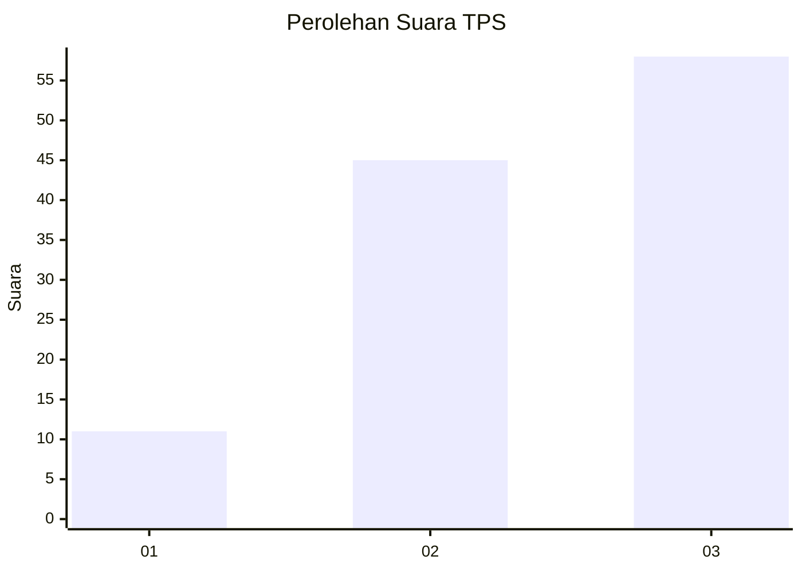
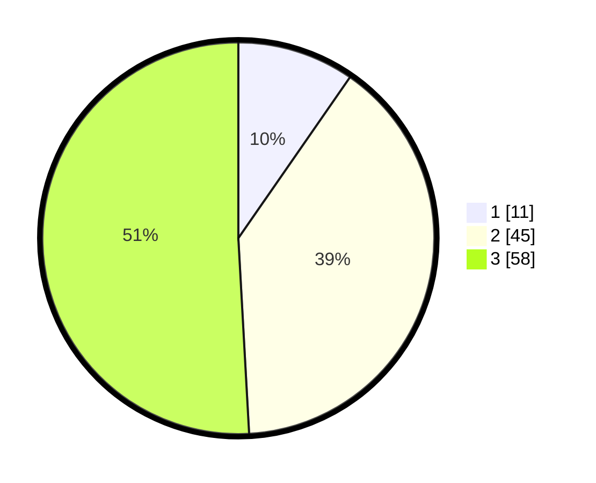

# Hasil

## Grafik

## Tabel

| No. | Nama Paslon    | Suara | Suara (raw) | Persentase |
|:--- |:-------------- | -----:| -----------:| ----------:|
| 1   | ANIES MUHAIMIN | 11    | [11][p-1]   | 9,65       |
| 2   | PRABOWO GIBRAN | 45    | [45][p-2]   | 39,47      |
| 3   | GANJAR MAHFUD  | 58    | [58][p-3]   | 50,88      |

[p-1]: https://github.com/gigit-pemilu/pemilu-2024-33-jawa-tengah/blob/main/pilpres/hitung-suara/sub/33-jawa-tengah/sub/06-purworejo/sub/09-kutoarjo/sub/1016-kutoarjo/sub/013-tps/sub/paslon-1.txt
[p-2]: https://github.com/gigit-pemilu/pemilu-2024-33-jawa-tengah/blob/main/pilpres/hitung-suara/sub/33-jawa-tengah/sub/06-purworejo/sub/09-kutoarjo/sub/1016-kutoarjo/sub/013-tps/sub/paslon-2.txt
[p-3]: https://github.com/gigit-pemilu/pemilu-2024-33-jawa-tengah/blob/main/pilpres/hitung-suara/sub/33-jawa-tengah/sub/06-purworejo/sub/09-kutoarjo/sub/1016-kutoarjo/sub/013-tps/sub/paslon-3.txt

## Foto C Plano

https://sirekap-obj-formc.kpu.go.id/13a1/pemilu/ppwp/33/06/09/10/16/3306091016013-20240214-141637--a407815b-d29e-4b94-9af5-88a34c8599e7.jpg

https://sirekap-obj-formc.kpu.go.id/13a1/pemilu/ppwp/33/06/09/10/16/3306091016013-20240214-141737--2028a8d1-dd18-431c-9237-df7c73d29344.jpg

https://sirekap-obj-formc.kpu.go.id/13a1/pemilu/ppwp/33/06/09/10/16/3306091016013-20240214-141839--c9b39a8f-f482-44af-be6d-6be43829e510.jpg

## Metadata

| Key        | Value               |
| ---------- | ------------------- |
| Time Stamp | 2024-02-14 21:46:01 |

