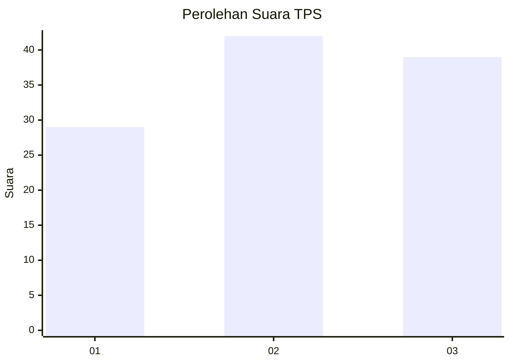
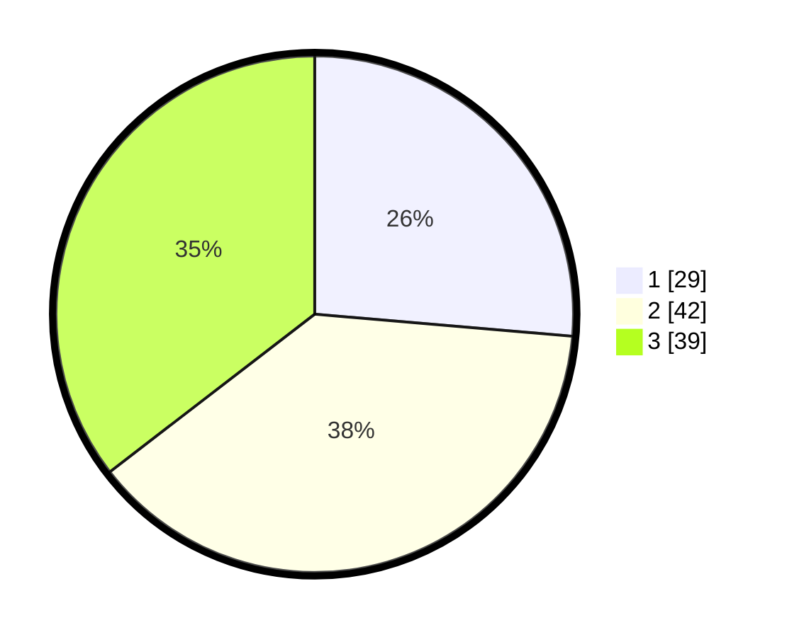

# Hasil

## Grafik

## Tabel

| No. | Nama Paslon    | Suara | Suara (raw) | Persentase |
|:--- |:-------------- | -----:| -----------:| ----------:|
| 1   | ANIES MUHAIMIN | 29    | [29][p-1]   | 26,36      |
| 2   | PRABOWO GIBRAN | 42    | [42][p-2]   | 38,18      |
| 3   | GANJAR MAHFUD  | 39    | [39][p-3]   | 35,45      |

[p-1]: https://github.com/gigit-pemilu/pemilu-2024-33-jawa-tengah/blob/main/pilpres/hitung-suara/sub/33-jawa-tengah/sub/06-purworejo/sub/09-kutoarjo/sub/1016-kutoarjo/sub/020-tps/sub/paslon-1.txt
[p-2]: https://github.com/gigit-pemilu/pemilu-2024-33-jawa-tengah/blob/main/pilpres/hitung-suara/sub/33-jawa-tengah/sub/06-purworejo/sub/09-kutoarjo/sub/1016-kutoarjo/sub/020-tps/sub/paslon-2.txt
[p-3]: https://github.com/gigit-pemilu/pemilu-2024-33-jawa-tengah/blob/main/pilpres/hitung-suara/sub/33-jawa-tengah/sub/06-purworejo/sub/09-kutoarjo/sub/1016-kutoarjo/sub/020-tps/sub/paslon-3.txt

## Foto C Plano

https://sirekap-obj-formc.kpu.go.id/1369/pemilu/ppwp/33/06/09/10/16/3306091016020-20240214-214115--2778bd71-cf10-40b3-aca1-83e8a0313d6e.jpg

https://sirekap-obj-formc.kpu.go.id/1369/pemilu/ppwp/33/06/09/10/16/3306091016020-20240214-214300--32aa6028-a3d2-4cf6-bac6-b254835bc404.jpg

https://sirekap-obj-formc.kpu.go.id/1369/pemilu/ppwp/33/06/09/10/16/3306091016020-20240214-214450--c912fd3b-1087-41d6-baa7-5c4639b55483.jpg

## Metadata

| Key        | Value               |
| ---------- | ------------------- |
| Time Stamp | 2024-02-15 17:00:25 |

