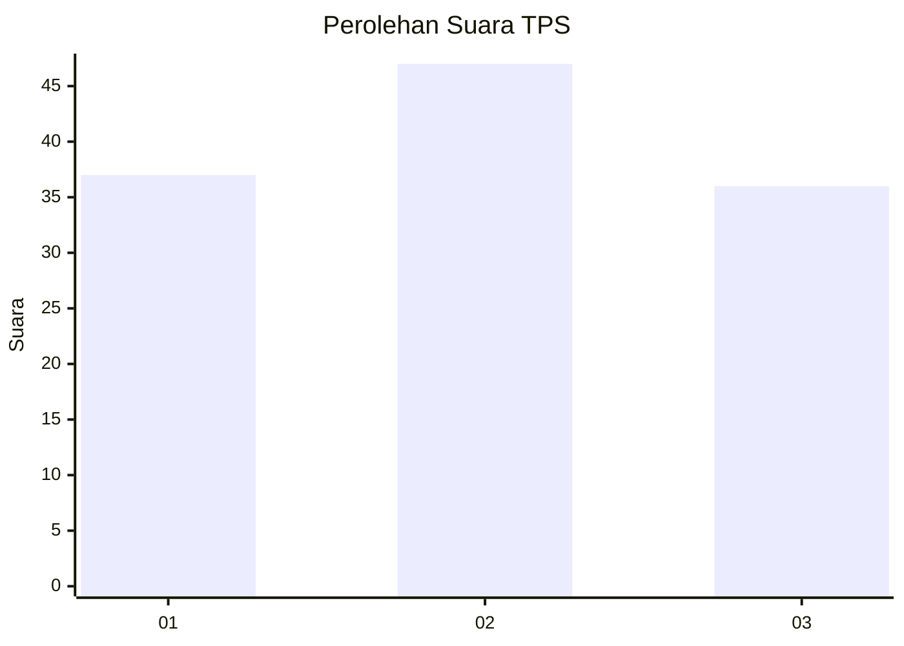
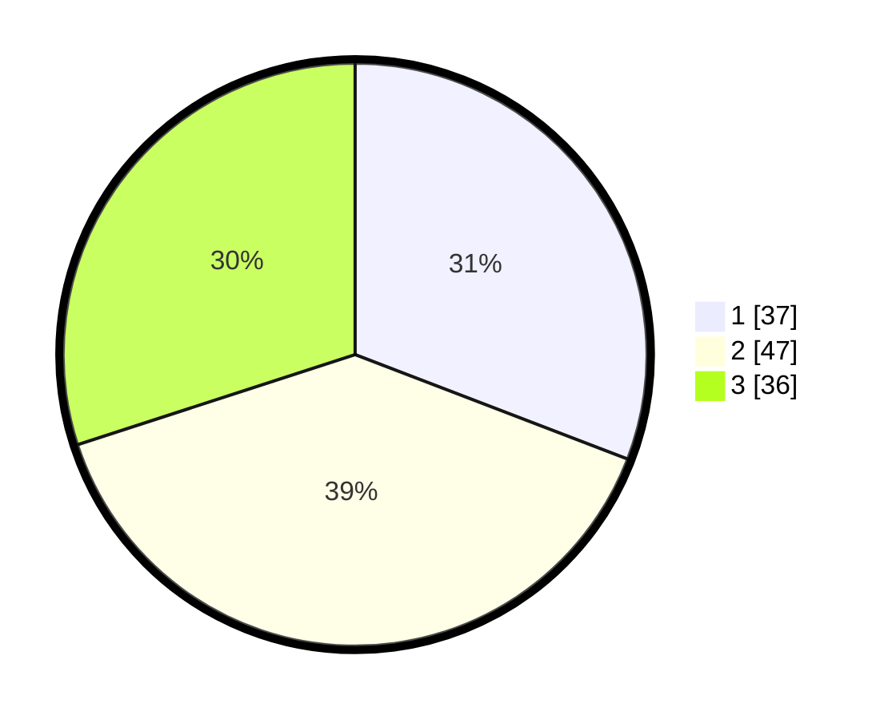

# Hasil

## Grafik

## Tabel

| No. | Nama Paslon    | Suara | Suara (raw) | Persentase |
|:--- |:-------------- | -----:| -----------:| ----------:|
| 1   | ANIES MUHAIMIN | 37    | [37][p-1]   | 30,83      |
| 2   | PRABOWO GIBRAN | 47    | [47][p-2]   | 39,17      |
| 3   | GANJAR MAHFUD  | 36    | [36][p-3]   | 30,00      |

[p-1]: https://github.com/gigit-pemilu/pemilu-2024-33-jawa-tengah/blob/main/pilpres/hitung-suara/sub/33-jawa-tengah/sub/06-purworejo/sub/09-kutoarjo/sub/1016-kutoarjo/sub/023-tps/sub/paslon-1.txt
[p-2]: https://github.com/gigit-pemilu/pemilu-2024-33-jawa-tengah/blob/main/pilpres/hitung-suara/sub/33-jawa-tengah/sub/06-purworejo/sub/09-kutoarjo/sub/1016-kutoarjo/sub/023-tps/sub/paslon-2.txt
[p-3]: https://github.com/gigit-pemilu/pemilu-2024-33-jawa-tengah/blob/main/pilpres/hitung-suara/sub/33-jawa-tengah/sub/06-purworejo/sub/09-kutoarjo/sub/1016-kutoarjo/sub/023-tps/sub/paslon-3.txt

## Foto C Plano

https://sirekap-obj-formc.kpu.go.id/1a43/pemilu/ppwp/33/06/09/10/16/3306091016023-20240215-143753--7367acd7-4d5a-474b-bb6c-184be546c4c3.jpg

https://sirekap-obj-formc.kpu.go.id/1a43/pemilu/ppwp/33/06/09/10/16/3306091016023-20240215-143815--9a2b35d8-63e7-4384-a717-344abe038767.jpg

https://sirekap-obj-formc.kpu.go.id/1a43/pemilu/ppwp/33/06/09/10/16/3306091016023-20240215-143819--529edd56-1af9-4e2f-bdfb-29fca2ecf3ac.jpg

## Metadata

| Key        | Value               |
| ---------- | ------------------- |
| Time Stamp | 2024-02-16 00:30:27 |

