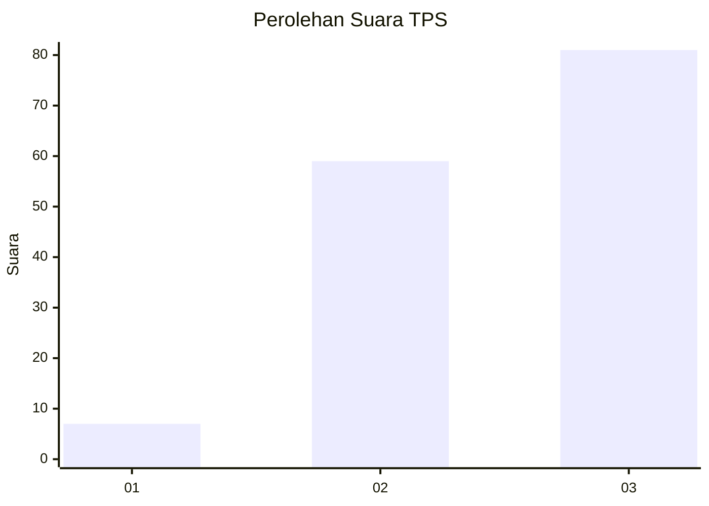
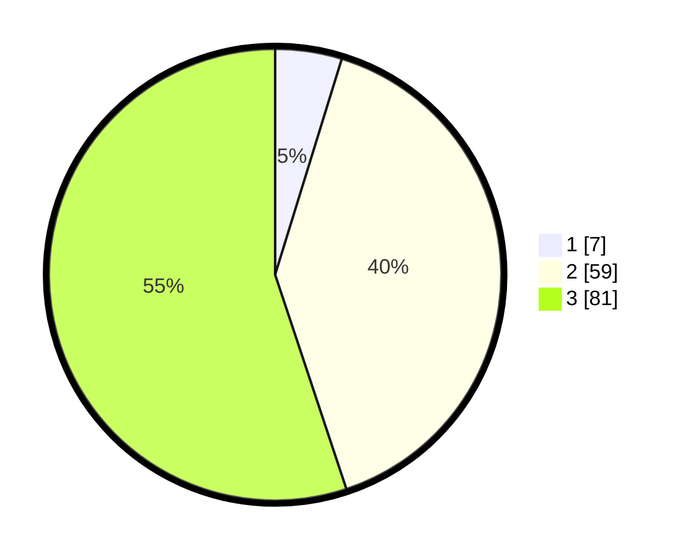

# Hasil

## Grafik

## Tabel

| No. | Nama Paslon    | Suara | Suara (raw) | Persentase |
|:--- |:-------------- | -----:| -----------:| ----------:|
| 1   | ANIES MUHAIMIN | 7     | [7][p-1]    | 4,76       |
| 2   | PRABOWO GIBRAN | 59    | [59][p-2]   | 40,14      |
| 3   | GANJAR MAHFUD  | 81    | [81][p-3]   | 55,10      |

[p-1]: https://github.com/gigit-pemilu/pemilu-2024-33-jawa-tengah/blob/main/pilpres/hitung-suara/sub/33-jawa-tengah/sub/06-purworejo/sub/09-kutoarjo/sub/1016-kutoarjo/sub/033-tps/sub/paslon-1.txt
[p-2]: https://github.com/gigit-pemilu/pemilu-2024-33-jawa-tengah/blob/main/pilpres/hitung-suara/sub/33-jawa-tengah/sub/06-purworejo/sub/09-kutoarjo/sub/1016-kutoarjo/sub/033-tps/sub/paslon-2.txt
[p-3]: https://github.com/gigit-pemilu/pemilu-2024-33-jawa-tengah/blob/main/pilpres/hitung-suara/sub/33-jawa-tengah/sub/06-purworejo/sub/09-kutoarjo/sub/1016-kutoarjo/sub/033-tps/sub/paslon-3.txt

## Foto C Plano

https://sirekap-obj-formc.kpu.go.id/419e/pemilu/ppwp/33/06/09/10/16/3306091016033-20240214-235208--afe975bb-30eb-49d1-9956-05f03f39be7c.jpg

https://sirekap-obj-formc.kpu.go.id/419e/pemilu/ppwp/33/06/09/10/16/3306091016033-20240214-235411--e0c243d9-8023-4683-87d1-ba017babeb4c.jpg

https://sirekap-obj-formc.kpu.go.id/419e/pemilu/ppwp/33/06/09/10/16/3306091016033-20240214-235929--ffe4b6f0-7909-42fc-984b-9ca6a386cadf.jpg

## Metadata

| Key        | Value               |
| ---------- | ------------------- |
| Time Stamp | 2024-02-16 01:30:27 |

