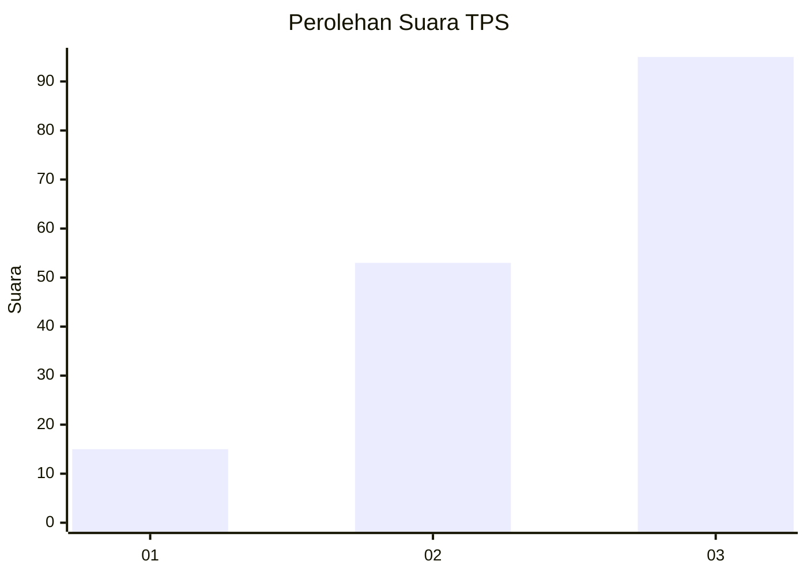
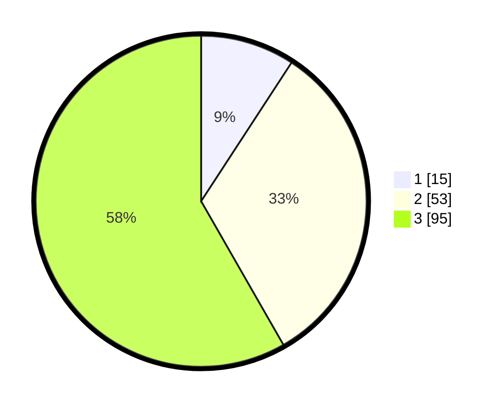

# Hasil

## Grafik

## Tabel

| No. | Nama Paslon    | Suara | Suara (raw) | Persentase |
|:--- |:-------------- | -----:| -----------:| ----------:|
| 1   | ANIES MUHAIMIN | 15    | [15][p-1]   | 9,20       |
| 2   | PRABOWO GIBRAN | 53    | [53][p-2]   | 32,52      |
| 3   | GANJAR MAHFUD  | 95    | [95][p-3]   | 58,28      |

[p-1]: https://github.com/gigit-pemilu/pemilu-2024-33-jawa-tengah/blob/main/pilpres/hitung-suara/sub/33-jawa-tengah/sub/06-purworejo/sub/09-kutoarjo/sub/1016-kutoarjo/sub/035-tps/sub/paslon-1.txt
[p-2]: https://github.com/gigit-pemilu/pemilu-2024-33-jawa-tengah/blob/main/pilpres/hitung-suara/sub/33-jawa-tengah/sub/06-purworejo/sub/09-kutoarjo/sub/1016-kutoarjo/sub/035-tps/sub/paslon-2.txt
[p-3]: https://github.com/gigit-pemilu/pemilu-2024-33-jawa-tengah/blob/main/pilpres/hitung-suara/sub/33-jawa-tengah/sub/06-purworejo/sub/09-kutoarjo/sub/1016-kutoarjo/sub/035-tps/sub/paslon-3.txt

## Foto C Plano

https://sirekap-obj-formc.kpu.go.id/c41f/pemilu/ppwp/33/06/09/10/16/3306091016035-20240214-204616--e88ffed1-d496-4cfe-bfce-6f42d49d876c.jpg

https://sirekap-obj-formc.kpu.go.id/c41f/pemilu/ppwp/33/06/09/10/16/3306091016035-20240214-204630--5982a776-442b-4a80-a63c-9e0fdf1fe6a5.jpg

https://sirekap-obj-formc.kpu.go.id/c41f/pemilu/ppwp/33/06/09/10/16/3306091016035-20240214-204639--ad1b1f03-d9d3-4a09-b6fa-e6b4a434452d.jpg

## Metadata

| Key        | Value               |
| ---------- | ------------------- |
| Time Stamp | 2024-02-15 15:30:25 |

