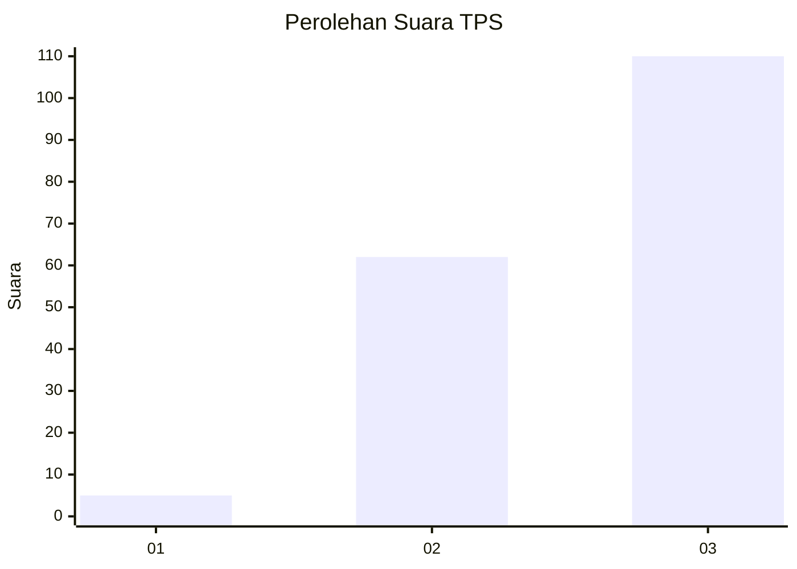
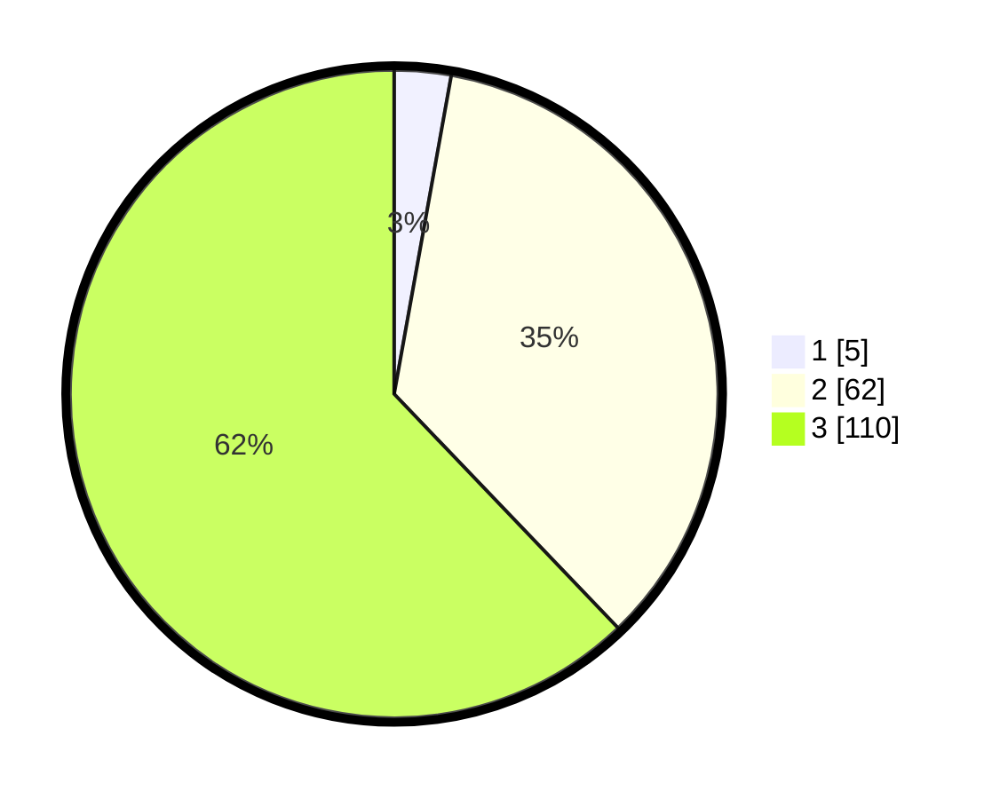

# Hasil

## Grafik

## Tabel

| No. | Nama Paslon    | Suara | Suara (raw) | Persentase |
|:--- |:-------------- | -----:| -----------:| ----------:|
| 1   | ANIES MUHAIMIN | 5     | [5][p-1]    | 2,82       |
| 2   | PRABOWO GIBRAN | 62    | [62][p-2]   | 35,03      |
| 3   | GANJAR MAHFUD  | 110   | [110][p-3]  | 62,15      |

[p-1]: https://github.com/gigit-pemilu/pemilu-2024-33-jawa-tengah/blob/main/pilpres/hitung-suara/sub/33-jawa-tengah/sub/06-purworejo/sub/09-kutoarjo/sub/1016-kutoarjo/sub/046-tps/sub/paslon-1.txt
[p-2]: https://github.com/gigit-pemilu/pemilu-2024-33-jawa-tengah/blob/main/pilpres/hitung-suara/sub/33-jawa-tengah/sub/06-purworejo/sub/09-kutoarjo/sub/1016-kutoarjo/sub/046-tps/sub/paslon-2.txt
[p-3]: https://github.com/gigit-pemilu/pemilu-2024-33-jawa-tengah/blob/main/pilpres/hitung-suara/sub/33-jawa-tengah/sub/06-purworejo/sub/09-kutoarjo/sub/1016-kutoarjo/sub/046-tps/sub/paslon-3.txt

## Foto C Plano

https://sirekap-obj-formc.kpu.go.id/6f68/pemilu/ppwp/33/06/09/10/16/3306091016046-20240215-045625--e3cf0b5c-17d4-4b42-921d-f6a913a5a448.jpg

https://sirekap-obj-formc.kpu.go.id/6f68/pemilu/ppwp/33/06/09/10/16/3306091016046-20240215-050028--19ef4d9f-8258-4804-b71c-449d22ef6a3b.jpg

https://sirekap-obj-formc.kpu.go.id/6f68/pemilu/ppwp/33/06/09/10/16/3306091016046-20240215-050257--3f79e13f-e82b-4f37-a39d-95d32122980a.jpg

## Metadata

| Key        | Value               |
| ---------- | ------------------- |
| Time Stamp | 2024-02-16 08:00:28 |

