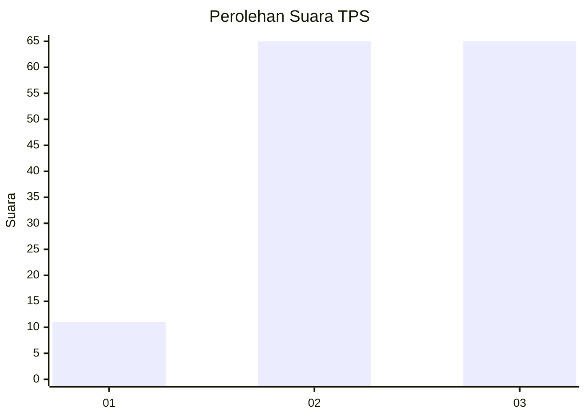
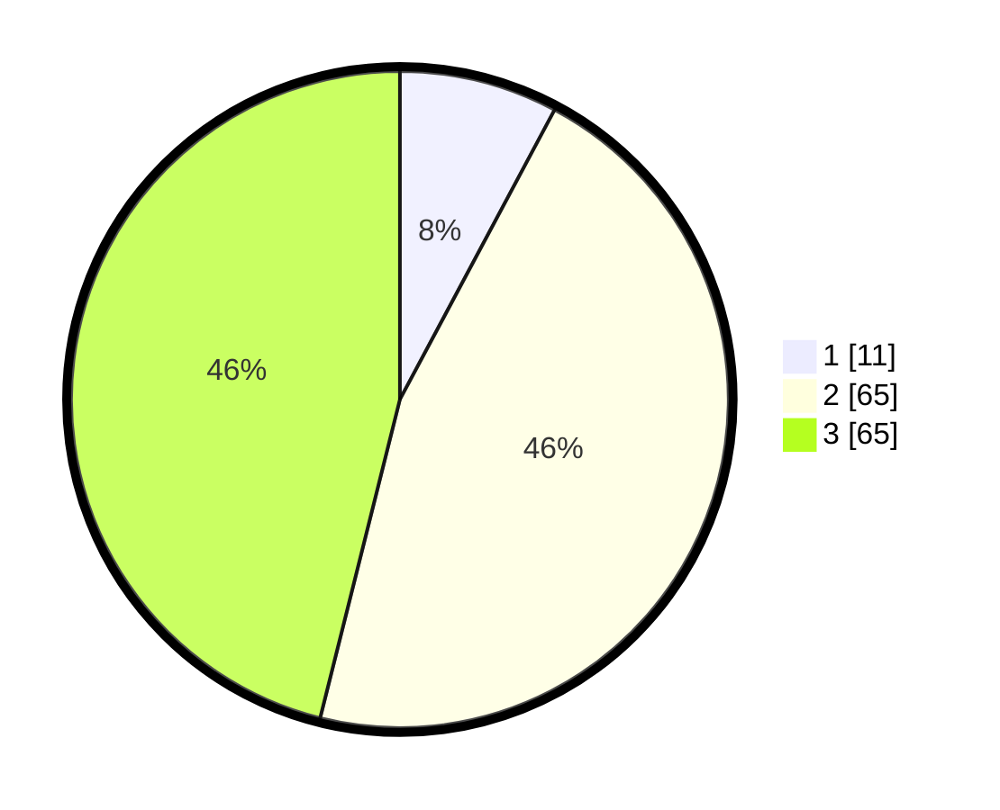

# Hasil

## Grafik

## Tabel

| No. | Nama Paslon    | Suara | Suara (raw) | Persentase |
|:--- |:-------------- | -----:| -----------:| ----------:|
| 1   | ANIES MUHAIMIN | 11    | [11][p-1]   | 7,80       |
| 2   | PRABOWO GIBRAN | 65    | [65][p-2]   | 46,10      |
| 3   | GANJAR MAHFUD  | 65    | [65][p-3]   | 46,10      |

[p-1]: https://github.com/gigit-pemilu/pemilu-2024-33-jawa-tengah/blob/main/pilpres/hitung-suara/sub/33-jawa-tengah/sub/06-purworejo/sub/09-kutoarjo/sub/1017-katerban/sub/004-tps/sub/paslon-1.txt
[p-2]: https://github.com/gigit-pemilu/pemilu-2024-33-jawa-tengah/blob/main/pilpres/hitung-suara/sub/33-jawa-tengah/sub/06-purworejo/sub/09-kutoarjo/sub/1017-katerban/sub/004-tps/sub/paslon-2.txt
[p-3]: https://github.com/gigit-pemilu/pemilu-2024-33-jawa-tengah/blob/main/pilpres/hitung-suara/sub/33-jawa-tengah/sub/06-purworejo/sub/09-kutoarjo/sub/1017-katerban/sub/004-tps/sub/paslon-3.txt

## Foto C Plano

https://sirekap-obj-formc.kpu.go.id/a887/pemilu/ppwp/33/06/09/10/17/3306091017004-20240214-213325--bec2ef75-d72a-49bd-8376-276b741f7d60.jpg

https://sirekap-obj-formc.kpu.go.id/a887/pemilu/ppwp/33/06/09/10/17/3306091017004-20240214-213447--5d97deff-3e49-423c-9ede-6e8843e01359.jpg

https://sirekap-obj-formc.kpu.go.id/a887/pemilu/ppwp/33/06/09/10/17/3306091017004-20240217-223543--520c5104-7be5-4b02-84c2-98ba3dff5ff9.jpg

## Metadata

| Key        | Value               |
| ---------- | ------------------- |
| Time Stamp | 2024-02-19 06:16:00 |

