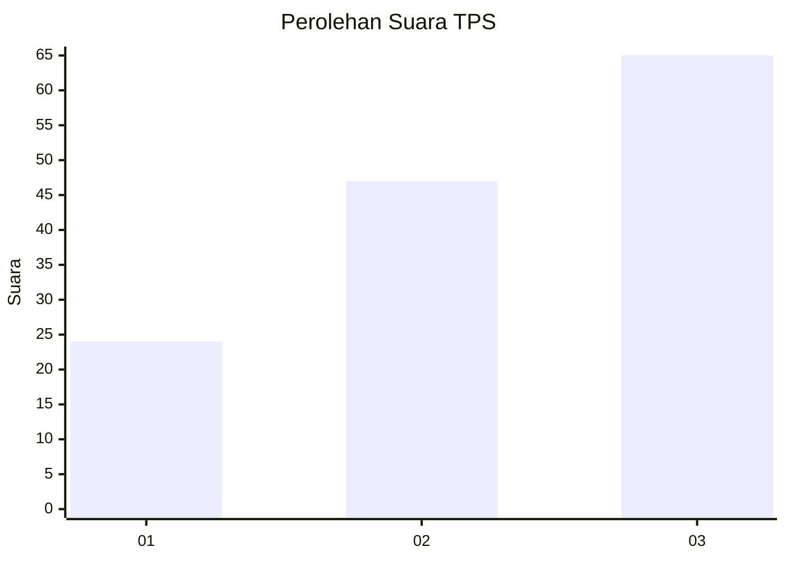
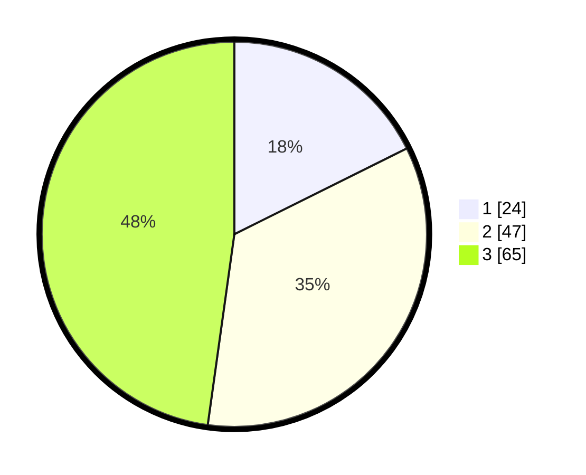

# Hasil

## Grafik

## Tabel

| No. | Nama Paslon    | Suara | Suara (raw) | Persentase |
|:--- |:-------------- | -----:| -----------:| ----------:|
| 1   | ANIES MUHAIMIN | 24    | [24][p-1]   | 17,65      |
| 2   | PRABOWO GIBRAN | 47    | [47][p-2]   | 34,56      |
| 3   | GANJAR MAHFUD  | 65    | [65][p-3]   | 47,79      |

[p-1]: https://github.com/gigit-pemilu/pemilu-2024/blob/main/pilpres/hitung-suara/sub/33-jawa-tengah/sub/06-purworejo/sub/09-kutoarjo/sub/1017-katerban/sub/014-tps/sub/paslon-1.txt
[p-2]: https://github.com/gigit-pemilu/pemilu-2024/blob/main/pilpres/hitung-suara/sub/33-jawa-tengah/sub/06-purworejo/sub/09-kutoarjo/sub/1017-katerban/sub/014-tps/sub/paslon-2.txt
[p-3]: https://github.com/gigit-pemilu/pemilu-2024/blob/main/pilpres/hitung-suara/sub/33-jawa-tengah/sub/06-purworejo/sub/09-kutoarjo/sub/1017-katerban/sub/014-tps/sub/paslon-3.txt

## Foto C Plano

https://sirekap-obj-formc.kpu.go.id/e9fd/pemilu/ppwp/33/06/09/10/17/3306091017014-20240217-210526--e6edf7a6-0431-43fa-9d59-ce67a0d8a952.jpg

https://sirekap-obj-formc.kpu.go.id/e9fd/pemilu/ppwp/33/06/09/10/17/3306091017014-20240217-210817--beb8476f-caef-4b23-a74b-3b0d8633d59b.jpg

https://sirekap-obj-formc.kpu.go.id/e9fd/pemilu/ppwp/33/06/09/10/17/3306091017014-20240214-222726--c363501c-3588-4689-a541-b295a6068149.jpg

## Metadata

| Key        | Value               |
| ---------- | ------------------- |
| Time Stamp | 2024-02-24 22:31:28 |

