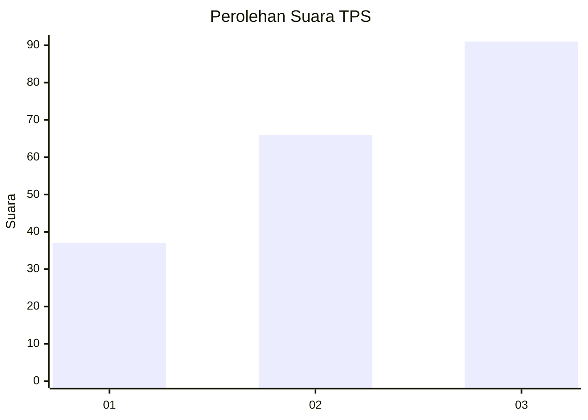
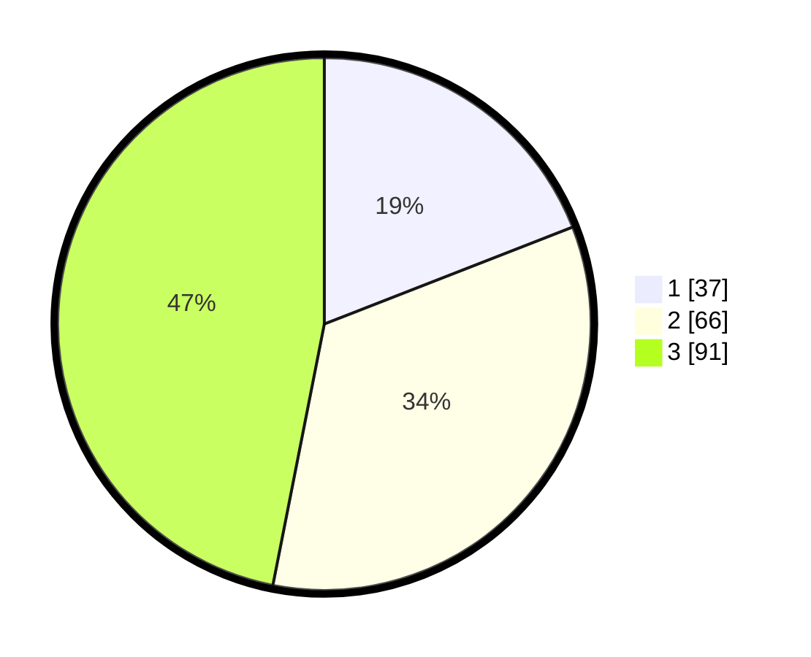

# Hasil

## Grafik

## Tabel

| No. | Nama Paslon    | Suara | Suara (raw) | Persentase |
|:--- |:-------------- | -----:| -----------:| ----------:|
| 1   | ANIES MUHAIMIN | 37    | [37][p-1]   | 19,07      |
| 2   | PRABOWO GIBRAN | 66    | [66][p-2]   | 34,02      |
| 3   | GANJAR MAHFUD  | 91    | [91][p-3]   | 46,91      |

[p-1]: https://github.com/gigit-pemilu/pemilu-2024-33-jawa-tengah/blob/main/pilpres/hitung-suara/sub/33-jawa-tengah/sub/06-purworejo/sub/09-kutoarjo/sub/2003-kiyangkongrejo/sub/003-tps/sub/paslon-1.txt
[p-2]: https://github.com/gigit-pemilu/pemilu-2024-33-jawa-tengah/blob/main/pilpres/hitung-suara/sub/33-jawa-tengah/sub/06-purworejo/sub/09-kutoarjo/sub/2003-kiyangkongrejo/sub/003-tps/sub/paslon-2.txt
[p-3]: https://github.com/gigit-pemilu/pemilu-2024-33-jawa-tengah/blob/main/pilpres/hitung-suara/sub/33-jawa-tengah/sub/06-purworejo/sub/09-kutoarjo/sub/2003-kiyangkongrejo/sub/003-tps/sub/paslon-3.txt

## Foto C Plano

https://sirekap-obj-formc.kpu.go.id/9ae9/pemilu/ppwp/33/06/09/20/03/3306092003003-20240218-104654--19f81e44-29ce-48fb-8150-d5c1e8cea460.jpg

https://sirekap-obj-formc.kpu.go.id/9ae9/pemilu/ppwp/33/06/09/20/03/3306092003003-20240217-105812--cb6b2a59-cf69-412c-a4e5-698416039018.jpg

https://sirekap-obj-formc.kpu.go.id/9ae9/pemilu/ppwp/33/06/09/20/03/3306092003003-20240216-203840--45a1fbd0-3596-4f16-9e76-e9d4ddc2769e.jpg

## Metadata

| Key        | Value               |
| ---------- | ------------------- |
| Time Stamp | 2024-02-19 06:16:00 |

