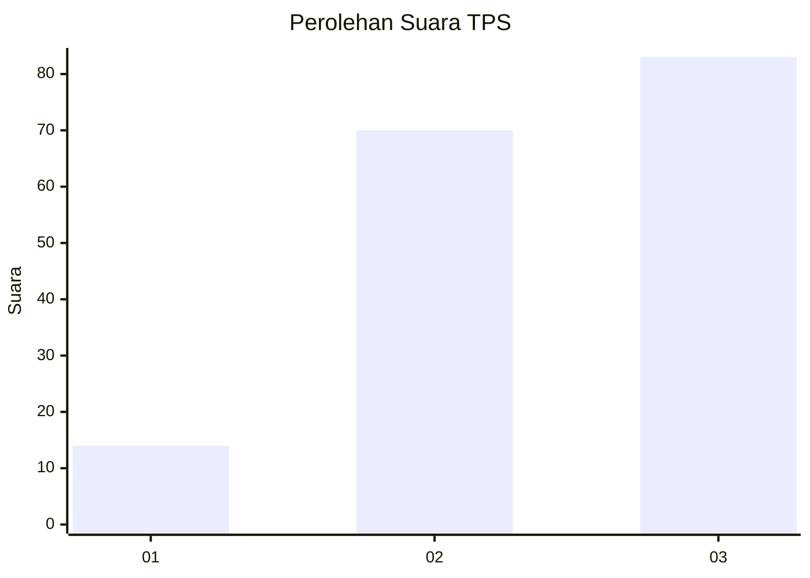
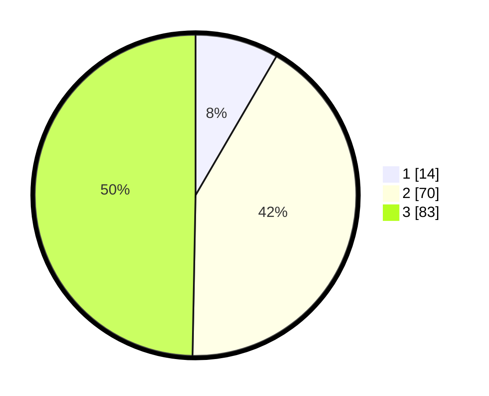

# Hasil

## Grafik

## Tabel

| No. | Nama Paslon    | Suara | Suara (raw) | Persentase |
|:--- |:-------------- | -----:| -----------:| ----------:|
| 1   | ANIES MUHAIMIN | 14    | [14][p-1]   | 8,38       |
| 2   | PRABOWO GIBRAN | 70    | [70][p-2]   | 41,92      |
| 3   | GANJAR MAHFUD  | 83    | [83][p-3]   | 49,70      |

[p-1]: https://github.com/gigit-pemilu/pemilu-2024-33-jawa-tengah/blob/main/pilpres/hitung-suara/sub/33-jawa-tengah/sub/06-purworejo/sub/09-kutoarjo/sub/2004-suren/sub/004-tps/sub/paslon-1.txt
[p-2]: https://github.com/gigit-pemilu/pemilu-2024-33-jawa-tengah/blob/main/pilpres/hitung-suara/sub/33-jawa-tengah/sub/06-purworejo/sub/09-kutoarjo/sub/2004-suren/sub/004-tps/sub/paslon-2.txt
[p-3]: https://github.com/gigit-pemilu/pemilu-2024-33-jawa-tengah/blob/main/pilpres/hitung-suara/sub/33-jawa-tengah/sub/06-purworejo/sub/09-kutoarjo/sub/2004-suren/sub/004-tps/sub/paslon-3.txt

## Foto C Plano

https://sirekap-obj-formc.kpu.go.id/7e51/pemilu/ppwp/33/06/09/20/04/3306092004004-20240217-123114--2fd3c080-73c2-44c4-9fd1-e86f71a9d816.jpg

https://sirekap-obj-formc.kpu.go.id/7e51/pemilu/ppwp/33/06/09/20/04/3306092004004-20240217-123223--5fb94435-1fde-437a-aa7f-34ca9681c081.jpg

https://sirekap-obj-formc.kpu.go.id/7e51/pemilu/ppwp/33/06/09/20/04/3306092004004-20240217-123406--1aef5670-3bdc-445f-91f3-46aea747f821.jpg

## Metadata

| Key        | Value               |
| ---------- | ------------------- |
| Time Stamp | 2024-02-17 13:37:34 |

