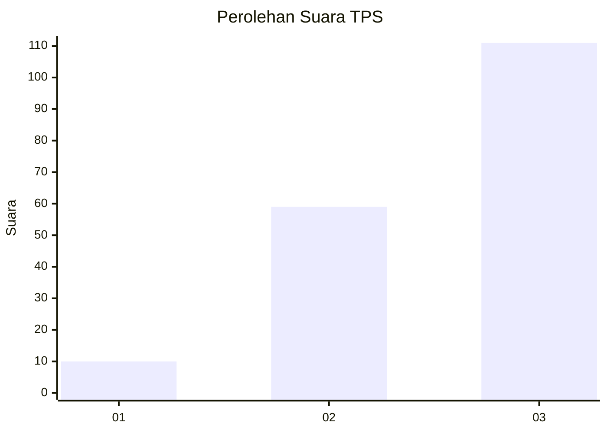
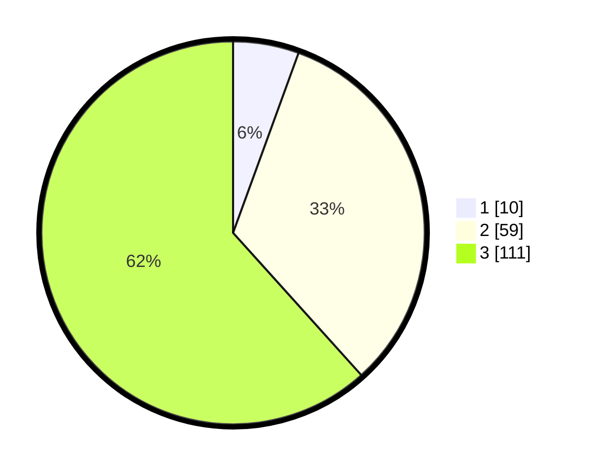

# Hasil

## Grafik

## Tabel

| No. | Nama Paslon    | Suara | Suara (raw) | Persentase |
|:--- |:-------------- | -----:| -----------:| ----------:|
| 1   | ANIES MUHAIMIN | 10    | [10][p-1]   | 5,56       |
| 2   | PRABOWO GIBRAN | 59    | [59][p-2]   | 32,78      |
| 3   | GANJAR MAHFUD  | 111   | [111][p-3]  | 61,67      |

[p-1]: https://github.com/gigit-pemilu/pemilu-2024-33-jawa-tengah/blob/main/pilpres/hitung-suara/sub/33-jawa-tengah/sub/06-purworejo/sub/09-kutoarjo/sub/2004-suren/sub/006-tps/sub/paslon-1.txt
[p-2]: https://github.com/gigit-pemilu/pemilu-2024-33-jawa-tengah/blob/main/pilpres/hitung-suara/sub/33-jawa-tengah/sub/06-purworejo/sub/09-kutoarjo/sub/2004-suren/sub/006-tps/sub/paslon-2.txt
[p-3]: https://github.com/gigit-pemilu/pemilu-2024-33-jawa-tengah/blob/main/pilpres/hitung-suara/sub/33-jawa-tengah/sub/06-purworejo/sub/09-kutoarjo/sub/2004-suren/sub/006-tps/sub/paslon-3.txt

## Foto C Plano

https://sirekap-obj-formc.kpu.go.id/bf1b/pemilu/ppwp/33/06/09/20/04/3306092004006-20240217-122006--1ce4be1a-dbab-4eb1-a764-e9fdd77a3326.jpg

https://sirekap-obj-formc.kpu.go.id/bf1b/pemilu/ppwp/33/06/09/20/04/3306092004006-20240217-122154--e25acc10-506d-490f-8afe-03b64b46bf27.jpg

https://sirekap-obj-formc.kpu.go.id/bf1b/pemilu/ppwp/33/06/09/20/04/3306092004006-20240217-122336--c31dc03f-a0e6-48a3-b046-7d0ad38154f3.jpg

## Metadata

| Key        | Value               |
| ---------- | ------------------- |
| Time Stamp | 2024-02-25 12:00:00 |

