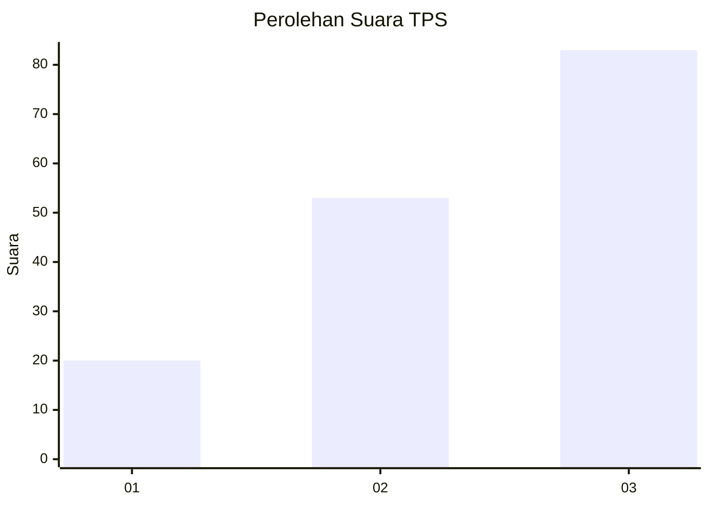
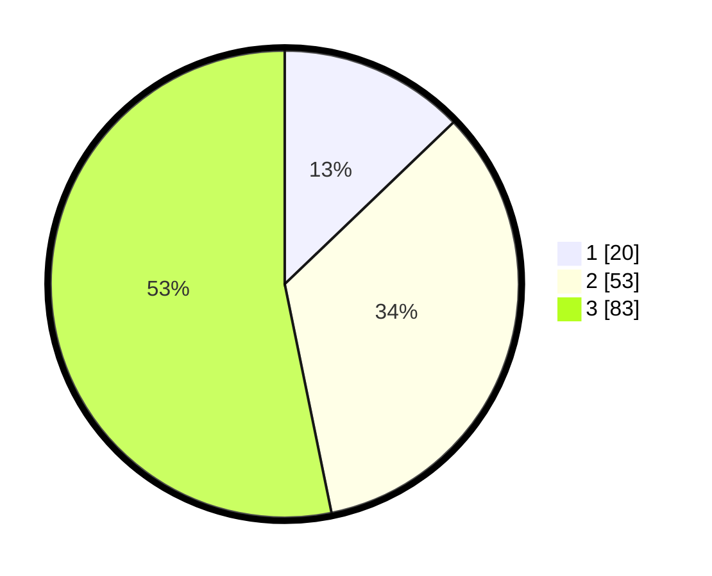

# Hasil

## Grafik

## Tabel

| No. | Nama Paslon    | Suara | Suara (raw) | Persentase |
|:--- |:-------------- | -----:| -----------:| ----------:|
| 1   | ANIES MUHAIMIN | 20    | [20][p-1]   | 12,82      |
| 2   | PRABOWO GIBRAN | 53    | [53][p-2]   | 33,97      |
| 3   | GANJAR MAHFUD  | 83    | [83][p-3]   | 53,21      |

[p-1]: https://github.com/gigit-pemilu/pemilu-2024/blob/main/pilpres/hitung-suara/sub/33-jawa-tengah/sub/06-purworejo/sub/09-kutoarjo/sub/2004-suren/sub/011-tps/sub/paslon-1.txt
[p-2]: https://github.com/gigit-pemilu/pemilu-2024/blob/main/pilpres/hitung-suara/sub/33-jawa-tengah/sub/06-purworejo/sub/09-kutoarjo/sub/2004-suren/sub/011-tps/sub/paslon-2.txt
[p-3]: https://github.com/gigit-pemilu/pemilu-2024/blob/main/pilpres/hitung-suara/sub/33-jawa-tengah/sub/06-purworejo/sub/09-kutoarjo/sub/2004-suren/sub/011-tps/sub/paslon-3.txt

## Foto C Plano

https://sirekap-obj-formc.kpu.go.id/8b60/pemilu/ppwp/33/06/09/20/04/3306092004011-20240217-114851--74e26b9e-7297-42e9-84fe-cda0af81bf8a.jpg

https://sirekap-obj-formc.kpu.go.id/8b60/pemilu/ppwp/33/06/09/20/04/3306092004011-20240217-115027--f48b78d8-82fe-4661-9b1e-48479d58420b.jpg

https://sirekap-obj-formc.kpu.go.id/8b60/pemilu/ppwp/33/06/09/20/04/3306092004011-20240217-115216--a13de6bb-aa7f-425b-be23-6913c7cc6326.jpg

## Metadata

| Key        | Value               |
| ---------- | ------------------- |
| Time Stamp | 2024-02-17 12:00:00 |

