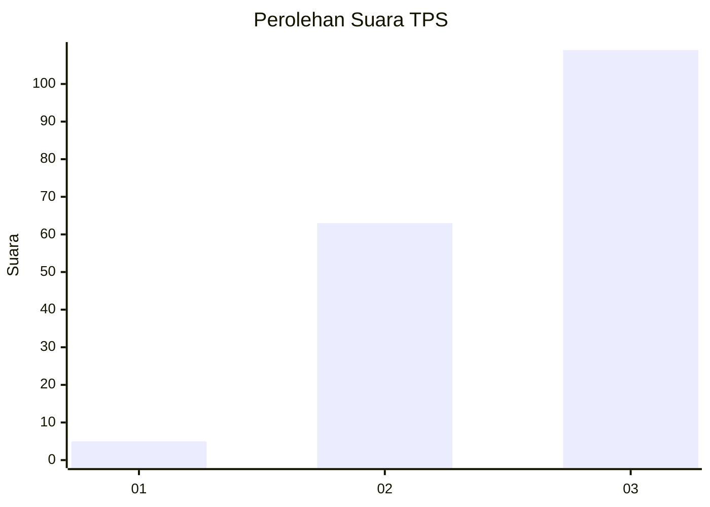
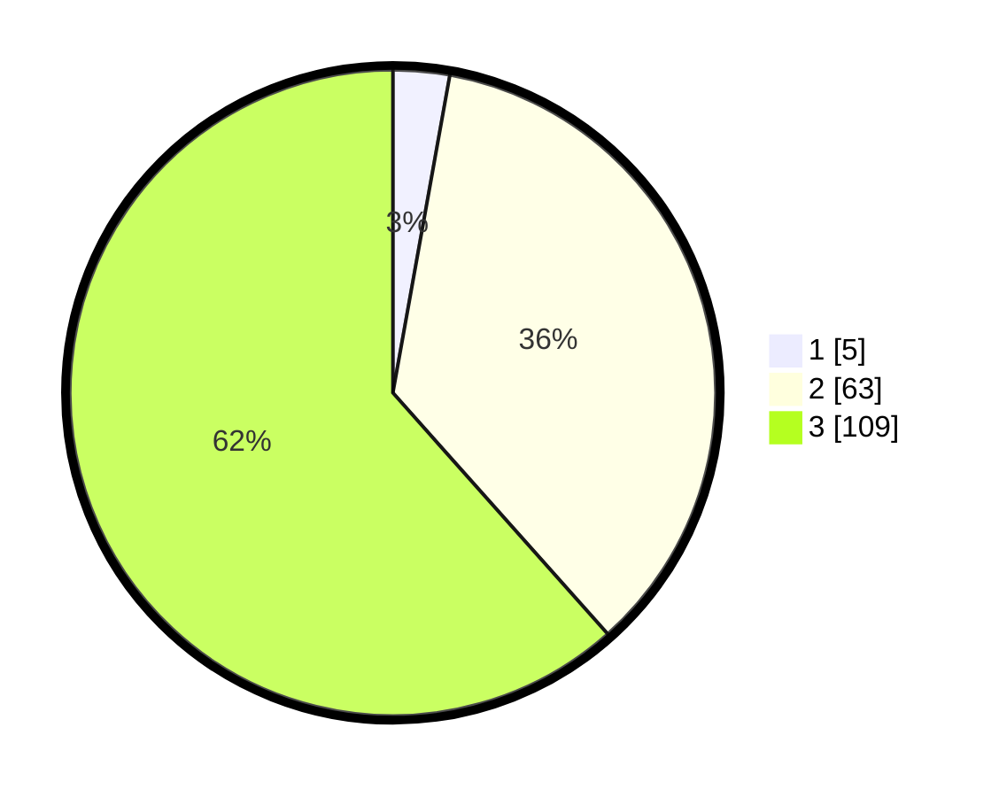

# Hasil

## Grafik

## Tabel

| No. | Nama Paslon    | Suara | Suara (raw) | Persentase |
|:--- |:-------------- | -----:| -----------:| ----------:|
| 1   | ANIES MUHAIMIN | 5     | [5][p-1]    | 2,82       |
| 2   | PRABOWO GIBRAN | 63    | [63][p-2]   | 35,59      |
| 3   | GANJAR MAHFUD  | 109   | [109][p-3]  | 61,58      |

[p-1]: https://github.com/gigit-pemilu/pemilu-2024-33-jawa-tengah/blob/main/pilpres/hitung-suara/sub/33-jawa-tengah/sub/06-purworejo/sub/09-kutoarjo/sub/2004-suren/sub/014-tps/sub/paslon-1.txt
[p-2]: https://github.com/gigit-pemilu/pemilu-2024-33-jawa-tengah/blob/main/pilpres/hitung-suara/sub/33-jawa-tengah/sub/06-purworejo/sub/09-kutoarjo/sub/2004-suren/sub/014-tps/sub/paslon-2.txt
[p-3]: https://github.com/gigit-pemilu/pemilu-2024-33-jawa-tengah/blob/main/pilpres/hitung-suara/sub/33-jawa-tengah/sub/06-purworejo/sub/09-kutoarjo/sub/2004-suren/sub/014-tps/sub/paslon-3.txt

## Foto C Plano

https://sirekap-obj-formc.kpu.go.id/9f2c/pemilu/ppwp/33/06/09/20/04/3306092004014-20240217-112750--c96fbf5a-89dc-402d-a0ea-82c5475a1ef9.jpg

https://sirekap-obj-formc.kpu.go.id/9f2c/pemilu/ppwp/33/06/09/20/04/3306092004014-20240217-112928--bb90f93a-2798-4279-bead-9e15efe5e6e4.jpg

https://sirekap-obj-formc.kpu.go.id/9f2c/pemilu/ppwp/33/06/09/20/04/3306092004014-20240217-113108--f131914e-1c4d-4ccc-86eb-6b45e9c2c18d.jpg

## Metadata

| Key        | Value               |
| ---------- | ------------------- |
| Time Stamp | 2024-02-24 22:31:28 |

