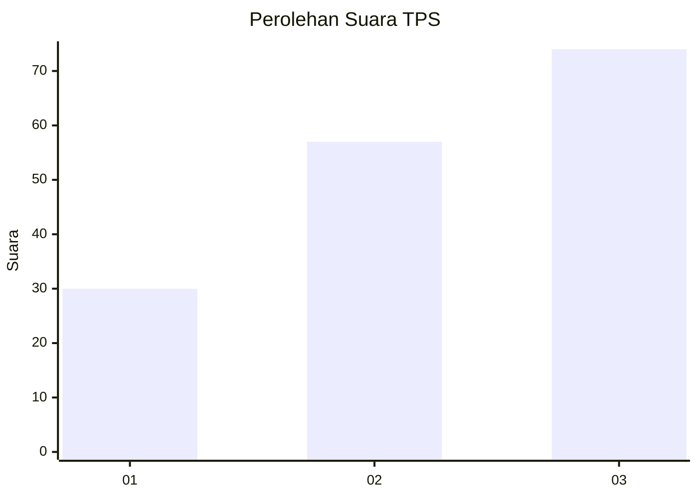
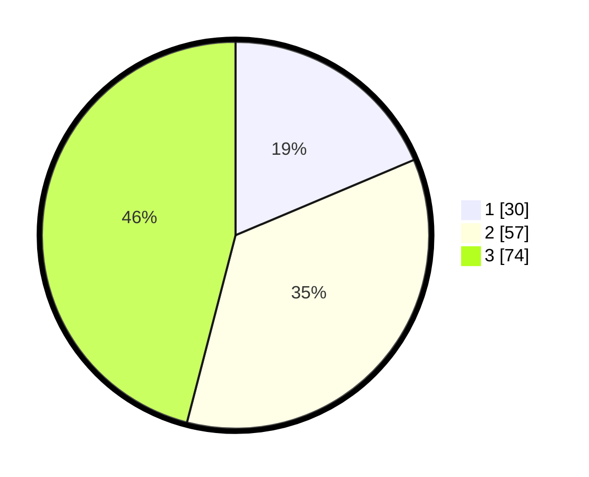

# Hasil

## Grafik

## Tabel

| No. | Nama Paslon    | Suara | Suara (raw) | Persentase |
|:--- |:-------------- | -----:| -----------:| ----------:|
| 1   | ANIES MUHAIMIN | 30    | [30][p-1]   | 18,63      |
| 2   | PRABOWO GIBRAN | 57    | [57][p-2]   | 35,40      |
| 3   | GANJAR MAHFUD  | 74    | [74][p-3]   | 45,96      |

[p-1]: https://github.com/gigit-pemilu/pemilu-2024/blob/main/pilpres/hitung-suara/sub/33-jawa-tengah/sub/06-purworejo/sub/09-kutoarjo/sub/2006-purwosari/sub/001-tps/sub/paslon-1.txt
[p-2]: https://github.com/gigit-pemilu/pemilu-2024/blob/main/pilpres/hitung-suara/sub/33-jawa-tengah/sub/06-purworejo/sub/09-kutoarjo/sub/2006-purwosari/sub/001-tps/sub/paslon-2.txt
[p-3]: https://github.com/gigit-pemilu/pemilu-2024/blob/main/pilpres/hitung-suara/sub/33-jawa-tengah/sub/06-purworejo/sub/09-kutoarjo/sub/2006-purwosari/sub/001-tps/sub/paslon-3.txt

## Foto C Plano

https://sirekap-obj-formc.kpu.go.id/bc70/pemilu/ppwp/33/06/09/20/06/3306092006001-20240217-104146--9dcb0b4c-1a6d-4781-a262-02233cad8e6f.jpg

https://sirekap-obj-formc.kpu.go.id/bc70/pemilu/ppwp/33/06/09/20/06/3306092006001-20240217-104300--e6ad6465-ebcc-44cc-bbab-37a2b45426fe.jpg

https://sirekap-obj-formc.kpu.go.id/bc70/pemilu/ppwp/33/06/09/20/06/3306092006001-20240217-104423--602a5b85-2e53-4611-b984-fb33e87db7cb.jpg

## Metadata

| Key        | Value               |
| ---------- | ------------------- |
| Time Stamp | 2024-02-17 11:00:02 |

