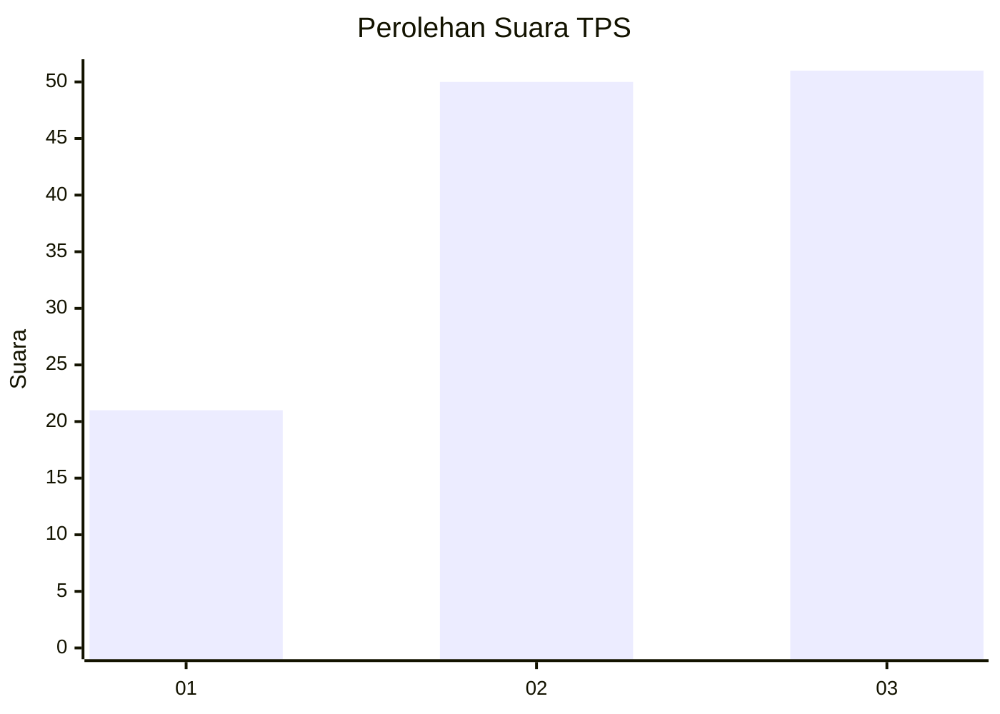
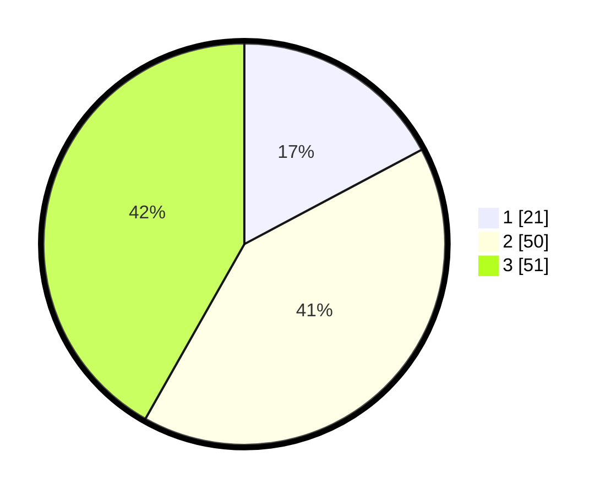

# Hasil

## Grafik

## Tabel

| No. | Nama Paslon    | Suara | Suara (raw) | Persentase |
|:--- |:-------------- | -----:| -----------:| ----------:|
| 1   | ANIES MUHAIMIN | 21    | [21][p-1]   | 17,21      |
| 2   | PRABOWO GIBRAN | 50    | [50][p-2]   | 40,98      |
| 3   | GANJAR MAHFUD  | 51    | [51][p-3]   | 41,80      |

[p-1]: https://github.com/gigit-pemilu/pemilu-2024-33-jawa-tengah/blob/main/pilpres/hitung-suara/sub/33-jawa-tengah/sub/06-purworejo/sub/09-kutoarjo/sub/2019-tunggorono/sub/002-tps/sub/paslon-1.txt
[p-2]: https://github.com/gigit-pemilu/pemilu-2024-33-jawa-tengah/blob/main/pilpres/hitung-suara/sub/33-jawa-tengah/sub/06-purworejo/sub/09-kutoarjo/sub/2019-tunggorono/sub/002-tps/sub/paslon-2.txt
[p-3]: https://github.com/gigit-pemilu/pemilu-2024-33-jawa-tengah/blob/main/pilpres/hitung-suara/sub/33-jawa-tengah/sub/06-purworejo/sub/09-kutoarjo/sub/2019-tunggorono/sub/002-tps/sub/paslon-3.txt

## Foto C Plano

https://sirekap-obj-formc.kpu.go.id/29a4/pemilu/ppwp/33/06/09/20/19/3306092019002-20240214-222627--488d3dd4-3619-439a-aed8-b572f060eddd.jpg

https://sirekap-obj-formc.kpu.go.id/29a4/pemilu/ppwp/33/06/09/20/19/3306092019002-20240214-222808--5c40b88c-8b96-4bfa-a800-ab7a488483fc.jpg

https://sirekap-obj-formc.kpu.go.id/29a4/pemilu/ppwp/33/06/09/20/19/3306092019002-20240214-222933--998a0d7f-d602-4dbb-bd45-465649fbb738.jpg

## Metadata

| Key        | Value               |
| ---------- | ------------------- |
| Time Stamp | 2024-02-16 08:00:28 |

