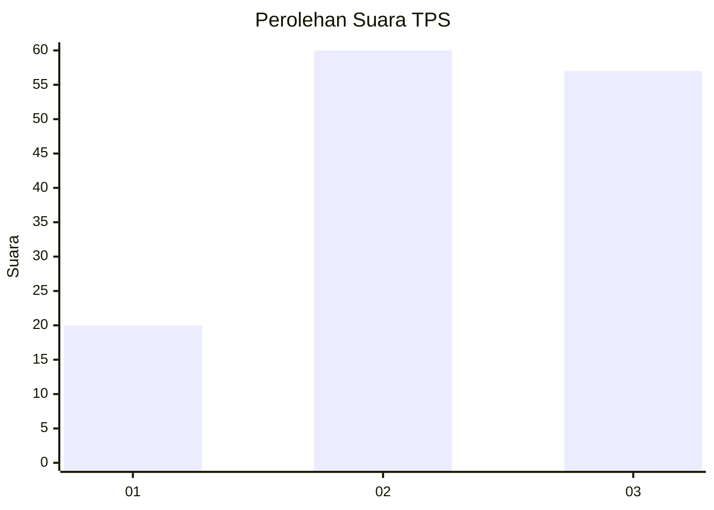
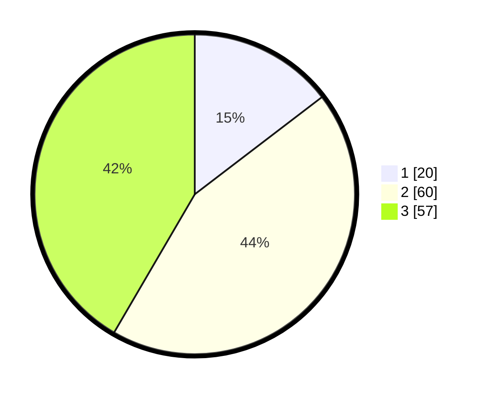

# Hasil

## Grafik

## Tabel

| No. | Nama Paslon    | Suara | Suara (raw) | Persentase |
|:--- |:-------------- | -----:| -----------:| ----------:|
| 1   | ANIES MUHAIMIN | 20    | [20][p-1]   | 14,60      |
| 2   | PRABOWO GIBRAN | 60    | [60][p-2]   | 43,80      |
| 3   | GANJAR MAHFUD  | 57    | [57][p-3]   | 41,61      |

[p-1]: https://github.com/gigit-pemilu/pemilu-2024/blob/main/pilpres/hitung-suara/sub/33-jawa-tengah/sub/06-purworejo/sub/09-kutoarjo/sub/2025-wirun/sub/016-tps/sub/paslon-1.txt
[p-2]: https://github.com/gigit-pemilu/pemilu-2024/blob/main/pilpres/hitung-suara/sub/33-jawa-tengah/sub/06-purworejo/sub/09-kutoarjo/sub/2025-wirun/sub/016-tps/sub/paslon-2.txt
[p-3]: https://github.com/gigit-pemilu/pemilu-2024/blob/main/pilpres/hitung-suara/sub/33-jawa-tengah/sub/06-purworejo/sub/09-kutoarjo/sub/2025-wirun/sub/016-tps/sub/paslon-3.txt

## Foto C Plano

https://sirekap-obj-formc.kpu.go.id/8181/pemilu/ppwp/33/06/09/20/25/3306092025016-20240216-212327--c0204c54-a5ce-443b-a4d3-a9b84e3fdc32.jpg

https://sirekap-obj-formc.kpu.go.id/8181/pemilu/ppwp/33/06/09/20/25/3306092025016-20240216-213630--962678a0-6ce5-4efb-908f-3692ac653d79.jpg

https://sirekap-obj-formc.kpu.go.id/8181/pemilu/ppwp/33/06/09/20/25/3306092025016-20240216-213630--7383c6f4-8d10-4950-85ac-f4c149c55e14.jpg

## Metadata

| Key        | Value               |
| ---------- | ------------------- |
| Time Stamp | 2024-02-16 23:30:00 |

