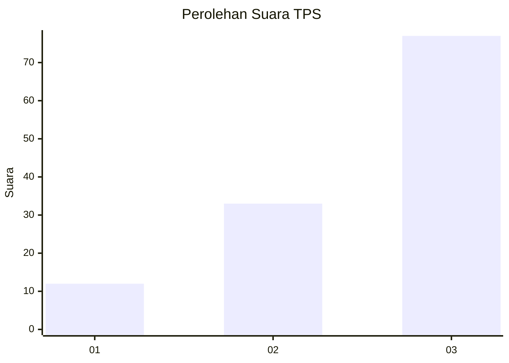
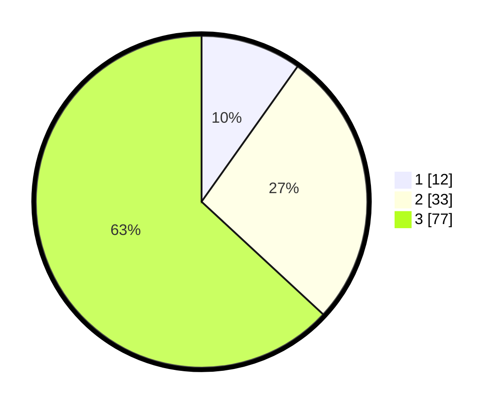

# Hasil

## Grafik

## Tabel

| No. | Nama Paslon    | Suara | Suara (raw) | Persentase |
|:--- |:-------------- | -----:| -----------:| ----------:|
| 1   | ANIES MUHAIMIN | 12    | [12][p-1]   | 9,84       |
| 2   | PRABOWO GIBRAN | 33    | [33][p-2]   | 27,05      |
| 3   | GANJAR MAHFUD  | 77    | [77][p-3]   | 63,11      |

[p-1]: https://github.com/gigit-pemilu/pemilu-2024/blob/main/pilpres/hitung-suara/sub/33-jawa-tengah/sub/06-purworejo/sub/10-butuh/sub/2020-kedungagung/sub/004-tps/sub/paslon-1.txt
[p-2]: https://github.com/gigit-pemilu/pemilu-2024/blob/main/pilpres/hitung-suara/sub/33-jawa-tengah/sub/06-purworejo/sub/10-butuh/sub/2020-kedungagung/sub/004-tps/sub/paslon-2.txt
[p-3]: https://github.com/gigit-pemilu/pemilu-2024/blob/main/pilpres/hitung-suara/sub/33-jawa-tengah/sub/06-purworejo/sub/10-butuh/sub/2020-kedungagung/sub/004-tps/sub/paslon-3.txt

## Foto C Plano

https://sirekap-obj-formc.kpu.go.id/e07a/pemilu/ppwp/33/06/10/20/20/3306102020004-20240217-132404--d564c1c7-ebea-433d-8cdc-8e8b0e589de8.jpg

https://sirekap-obj-formc.kpu.go.id/e07a/pemilu/ppwp/33/06/10/20/20/3306102020004-20240214-222636--e37215d7-f569-44b2-aa76-8e3f085c8511.jpg

https://sirekap-obj-formc.kpu.go.id/e07a/pemilu/ppwp/33/06/10/20/20/3306102020004-20240214-190720--b03b3c51-24a9-4031-981f-295059e75e28.jpg

## Metadata

| Key        | Value               |
| ---------- | ------------------- |
| Time Stamp | 2024-02-17 13:37:34 |

