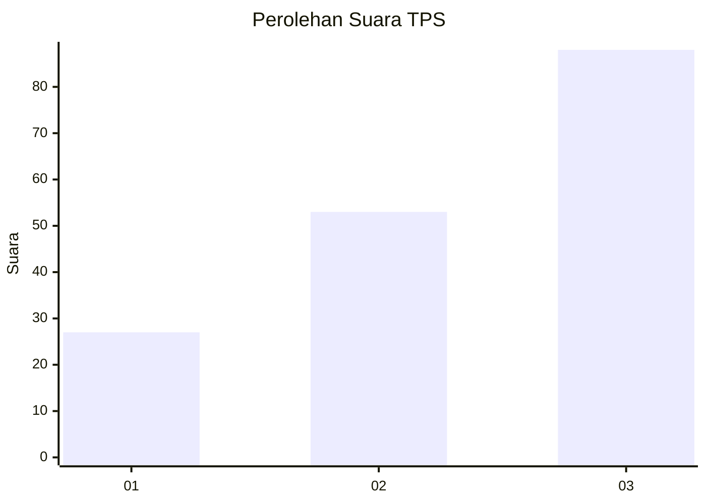
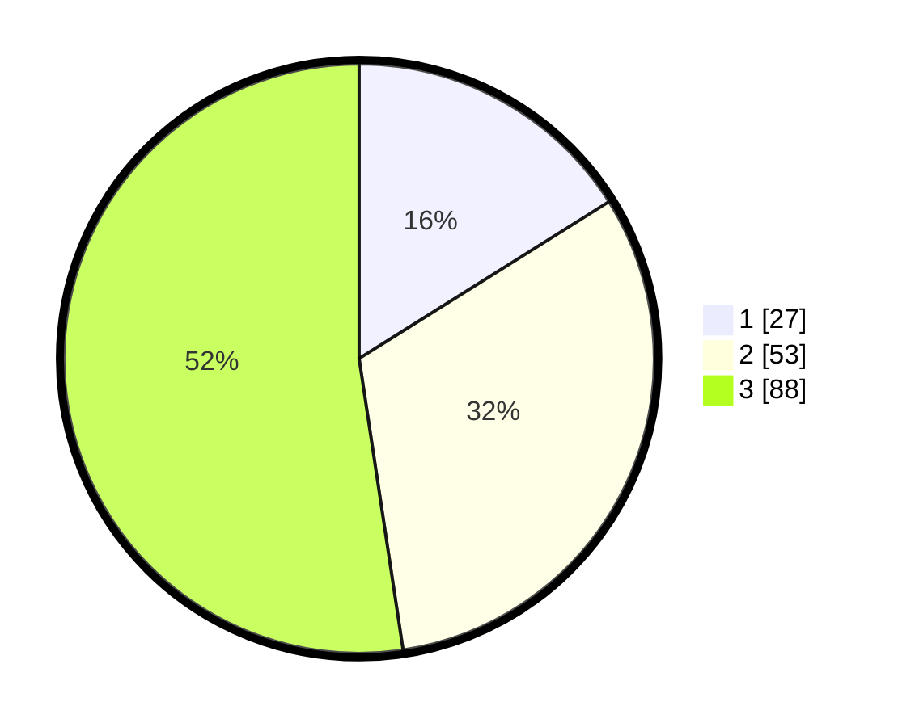

# Hasil

## Grafik

## Tabel

| No. | Nama Paslon    | Suara | Suara (raw) | Persentase |
|:--- |:-------------- | -----:| -----------:| ----------:|
| 1   | ANIES MUHAIMIN | 27    | [27][p-1]   | 16,07      |
| 2   | PRABOWO GIBRAN | 53    | [53][p-2]   | 31,55      |
| 3   | GANJAR MAHFUD  | 88    | [88][p-3]   | 52,38      |

[p-1]: https://github.com/gigit-pemilu/pemilu-2024-33-jawa-tengah/blob/main/pilpres/hitung-suara/sub/33-jawa-tengah/sub/06-purworejo/sub/10-butuh/sub/2039-butuh/sub/004-tps/sub/paslon-1.txt
[p-2]: https://github.com/gigit-pemilu/pemilu-2024-33-jawa-tengah/blob/main/pilpres/hitung-suara/sub/33-jawa-tengah/sub/06-purworejo/sub/10-butuh/sub/2039-butuh/sub/004-tps/sub/paslon-2.txt
[p-3]: https://github.com/gigit-pemilu/pemilu-2024-33-jawa-tengah/blob/main/pilpres/hitung-suara/sub/33-jawa-tengah/sub/06-purworejo/sub/10-butuh/sub/2039-butuh/sub/004-tps/sub/paslon-3.txt

## Foto C Plano

https://sirekap-obj-formc.kpu.go.id/89d6/pemilu/ppwp/33/06/10/20/39/3306102039004-20240214-141446--f93b20d3-b70e-439e-882c-cd045ed9c635.jpg

https://sirekap-obj-formc.kpu.go.id/89d6/pemilu/ppwp/33/06/10/20/39/3306102039004-20240214-141403--1c0e264f-54c9-43ab-a4e0-2b8d0bb2b258.jpg

https://sirekap-obj-formc.kpu.go.id/89d6/pemilu/ppwp/33/06/10/20/39/3306102039004-20240214-141533--6d57ebba-499a-41a5-9872-aabf3025a799.jpg

## Metadata

| Key        | Value               |
| ---------- | ------------------- |
| Time Stamp | 2024-02-16 05:30:26 |

