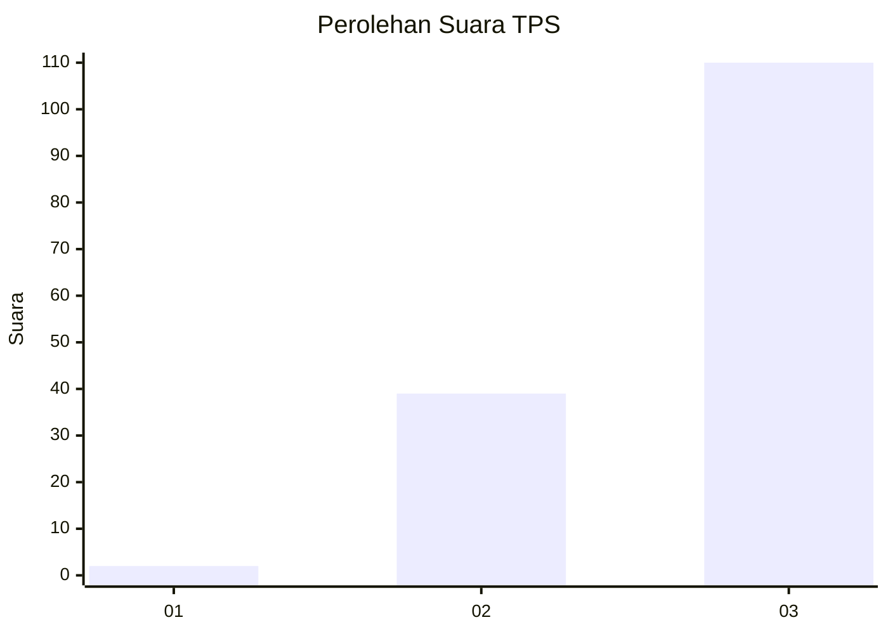
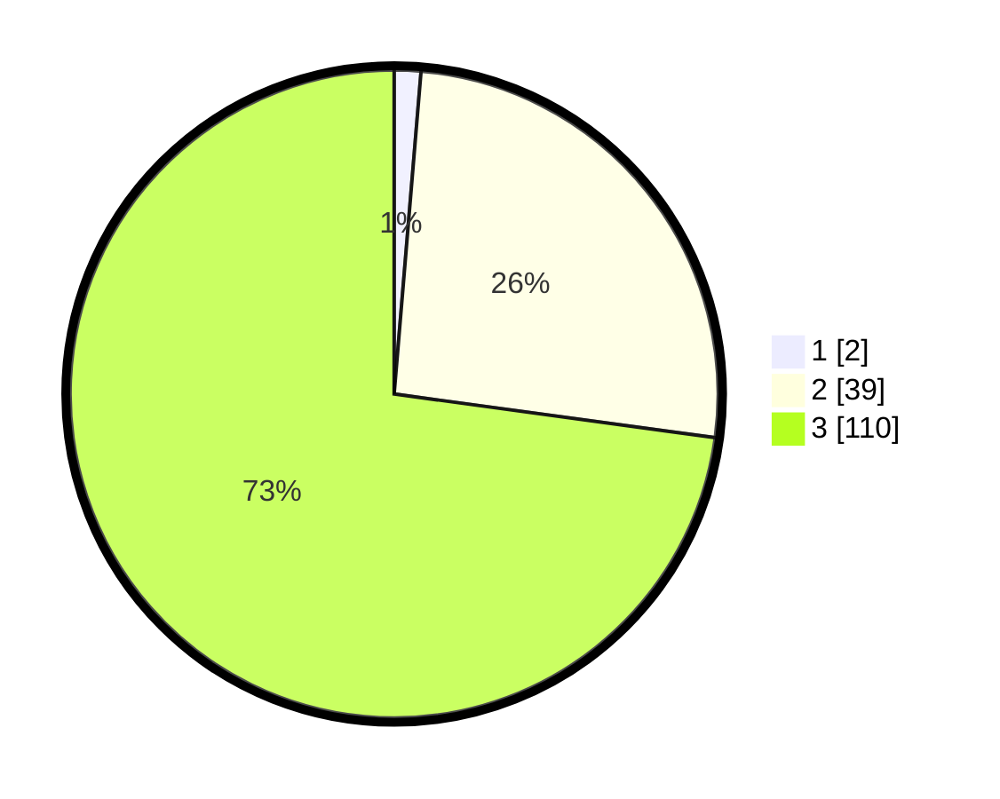

# Hasil

## Grafik

## Tabel

| No. | Nama Paslon    | Suara | Suara (raw) | Persentase |
|:--- |:-------------- | -----:| -----------:| ----------:|
| 1   | ANIES MUHAIMIN | 2     | [2][p-1]    | 1,32       |
| 2   | PRABOWO GIBRAN | 39    | [39][p-2]   | 25,83      |
| 3   | GANJAR MAHFUD  | 110   | [110][p-3]  | 72,85      |

[p-1]: https://github.com/gigit-pemilu/pemilu-2024/blob/main/pilpres/hitung-suara/sub/33-jawa-tengah/sub/06-purworejo/sub/11-pituruh/sub/2002-kalimati/sub/003-tps/sub/paslon-1.txt
[p-2]: https://github.com/gigit-pemilu/pemilu-2024/blob/main/pilpres/hitung-suara/sub/33-jawa-tengah/sub/06-purworejo/sub/11-pituruh/sub/2002-kalimati/sub/003-tps/sub/paslon-2.txt
[p-3]: https://github.com/gigit-pemilu/pemilu-2024/blob/main/pilpres/hitung-suara/sub/33-jawa-tengah/sub/06-purworejo/sub/11-pituruh/sub/2002-kalimati/sub/003-tps/sub/paslon-3.txt

## Foto C Plano

https://sirekap-obj-formc.kpu.go.id/f4e3/pemilu/ppwp/33/06/11/20/02/3306112002003-20240215-003833--61127b68-9cf0-418c-8334-161cbc0d50ab.jpg

https://sirekap-obj-formc.kpu.go.id/f4e3/pemilu/ppwp/33/06/11/20/02/3306112002003-20240215-004020--2540a438-9209-4fc6-abd8-10576a18c75b.jpg

https://sirekap-obj-formc.kpu.go.id/f4e3/pemilu/ppwp/33/06/11/20/02/3306112002003-20240215-004155--7e519c59-18ff-418b-830e-14f4abd1fdda.jpg

## Metadata

| Key        | Value               |
| ---------- | ------------------- |
| Time Stamp | 2024-02-15 15:30:25 |

