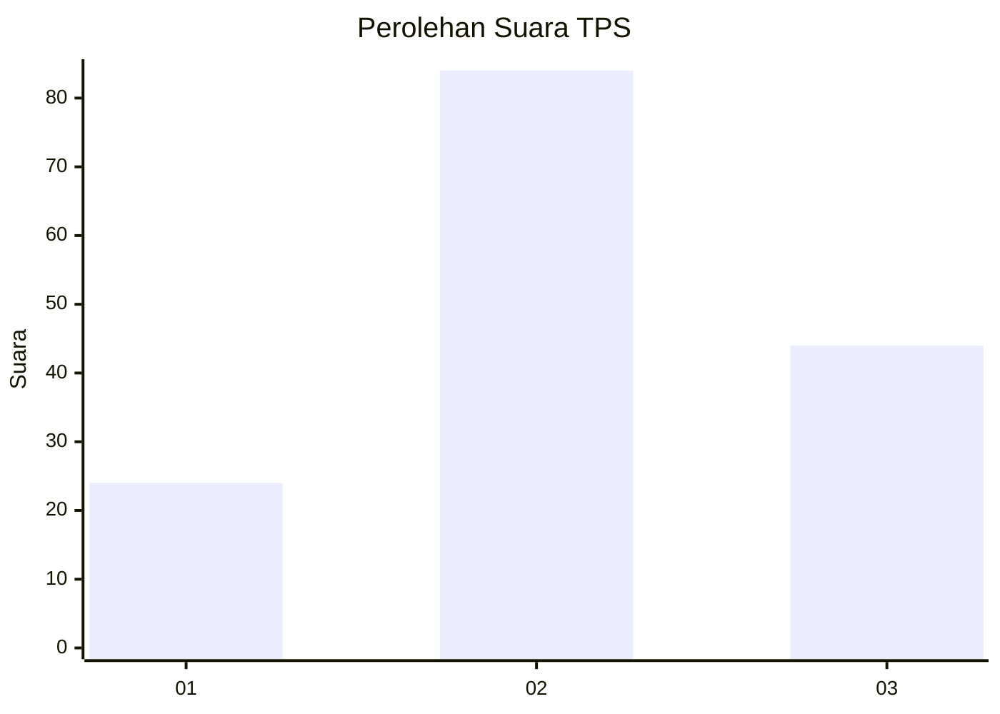
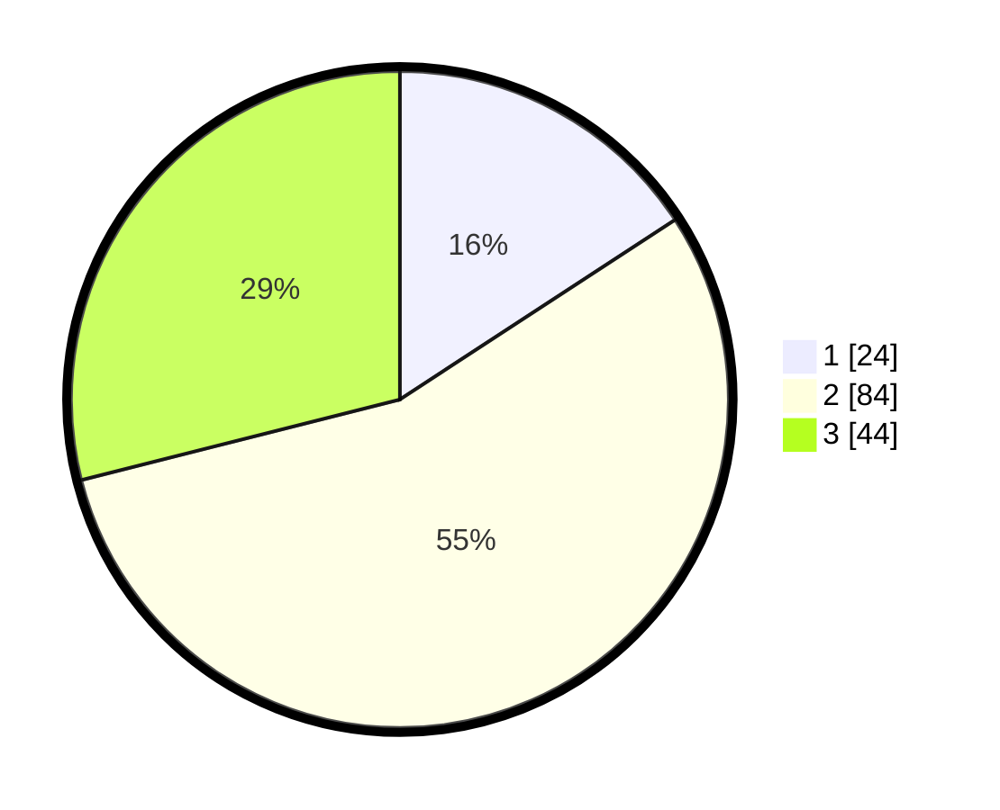

# Hasil

## Grafik

## Tabel

| No. | Nama Paslon    | Suara | Suara (raw) | Persentase |
|:--- |:-------------- | -----:| -----------:| ----------:|
| 1   | ANIES MUHAIMIN | 24    | [24][p-1]   | 15,79      |
| 2   | PRABOWO GIBRAN | 84    | [84][p-2]   | 55,26      |
| 3   | GANJAR MAHFUD  | 44    | [44][p-3]   | 28,95      |

[p-1]: https://github.com/gigit-pemilu/pemilu-2024/blob/main/pilpres/hitung-suara/sub/33-jawa-tengah/sub/06-purworejo/sub/11-pituruh/sub/2006-tersidilor/sub/005-tps/sub/paslon-1.txt
[p-2]: https://github.com/gigit-pemilu/pemilu-2024/blob/main/pilpres/hitung-suara/sub/33-jawa-tengah/sub/06-purworejo/sub/11-pituruh/sub/2006-tersidilor/sub/005-tps/sub/paslon-2.txt
[p-3]: https://github.com/gigit-pemilu/pemilu-2024/blob/main/pilpres/hitung-suara/sub/33-jawa-tengah/sub/06-purworejo/sub/11-pituruh/sub/2006-tersidilor/sub/005-tps/sub/paslon-3.txt

## Foto C Plano

https://sirekap-obj-formc.kpu.go.id/f10c/pemilu/ppwp/33/06/11/20/06/3306112006005-20240215-005416--5853dc04-8b7d-4469-81ef-50a7fef34d74.jpg

https://sirekap-obj-formc.kpu.go.id/f10c/pemilu/ppwp/33/06/11/20/06/3306112006005-20240214-220022--43868370-4e38-4e85-bac6-b972886c734c.jpg

https://sirekap-obj-formc.kpu.go.id/f10c/pemilu/ppwp/33/06/11/20/06/3306112006005-20240215-005727--2eae6391-05d0-419f-a593-4e65861d0600.jpg

## Metadata

| Key        | Value               |
| ---------- | ------------------- |
| Time Stamp | 2024-02-15 16:00:26 |

